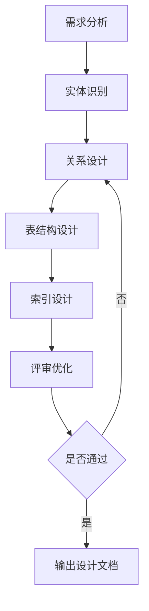
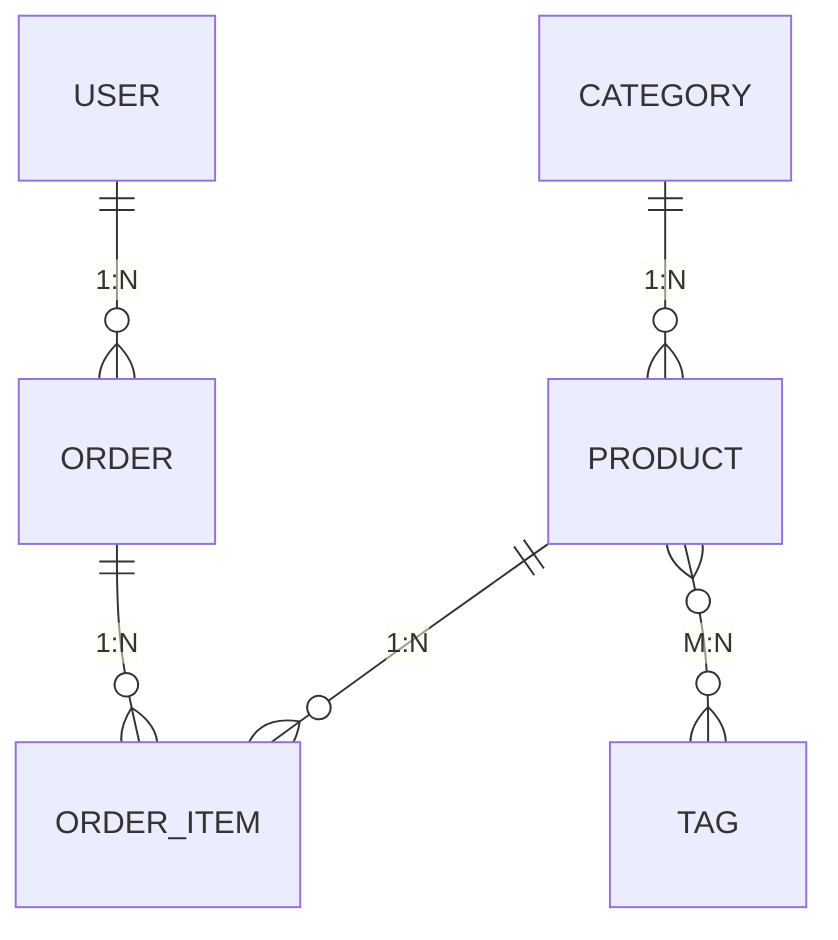

# 💾 数据库设计规范

> **架构阶段** | **MySQL 8.0** | **规范化设计**

---

## 📋 概述

**设计原则：**
- 范式化设计（3NF）
- 合理的索引策略
- 完善的注释规范
- 预留扩展空间

---

## 🎯 设计流程



---

## 📐 范式设计

### 范式说明

| 范式 | 说明 | 目标 |
|------|------|------|
| **1NF** | 字段不可再分 | 原子性 |
| **2NF** | 消除部分依赖 | 完全依赖 |
| **3NF** | 消除传递依赖 | 直接依赖 |
| **BCNF** | 消除主属性传递依赖 | 更严格 |

### 范式示例

```sql
-- 违反 1NF（字段可再分）
CREATE TABLE orders (
    products VARCHAR(255)  -- "商品1,商品2,商品3"
);

-- 符合 1NF（拆分为独立字段或表）
CREATE TABLE order_items (
    id BIGINT PRIMARY KEY,
    order_id BIGINT,
    product_id BIGINT,
    quantity INT
);
```

---

## 📊 表结构设计规范

### 字段命名规范

| 规则 | 说明 | 示例 |
|------|------|------|
| **表名** | 小写、复数、下划线分隔 | `order_items` |
| **字段名** | 小写、下划线分隔 | `created_at` |
| **主键** | `id` | `id BIGINT` |
| **外键** | `{关联表}_id` | `order_id BIGINT` |
| **时间字段** | `_at` 后缀 | `created_at TIMESTAMP` |
| **布尔字段** | `is_` 前缀 | `is_active BOOLEAN` |

### 字段类型选择

| 数据 | 推荐类型 | 说明 |
|------|---------|------|
| **主键** | `BIGINT UNSIGNED` | 自增主键 |
| **金额** | `DECIMAL(10,2)` | 精确计算 |
| **字符串** | `VARCHAR(255)` | 变长字符串 |
| **长文本** | `TEXT` | 描述等 |
| **时间** | `TIMESTAMP` | 时间戳 |
| **布尔** | `TINYINT(1)` | 0/1 |
| **JSON** | `JSON` | 结构化数据 |

### 表结构模板

```sql
CREATE TABLE `orders` (
    `id` BIGINT UNSIGNED NOT NULL AUTO_INCREMENT,
    `order_sn` VARCHAR(64) NOT NULL COMMENT '订单编号',
    `user_id` BIGINT UNSIGNED NOT NULL COMMENT '用户ID',
    `status` ENUM('pending','paid','shipped','completed','cancelled') DEFAULT 'pending' COMMENT '状态',
    `total_amount` DECIMAL(10,2) NOT NULL DEFAULT 0 COMMENT '总金额',
    `pay_amount` DECIMAL(10,2) NOT NULL DEFAULT 0 COMMENT '实付金额',
    `remark` VARCHAR(500) DEFAULT NULL COMMENT '备注',
    `created_at` TIMESTAMP DEFAULT CURRENT_TIMESTAMP,
    `updated_at` TIMESTAMP DEFAULT CURRENT_TIMESTAMP ON UPDATE CURRENT_TIMESTAMP,
    `deleted_at` TIMESTAMP NULL DEFAULT NULL COMMENT '软删除',
    PRIMARY KEY (`id`),
    UNIQUE KEY `uk_order_sn` (`order_sn`),
    KEY `idx_user_id` (`user_id`),
    KEY `idx_status` (`status`),
    KEY `idx_created_at` (`created_at`)
) ENGINE=InnoDB DEFAULT CHARSET=utf8mb4 COLLATE=utf8mb4_unicode_ci COMMENT='订单表';
```

---

## 🔗 关系设计

### 关系类型



### 外键策略

| 策略 | 说明 | 适用场景 |
|------|------|---------|
| **CASCADE** | 级联删除 | 强关联数据 |
| **RESTRICT** | 限制删除 | 重要数据 |
| **SET NULL** | 置空 | 可选关联 |
| **NO ACTION** | 无操作 | 默认策略 |

---

## 📇 索引设计

### 索引类型

| 类型 | 说明 | 适用场景 |
|------|------|---------|
| **主键索引** | 唯一标识 | 每个表必须 |
| **唯一索引** | 值唯一 | 邮箱、手机号 |
| **普通索引** | 加速查询 | 常用查询字段 |
| **复合索引** | 多字段组合 | 联合查询 |

### 索引设计原则

1. **在 WHERE 子句中的字段上创建索引**
2. **在 JOIN 子句中的外键上创建索引**
3. **在 ORDER BY 子句中的字段上创建索引**
4. **避免在低基数字段上创建索引**
5. **避免在频繁更新的字段上创建索引**

### 索引失效场景

```sql
-- ❌ 使用函数
WHERE YEAR(created_at) = 2024

-- ✅ 改为范围查询
WHERE created_at >= '2024-01-01' AND created_at < '2025-01-01'

-- ❌ LIKE 左模糊
WHERE name LIKE '%abc'

-- ✅ 改为右模糊或全文索引
WHERE name LIKE 'abc%'
```

---

## 📝 注释规范

### 表注释

```sql
CREATE TABLE `orders` (
    ...
) COMMENT='订单表';
```

### 字段注释

```sql
`order_sn` VARCHAR(64) NOT NULL COMMENT '订单编号',
`status` ENUM(...) DEFAULT 'pending' COMMENT '状态: pending/paid/shipped/completed/cancelled',
```

### 索引注释

```sql
KEY `idx_user_status` (`user_id`, `status`) COMMENT '用户状态联合索引',
```

---

## 📊 设计文档模板

```markdown
# 数据库设计文档

## 📋 设计概述
- 模块: {module}
- 核心实体: {entities}
- 预计数据量: {scale}

## 📊 ER 图
{Mermaid ER 图代码}

## 📦 表结构

### 表1: {table_name}
| 字段名 | 类型 | 约束 | 说明 |
|--------|------|------|------|
| id | BIGINT | PK, AUTO_INCREMENT | 主键 |
| {field} | {type} | {constraint} | {comment} |

**索引设计：**
| 索引名 | 字段 | 类型 | 用途 |
|--------|------|------|------|
| {index} | {fields} | {type} | {purpose} |

**外键设计：**
| 关联表 | 字段 | 删除策略 |
|--------|------|---------|
| {table} | {field} | {strategy} |

## 🔗 关系设计
| 实体A | 关系 | 实体B | 说明 |
|-------|------|-------|------|
| {A} | {relation} | {B} | {desc} |

## 📈 性能优化
- 索引策略: {strategy}
- 分表策略: {strategy}
- 缓存策略: {strategy}
```

---

## 💡 最佳实践

### 设计原则

1. **规范化**：遵循范式减少数据冗余
2. **反规范化**：适当冗余提高查询效率
3. **索引优化**：为常用查询创建索引
4. **数据完整性**：使用约束保证数据准确
5. **可扩展性**：预留扩展字段或分表方案

### 检查清单

- [ ] 表结构是否满足范式？
- [ ] 字段类型是否合适？
- [ ] 主键设计是否合理？
- [ ] 外键关系是否正确？
- [ ] 索引设计是否优化？
- [ ] 注释是否完整？
- [ ] 数据量预估是否合理？

---

**版本**: v1.0 | **更新日期**: 2026-04-30
