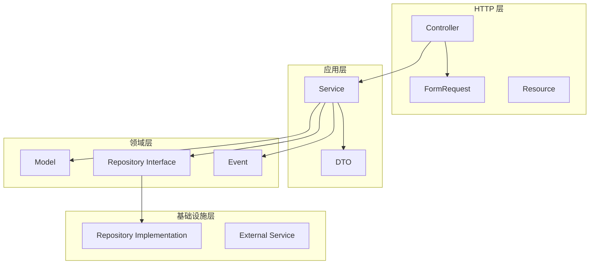

# ⚙️ 后端开发规范

> **开发阶段** | **Laravel 12 + PHP 8.2** | **DDD 分层架构**

---

## 📋 概述

**技术栈：**
- 框架：Laravel 12
- PHP 版本：8.2+
- 架构：DDD 分层架构
- 数据库：MySQL 8.0
- 缓存：Redis 7.0

---

## 🎯 目录结构

```
app/
├── Domains/                    # 领域层（核心业务逻辑）
│   ├── User/
│   │   ├── Models/
│   │   ├── Services/
│   │   ├── Events/
│   │   └── Exceptions/
│   ├── Product/
│   └── Order/
│
├── Infrastructure/             # 基础设施层
│   ├── Repositories/
│   └── Services/
│
├── Http/                       # HTTP 层
│   ├── Controllers/
│   ├── Requests/
│   └── Middleware/
│
└── Console/                    # 命令行
    └── Commands/
```

---

## 📐 代码规范

### 命名规范

| 类型 | 规范 | 示例 |
|------|------|------|
| **类名** | PascalCase | `OrderService` |
| **方法名** | camelCase | `createOrder()` |
| **变量名** | camelCase | `$orderAmount` |
| **常量** | UPPER_SNAKE_CASE | `MAX_RETRY_COUNT` |
| **表名** | snake_case, 复数 | `order_items` |
| **字段名** | snake_case | `created_at` |

### 类型声明

```php
<?php
declare(strict_types=1);

namespace App\Domains\Order\Services;

use App\Domains\Order\Models\Order;
use App\Domains\Order\Data\OrderCreateData;
use Illuminate\Support\Facades\DB;

class OrderService
{
    public function __construct(
        private readonly OrderRepository $orderRepository
    ) {}
    
    public function createOrder(OrderCreateData $data): Order
    {
        return DB::transaction(function () use ($data) {
            // 业务逻辑
        });
    }
    
    public function getOrderById(int $id): ?Order
    {
        return $this->orderRepository->findById($id);
    }
}
```

---

## 🏗️ 分层架构



### 各层职责

| 层级 | 职责 | 示例 |
|------|------|------|
| **HTTP 层** | 接收请求、返回响应 | Controller, FormRequest |
| **应用层** | 业务逻辑编排 | Service, DTO |
| **领域层** | 核心业务规则 | Model, Event |
| **基础设施层** | 技术实现 | Repository, External API |

---

## 🔧 设计模式

### 依赖注入

```php
<?php
// ✅ 正确：使用依赖注入
class OrderService
{
    public function __construct(
        private readonly OrderRepository $orderRepository,
        private readonly EventDispatcher $eventDispatcher
    ) {}
}

// ❌ 错误：直接实例化
class OrderService
{
    public function create()
    {
        $repository = new OrderRepository(); // 硬编码依赖
    }
}
```

### 工厂模式

```php
<?php
class PaymentFactory
{
    public static function create(string $type): PaymentInterface
    {
        return match($type) {
            'wechat' => new WechatPayment(),
            'alipay' => new AlipayPayment(),
            default => throw new InvalidArgumentException("Unknown type: {$type}"),
        };
    }
}
```

### 策略模式

```php
<?php
interface DiscountStrategy
{
    public function calculate(float $price): float;
}

class VoucherDiscount implements DiscountStrategy
{
    public function __construct(private readonly float $amount) {}
    
    public function calculate(float $price): float
    {
        return max(0, $price - $this->amount);
    }
}
```

---

## 📝 代码示例

### Model

```php
<?php
declare(strict_types=1);

namespace App\Domains\Order\Models;

use Illuminate\Database\Eloquent\Factories\HasFactory;
use Illuminate\Database\Eloquent\Model;
use Illuminate\Database\Eloquent\SoftDeletes;

class Order extends Model
{
    use HasFactory, SoftDeletes;
    
    protected $fillable = [
        'order_sn',
        'user_id',
        'status',
        'total_amount',
        'pay_amount',
    ];
    
    protected $casts = [
        'total_amount' => 'decimal:2',
        'pay_amount' => 'decimal:2',
    ];
    
    public function user()
    {
        return $this->belongsTo(User::class);
    }
    
    public function items()
    {
        return $this->hasMany(OrderItem::class);
    }
}
```

### Service

```php
<?php
declare(strict_types=1);

namespace App\Domains\Order\Services;

use App\Domains\Order\Models\Order;
use App\Domains\Order\Data\OrderCreateData;
use App\Domains\Order\Events\OrderCreated;
use Illuminate\Support\Facades\DB;

class OrderService
{
    public function createOrder(OrderCreateData $data): Order
    {
        return DB::transaction(function () use ($data) {
            // 1. 创建订单
            $order = Order::create([
                'order_sn' => $this->generateOrderSn(),
                'user_id' => $data->userId,
                'status' => 'pending',
                'total_amount' => $data->totalAmount,
                'pay_amount' => $data->payAmount,
            ]);
            
            // 2. 触发事件
            event(new OrderCreated($order));
            
            return $order;
        });
    }
    
    private function generateOrderSn(): string
    {
        return 'ORD' . date('Ymd') . str_pad(
            (string) Redis::incr('order:sequence:today'),
            6,
            '0',
            STR_PAD_LEFT
        );
    }
}
```

---

## 📋 检查清单

- [ ] 是否声明了 `strict_types`？
- [ ] 是否使用了类型声明？
- [ ] 是否使用了依赖注入？
- [ ] 是否遵循了分层架构？
- [ ] 是否有异常处理？
- [ ] 是否有日志记录？
- [ ] 是否有单元测试？
- [ ] 是否符合命名规范？

---

**版本**: v1.0 | **更新日期**: 2026-04-30
