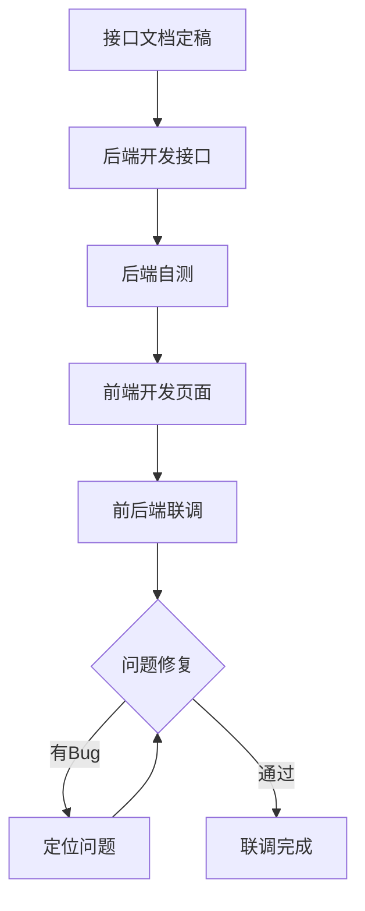
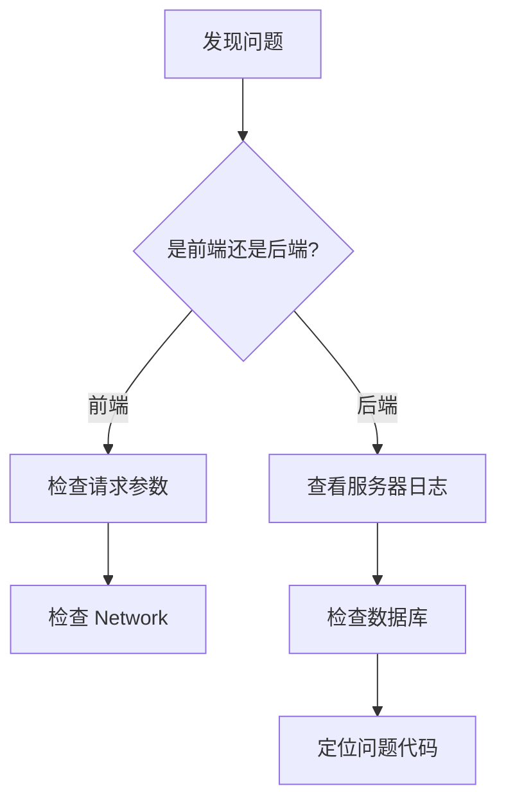

# 🔗 联调测试规范

> **测试阶段** | **前后端协作** | **接口对接**

---

## 📋 概述

**目标：** 确保前后端接口正确对接，功能正常运行

**参与角色：**
- 前端开发
- 后端开发
- 测试工程师

---

## 🎯 联调流程



---

## 📝 联调检查清单

### 1. 接口文档

| 检查项 | 说明 | 状态 |
|--------|------|------|
| 接口地址 | URL 是否正确 | ⬜ |
| 请求方法 | GET/POST/PUT/DELETE | ⬜ |
| 请求参数 | 参数名、类型、是否必填 | ⬜ |
| 响应格式 | 成功/失败响应结构 | ⬜ |
| 错误码 | 错误码和错误信息 | ⬜ |

### 2. 前端对接

| 检查项 | 说明 | 状态 |
|--------|------|------|
| 参数传递 | 参数名、类型是否正确 | ⬜ |
| 响应解析 | JSON 解析是否正确 | ⬜ |
| 错误处理 | 错误提示是否友好 | ⬜ |
| 加载状态 | Loading 状态是否显示 | ⬜ |
| 边界处理 | 空数据、异常数据处理 | ⬜ |

### 3. 后端验证

| 检查项 | 说明 | 状态 |
|--------|------|------|
| 参数验证 | 验证规则是否正确 | ⬜ |
| 权限控制 | 权限检查是否生效 | ⬜ |
| 错误响应 | 中文错误信息 | ⬜ |
| 日志记录 | 关键操作是否记录 | ⬜ |
| 性能表现 | 响应时间是否达标 | ⬜ |

---

## 🔧 联调工具

### 1. Postman / Apifox

```yaml
# 测试集合
Collection: 电商系统 API
Environment: Local

# 测试用例
- 商品列表 GET /api/v1/products
- 商品详情 GET /api/v1/products/{id}
- 创建商品 POST /api/v1/products
```

### 2. 浏览器开发者工具

```
1. 打开 F12 开发者工具
2. 切换到 Network 面板
3. 发起请求
4. 查看请求/响应详情
```

### 3. cURL 命令

```bash
# 测试 GET 请求
curl -X GET http://localhost:8000/api/v1/products

# 测试 POST 请求
curl -X POST http://localhost:8000/api/v1/products \
  -H "Content-Type: application/json" \
  -H "Authorization: Bearer {token}" \
  -d '{"name": "测试商品", "price": 99.99}'
```

---

## 🐛 问题定位

### 常见问题

| 问题 | 可能原因 | 解决方案 |
|------|---------|---------|
| 404 Not Found | 路由未定义 | 检查路由配置 |
| 401 Unauthorized | Token 无效 | 检查认证逻辑 |
| 403 Forbidden | 无权限 | 检查权限配置 |
| 422 Validation | 参数验证失败 | 检查请求参数 |
| 500 Server Error | 服务器错误 | 查看服务器日志 |

### 调试步骤



---

## 📊 联调报告

```markdown
# 联调测试报告

## 基本信息
- 联调日期: {date}
- 联调模块: {module}
- 参与人员: {participants}

## 接口清单
| 接口 | 方法 | 状态 | 问题 |
|------|------|------|------|
| /api/v1/products | GET | ✅ | - |
| /api/v1/products/{id} | GET | ✅ | - |
| /api/v1/products | POST | ⚠️ | 参数验证问题 |

## 问题记录
| 序号 | 问题描述 | 类型 | 状态 | 负责人 |
|------|---------|------|------|--------|
| 1 | {desc} | 前端 | 已修复 | {person} |
| 2 | {desc} | 后端 | 处理中 | {person} |

## 结论
{联调结论和后续安排}
```

---

## 💡 最佳实践

### 1. 提前沟通
- 接口文档先行
- 统一响应格式
- 明确错误码

### 2. 并行开发
- Mock 数据开发
- 接口模拟服务
- 契约测试

### 3. 问题跟踪
- 使用问题跟踪工具
- 记录问题详情
- 及时沟通解决

---

**版本**: v1.0 | **更新日期**: 2026-04-30
