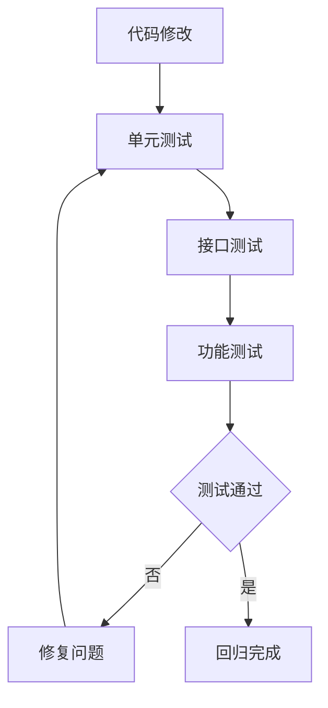
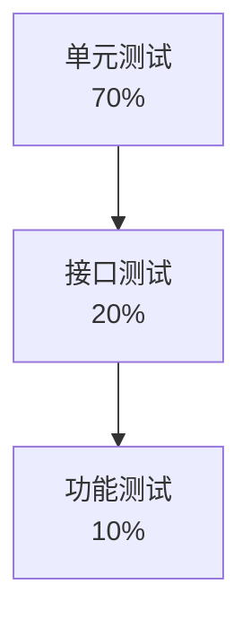

# 🔄 回归测试规范

> **测试阶段** | **确保修改不破坏现有功能** | **自动化回归**

---

## 📋 概述

**目标：** 确保代码修改后，现有功能仍然正常

**回归范围：**
- 单元测试
- 接口测试
- 功能测试

---

## 🎯 回归流程



---

## 📊 测试金字塔



### 测试类型

| 类型 | 说明 | 执行时间 | 覆盖率 |
|------|------|---------|--------|
| **单元测试** | 测试单个函数/方法 | 毫秒级 | 70% |
| **接口测试** | 测试 API 接口 | 秒级 | 20% |
| **功能测试** | 测试完整用户流程 | 分钟级 | 10% |

---

## 📝 回归测试策略

### 1. 代码级回归

```bash
# 运行单元测试
php artisan test --testsuite=Unit

# 运行指定模块测试
php artisan test --filter=OrderServiceTest
```

### 2. 接口级回归

```bash
# 运行所有接口测试
php artisan test --testsuite=Feature

# 运行指定接口测试
php artisan test --filter=ProductApiTest
```

### 3. 功能级回归

```bash
# 运行场景测试
php artisan test --testsuite=Scenarios
```

---

## 🔧 回归测试用例

### 自动化回归

```php
<?php
// tests/Regression/OrderRegressionTest.php

namespace Tests\Regression;

use Tests\TestCase;
use App\Models\Order;
use App\Models\User;

class OrderRegressionTest extends TestCase
{
    /**
     * 回归：订单创建流程
     */
    public function test_order_creation_regression(): void
    {
        // 1. 准备测试数据
        $user = User::factory()->create();
        
        // 2. 执行操作
        $response = $this->actingAs($user)
            ->postJson('/api/v1/orders', [
                'product_id' => 1,
                'quantity' => 1,
            ]);
        
        // 3. 验证结果
        $response->assertCreated();
        $this->assertDatabaseHas('orders', [
            'user_id' => $user->id,
            'status' => 'pending',
        ]);
    }
    
    /**
     * 回归：订单支付流程
     */
    public function test_order_payment_regression(): void
    {
        // 1. 创建订单
        $order = Order::factory()->pending()->create();
        
        // 2. 支付
        $response = $this->actingAs($order->user)
            ->postJson("/api/v1/orders/{$order->id}/pay");
        
        // 3. 验证
        $response->assertOk();
        $this->assertDatabaseHas('orders', [
            'id' => $order->id,
            'status' => 'paid',
        ]);
    }
}
```

---

## 📊 回归报告

```markdown
# 回归测试报告

## 基本信息
- 回归日期: {date}
- 回归范围: {scope}
- 测试环境: {environment}

## 测试结果
| 测试类型 | 用例数 | 通过 | 失败 | 覆盖率 |
|---------|--------|------|------|--------|
| 单元测试 | 150 | 148 | 2 | 85% |
| 接口测试 | 50 | 50 | 0 | 90% |
| 功能测试 | 20 | 19 | 1 | 80% |

## 失败用例
| 用例 | 问题 | 状态 |
|------|------|------|
| test_order_xxx | {desc} | 已修复 |

## 结论
{回归结论}
```

---

## 💡 最佳实践

1. **自动化优先**：尽量自动化回归测试
2. **及时回归**：每次代码修改后立即回归
3. **覆盖全面**：覆盖核心功能和边界情况
4. **记录结果**：详细记录回归结果

---

**版本**: v1.0 | **更新日期**: 2026-04-30
