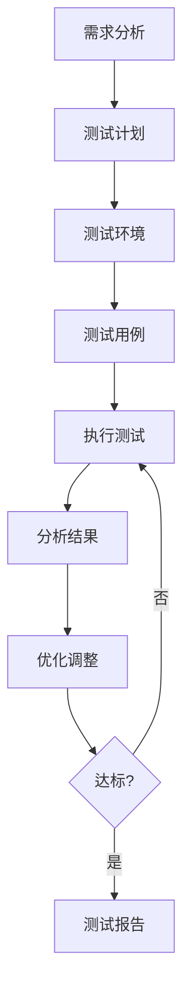

# ⚡ 性能测试规范

> **测试阶段** | **JMeter / k6** | **压测与优化**

---

## 📋 概述

**目标：** 验证系统在高并发下的性能表现

**性能指标：**
- 响应时间
- 并发用户数
- 吞吐量
- 错误率

---

## 🎯 性能测试流程



---

## 📊 性能指标

### 1. 响应时间

| 指标 | 目标 | 说明 |
|------|------|------|
| **P50** | < 100ms | 50% 请求响应时间 |
| **P95** | < 200ms | 95% 请求响应时间 |
| **P99** | < 500ms | 99% 请求响应时间 |

### 2. 吞吐量

| 指标 | 目标 | 说明 |
|------|------|------|
| **QPS** | > 1000 | 每秒请求数 |
| **TPS** | > 500 | 每秒事务数 |

### 3. 并发用户

| 指标 | 目标 | 说明 |
|------|------|------|
| **并发数** | > 100 | 同时在线用户 |
| **峰值** | > 500 | 高峰期并发 |

### 4. 错误率

| 指标 | 目标 | 说明 |
|------|------|------|
| **错误率** | < 1% | 请求失败率 |

---

## 🔧 测试工具

### JMeter

```xml
<!-- 测试计划 -->
<TestPlan>
  <ThreadGroup>
    <numThreads>100</numThreads>
    <rampTime>10</rampTime>
    <loopCount>1000</loopCount>
  </ThreadGroup>
</TestPlan>
```

### k6

```javascript
import http from 'k6/http';
import { check, sleep } from 'k6';

export const options = {
  stages: [
    { duration: '30s', target: 20 },
    { duration: '1m', target: 100 },
    { duration: '30s', target: 0 },
  ],
};

export default function () {
  const res = http.get('http://localhost:8000/api/v1/products');
  check(res, { 'status was 200': (r) => r.status == 200 });
  sleep(1);
}
```

---

## 📝 测试用例

### 1. 基准测试

```yaml
测试场景: 基准测试
并发数: 1
持续时间: 1分钟
测试接口:
  - GET /api/v1/products
  - GET /api/v1/products/1
```

### 2. 负载测试

```yaml
测试场景: 负载测试
并发数: 100
持续时间: 5分钟
测试接口:
  - GET /api/v1/products
  - POST /api/v1/orders
```

### 3. 压力测试

```yaml
测试场景: 压力测试
并发数: 500
持续时间: 10分钟
测试接口:
  - GET /api/v1/products
  - POST /api/v1/orders
```

---

## 📊 测试报告

```markdown
# 性能测试报告

## 基本信息
- 测试日期: {date}
- 测试环境: {environment}
- 测试工具: {tool}

## 测试结果

### 响应时间
| 接口 | P50 | P95 | P99 | 目标 |
|------|-----|-----|-----|------|
| GET /products | 50ms | 120ms | 180ms | <200ms |
| POST /orders | 80ms | 150ms | 250ms | <500ms |

### 吞吐量
| 指标 | 实际值 | 目标 | 结果 |
|------|--------|------|------|
| QPS | 1200 | >1000 | ✅ 通过 |
| TPS | 600 | >500 | ✅ 通过 |

### 并发测试
| 并发数 | 响应时间 | 错误率 | 结果 |
|--------|---------|--------|------|
| 100 | 120ms | 0% | ✅ 通过 |
| 500 | 250ms | 0.5% | ✅ 通过 |
| 1000 | 500ms | 2% | ❌ 未通过 |

## 瓶颈分析
1. 数据库查询慢：缺少索引
2. 缓存命中率低：缓存策略不当

## 优化建议
1. 为常用查询字段添加索引
2. 优化缓存策略
3. 考虑读写分离

## 结论
{结论}
```

---

## 💡 最佳实践

1. **测试环境**：尽量模拟生产环境
2. **测试数据**：使用真实数据量
3. **持续监控**：测试过程中监控服务器
4. **多次测试**：多次测试取平均值
5. **逐步加压**：逐步增加并发数

---

**版本**: v1.0 | **更新日期**: 2026-04-30
