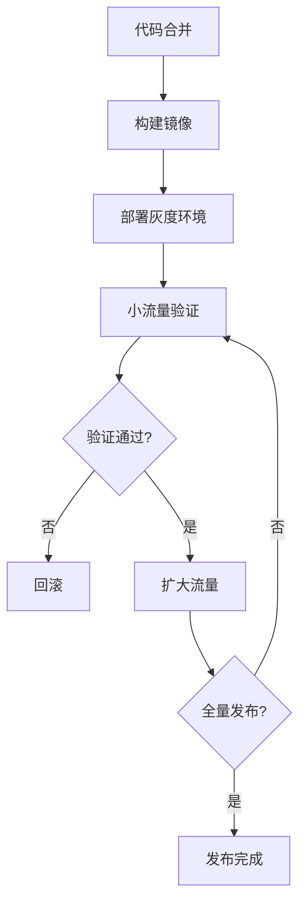

# 🐳 灰度发布规范

> **运维阶段** | **降低发布风险** | **平滑过渡**

---

## 📋 概述

**目标：** 通过小流量验证，降低新版本发布风险

**灰度策略：**
- 按用户比例
- 按地区
- 按设备类型

---

## 🎯 灰度发布流程



---

## 📊 灰度策略

### 1. 按用户比例

```nginx
# Nginx 配置
upstream backend {
    server 10.0.0.1:80 weight=9;  # 旧版本 90%
    server 10.0.0.2:80 weight=1;  # 新版本 10%
}
```

### 2. 按用户 ID

```php
<?php
// 根据用户 ID 灰度
function isGrayUser(int $userId, float $rate = 0.1): bool
{
    return ($userId % 100) < ($rate * 100);
}

// 使用
if (isGrayUser($user->id, 0.1)) {
    // 新版本逻辑
} else {
    // 旧版本逻辑
}
```

### 3. 按配置开关

```php
<?php
// config/feature.php
return [
    'new_checkout' => env('FEATURE_NEW_CHECKOUT', false),
];

// 使用
if (config('feature.new_checkout')) {
    // 新版结账流程
} else {
    // 旧版结账流程
}
```

---

## 📝 灰度发布清单

### 发布前

- [ ] 代码 review 完成
- [ ] 单元测试通过
- [ ] 集成测试通过
- [ ] 性能测试达标
- [ ] 数据库变更已备份
- [ ] 回滚方案已准备

### 灰度中

- [ ] 监控系统正常
- [ ] 错误率在阈值内
- [ ] 响应时间正常
- [ ] 业务指标正常

### 发布后

- [ ] 全量发布完成
- [ ] 监控持续运行
- [ ] 旧版本下线
- [ ] 文档更新

---

## 🔧 实现方案

### Nginx 流量分割

```nginx
# 灰度发布配置
upstream backend_stable {
    server 10.0.0.1:80;
}

upstream backend_canary {
    server 10.0.0.2:80;
}

# 根据 Cookie 灰度
map $cookie_canary $backend {
    default backend_stable;
    "1" backend_canary;
}

server {
    location / {
        proxy_pass http://$backend;
    }
}
```

### Laravel Feature Flag

```php
<?php
// 使用 laravel/feature
use Laravel\Feature\Facades\Feature;

// 定义功能
Feature::define('new_checkout', function ($user) {
    return $user->isBetaUser();
});

// 使用
if (Feature::active('new_checkout', $user)) {
    // 新功能
}
```

---

## 📊 监控指标

| 指标 | 阈值 | 说明 |
|------|------|------|
| **错误率** | < 1% | 请求失败率 |
| **响应时间** | < 500ms | P95 响应时间 |
| **CPU 使用率** | < 80% | 服务器负载 |
| **内存使用率** | < 80% | 内存占用 |

---

## 🔄 回滚策略

### 自动回滚

```bash
# 回滚到上一版本
docker-compose -f docker-compose.prod.yml pull
docker-compose -f docker-compose.prod.yml up -d --no-deps app
```

### 手动回滚

```bash
# 回滚到指定版本
docker tag $REGISTRY/app:previous $REGISTRY/app:latest
docker-compose -f docker-compose.prod.yml up -d --no-deps app
```

---

## 💡 最佳实践

1. **小步快跑**：每次只发布小改动
2. **充分监控**：灰度期间密切监控
3. **快速回滚**：发现问题立即回滚
4. **用户反馈**：收集灰度用户反馈
5. **文档记录**：记录每次灰度过程

---

**版本**: v1.0 | **更新日期**: 2026-04-30
