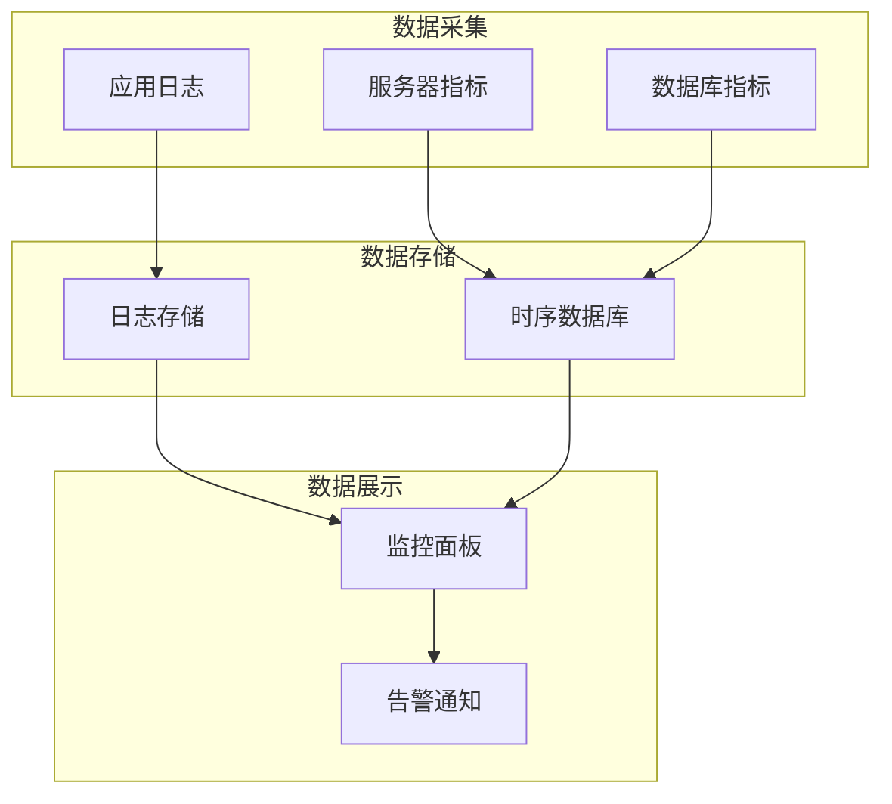

# 📊 性能监控规范

> **运维阶段** | **实时监控** | **告警通知**

---

## 📋 概述

**目标：** 实时监控系统运行状态，及时发现和处理问题

**监控维度：**
- 基础设施监控
- 应用性能监控
- 业务指标监控

---

## 🎯 监控架构



---

## 📊 监控指标

### 1. 基础设施指标

| 指标 | 说明 | 告警阈值 |
|------|------|---------|
| **CPU 使用率** | 服务器 CPU 负载 | > 80% |
| **内存使用率** | 内存占用 | > 80% |
| **磁盘使用率** | 磁盘空间 | > 85% |
| **网络流量** | 入/出流量 | 异常波动 |

### 2. 应用性能指标

| 指标 | 说明 | 告警阈值 |
|------|------|---------|
| **响应时间** | API 响应时间 | > 500ms |
| **错误率** | 请求失败率 | > 1% |
| **QPS** | 每秒请求数 | 突增/突降 |
| **并发数** | 同时在线用户 | > 阈值 |

### 3. 业务指标

| 指标 | 说明 | 告警阈值 |
|------|------|---------|
| **订单量** | 每分钟订单数 | 异常波动 |
| **支付成功率** | 支付完成率 | < 99% |
| **转化率** | 下单转化率 | 下降 20% |

---

## 🔧 监控工具

### Laravel Telescope

```php
// 安装
composer require laravel/telescope

// 配置
php artisan telescope:install
```

### Laravel Horizon

```php
// 安装
composer require laravel/horizon

// 配置
php artisan horizon:install
```

### Prometheus + Grafana

```yaml
# docker-compose.yml
services:
  prometheus:
    image: prom/prometheus
    volumes:
      - ./prometheus.yml:/etc/prometheus/prometheus.yml
    ports:
      - "9090:9090"
  
  grafana:
    image: grafana/grafana
    ports:
      - "3000:3000"
```

---

## 📝 告警配置

### 告警规则

```yaml
# alertmanager.yml
groups:
  - name: application
    rules:
      - alert: HighErrorRate
        expr: rate(http_requests_total{status=~"5.."}[5m]) > 0.01
        for: 5m
        labels:
          severity: critical
        annotations:
          summary: "错误率过高"
          
      - alert: HighResponseTime
        expr: histogram_quantile(0.95, rate(http_request_duration_seconds_bucket[5m])) > 0.5
        for: 5m
        labels:
          severity: warning
        annotations:
          summary: "响应时间过长"
```

### 告警通知

```yaml
# alertmanager.yml
receivers:
  - name: 'webhook'
    webhook_configs:
      - url: 'http://localhost:8000/api/alerts'
  
  - name: 'email'
    email_configs:
      - to: 'admin@example.com'
        from: 'alertmanager@example.com'
        smarthost: 'smtp.example.com:587'
```

---

## 📊 监控面板

### Grafana Dashboard

```json
{
  "dashboard": {
    "title": "应用监控面板",
    "panels": [
      {
        "title": "QPS",
        "type": "graph",
        "targets": [
          {
            "expr": "rate(http_requests_total[1m])"
          }
        ]
      },
      {
        "title": "响应时间",
        "type": "graph",
        "targets": [
          {
            "expr": "histogram_quantile(0.95, rate(http_request_duration_seconds_bucket[5m]))"
          }
        ]
      }
    ]
  }
}
```

---

## 📋 监控清单

### 日常检查

- [ ] 服务器资源使用率
- [ ] 应用响应时间
- [ ] 错误日志
- [ ] 业务指标

### 定期检查

- [ ] 数据库慢查询
- [ ] 缓存命中率
- [ ] 队列积压情况
- [ ] 磁盘空间

---

## 💡 最佳实践

1. **告警分级**：区分 critical、warning、info
2. **告警收敛**：避免告警风暴
3. **值班制度**：明确告警处理责任人
4. **定期复盘**：分析告警原因，优化系统

---

**版本**: v1.0 | **更新日期**: 2026-04-30
