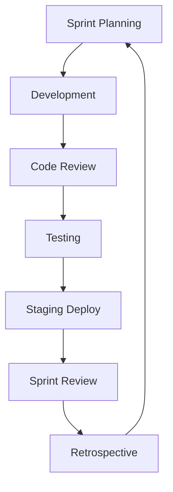
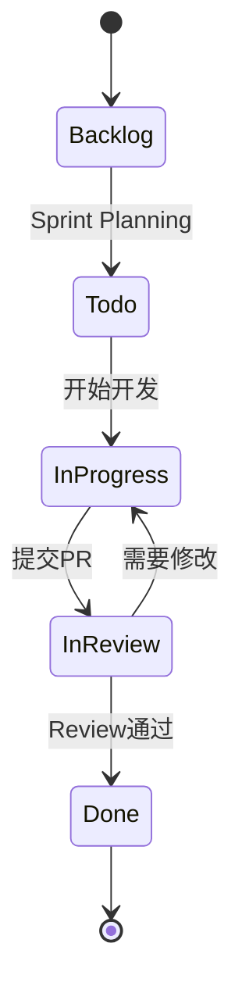

# 📋 开发流程规范

> **工作流程** | **敏捷开发** | **一人公司适配**

---

## 📋 概述

**开发模式：** 敏捷开发（Scrum Lite）

**迭代周期：** 2 周

**核心原则：**
- 小步快跑
- 持续交付
- 快速反馈

---

## 🎯 开发流程



---

## 📅 迭代周期

### Sprint Planning（周一）

**时间：** 10:00 - 11:00

**内容：**
1. 确定本迭代目标
2. 选择用户故事
3. 分解任务
4. 评估工时

**产出：**
- Sprint Backlog
- 任务分解表

### Daily Standup（每天）

**时间：** 9:30 - 9:40

**内容：**
1. 昨天完成了什么
2. 今天计划做什么
3. 有什么阻碍

### Development（开发）

**时间：** 周一至周四

**流程：**
1. 从 Sprint Backlog 取任务
2. 开发实现
3. 自测
4. 提交代码
5. Code Review

### Code Review（持续）

**时间：** 持续进行

**流程：**
1. 提交 PR
2. 自动化检查
3. 人工 Review
4. 合并代码

### Testing（测试）

**时间：** 周四下午 - 周五上午

**内容：**
1. 集成测试
2. 回归测试
3. Bug 修复

### Sprint Review（周五）

**时间：** 14:00 - 15:00

**内容：**
1. 演示完成的功能
2. 收集反馈
3. 确认验收

### Retrospective（周五）

**时间：** 15:00 - 16:00

**内容：**
1. 什么做得好
2. 什么可以改进
3. 行动项

---

## 📋 任务管理

### 任务状态



### 任务模板

```markdown
# 任务：{任务标题}

## 描述
{任务描述}

## 验收标准
- [ ] {标准1}
- [ ] {标准2}

## 技术方案
{技术方案}

## 工时评估
- 预估工时: {hours} 小时
- 实际工时: {hours} 小时

## 相关文档
- {文档链接}
```

---

## 📊 工时管理

### 工时估算

| 任务类型 | 估算方法 | 示例 |
|---------|---------|------|
| **简单任务** | 经验估算 | 0.5-1 小时 |
| **中等任务** | 类比估算 | 2-4 小时 |
| **复杂任务** | 三点估算 | 乐观+悲观+正常 / 3 |

### 三点估算公式

```
估算工时 = (乐观 + 4×正常 + 悲观) / 6
```

### 工时记录

```markdown
# 工时记录

## 2026-04-30
- 任务1: 2小时
- 任务2: 3小时
- Code Review: 1小时
- 总计: 6小时
```

---

## 🔧 工具推荐

| 工具 | 用途 | 推荐度 |
|------|------|--------|
| **GitHub Projects** | 任务管理 | ⭐⭐⭐⭐⭐ |
| **Trello** | 看板管理 | ⭐⭐⭐⭐ |
| **Notion** | 文档协作 | ⭐⭐⭐⭐⭐ |
| **Slack** | 团队沟通 | ⭐⭐⭐⭐ |

---

## 💡 最佳实践

1. **小步快跑**：每个任务不超过 4 小时
2. **及时沟通**：遇到问题及时反馈
3. **文档先行**：先写文档再写代码
4. **持续集成**：频繁提交代码
5. **定期复盘**：持续改进流程

---

**版本**: v1.0 | **更新日期**: 2026-04-30
