# 🧠 顶级思维方式与方法论

> **基于丁元英 & 叶子农的思维方式** | **客观规律 + 思考工具** | **思想与行动的统一**

---

## 📋 概述

**核心理念：**
> "神即道，道法自然，如来。" —— 丁元英
> "见路不走，实事求是。" —— 叶子农

**两位大师的共同点：**
- 都尊重客观规律
- 都洞察人性本质
- 都追求事物的本质
- 都强调实践验证

---

## 🎯 顶级思维的核心原则

### 原则一：客观规律不可违背

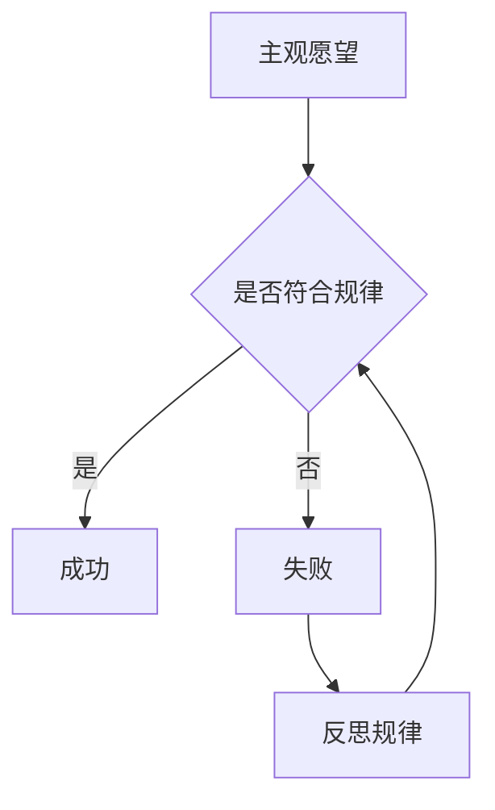

**丁元英观点：**
> "强势文化就是遵循事物规律的文化，弱势文化就是依赖强者的道德期望破格获取的文化。"

**实践要点：**
1. 区分"想要"和"能要"
2. 找到事物运行的底层逻辑
3. 顺应规律，而非对抗规律

---

### 原则二：因果律是根本

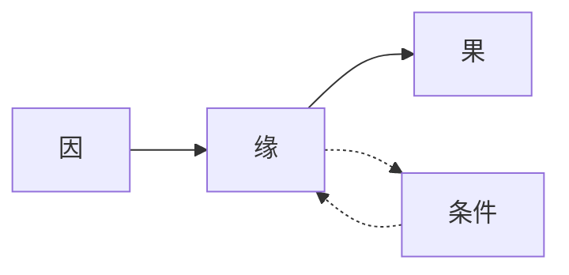

**叶子农观点：**
> "因果律是事物发展的根本规律，种什么因，得什么果。"

**实践要点：**
1. 追溯问题的根本原因
2. 理解条件对结果的影响
3. 从源头解决问题

---

### 原则三：实事求是，见路不走

**叶子农观点：**
> "见路不走，不是不让你走路，而是不让你执着于路。实事求是，就是从实际出发，而不是从经验出发。"

**实践要点：**
1. 不照搬成功经验
2. 从具体问题出发
3. 找到适合自己的路

---

### 原则四：等价交换，不破格获取

**丁元英观点：**
> "市场经济的生存原则是等价交换，任何试图绕过这个原则的行为都是不可持续的。"

**实践要点：**
1. 承认价值交换的本质
2. 提升自己的交换价值
3. 不依赖他人的施舍

---

### 原则五：洞察人性，理解人性

**丁元英观点：**
> "透视社会依次有三个层面：技术、制度和文化。文化是根本，是决定因素。"

**实践要点：**
1. 理解人的行为动机
2. 识别文化属性的影响
3. 设计符合人性的机制

---

## 🔧 思考工具箱

### 工具一：逆向思维（丁元英式）

**核心思想：** 从结果倒推过程

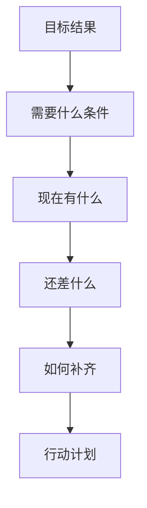

**应用方法：**
```
1. 明确你想要的结果
2. 列出实现这个结果需要的条件
3. 评估你现在拥有的条件
4. 找出差距
5. 制定补齐差距的计划
```

**示例：**
```
目标：3 年内年收入 100 万
↓
需要什么：稳定的客户源、高价值服务、团队
↓
现在有什么：技术能力、一些客户
↓
还差什么：品牌影响力、销售能力、团队管理
↓
如何补齐：建立个人品牌、学习销售、找合伙人
```

---

### 工具二：本质思维（丁元英式）

**核心思想：** 看透事物的本质

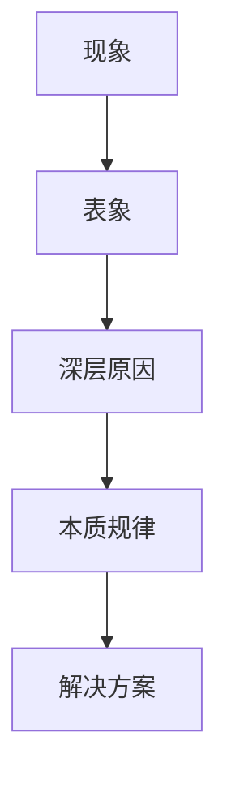

**应用方法：**
```
1. 描述你看到的现象
2. 问自己"为什么会这样？"
3. 继续追问"为什么？"（至少5次）
4. 找到根本原因
5. 针对根本原因设计解决方案
```

**示例：**
```
现象：产品卖不出去
↓
为什么？→ 价格太高
↓
为什么？→ 成本太高
↓
为什么？→ 供应链效率低
↓
为什么？→ 供应商选择不当
↓
本质：供应链管理问题
↓
解决方案：优化供应商体系
```

---

### 工具三：系统思维（全局观）

**核心思想：** 从全局角度思考问题

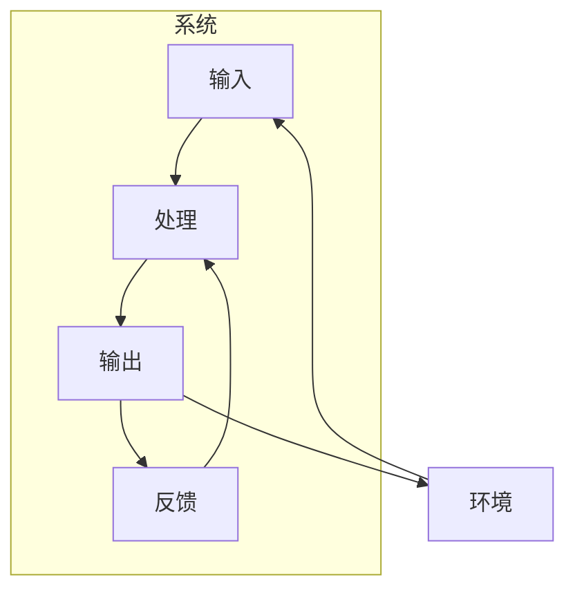

**应用方法：**
```
1. 识别系统的边界
2. 找出系统中的关键要素
3. 分析要素之间的关系
4. 找出系统的瓶颈
5. 从整体优化而非局部优化
```

---

### 工具四：辩证思维（叶子农式）

**核心思想：** 看到事物的两面性

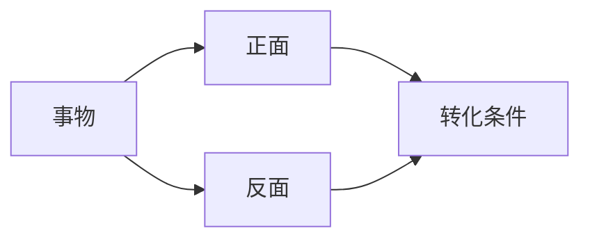

**应用方法：**
```
1. 描述事物的一个方面
2. 思考它的对立面
3. 找出转化的条件
4. 在两面之间找到平衡
```

**示例：**
```
优点：产品功能丰富
↓
反面：复杂度高，用户难以上手
↓
转化条件：简化核心功能，提供渐进式引导
↓
平衡：核心功能简洁，高级功能可选
```

---

### 工具五：因果链分析

**核心思想：** 找到问题的因果链条

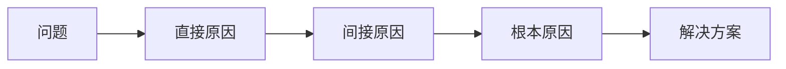

**应用方法：**
```
1. 定义问题
2. 列出所有可能的原因
3. 找出直接原因
4. 继续追溯间接原因
5. 找到根本原因
6. 针对根本原因设计解决方案
```

---

### 工具六：见路不走（叶子农式）

**核心思想：** 不执着于经验，从实际出发

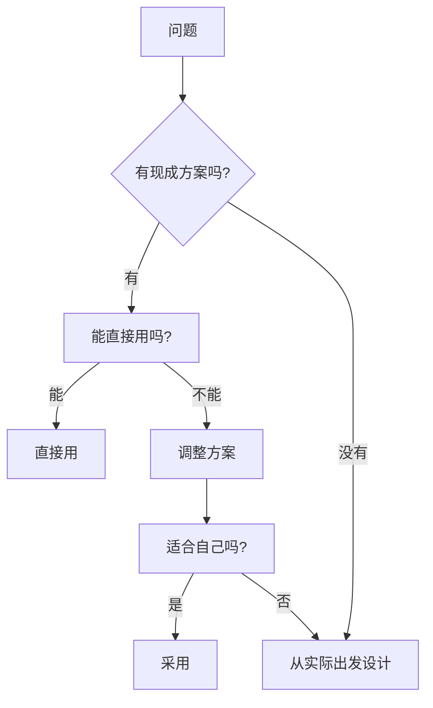

**应用方法：**
```
1. 不问"别人怎么做的"
2. 问"这个问题的本质是什么"
3. 问"我的实际情况是什么"
4. 问"什么方案最适合我"
5. 从实际出发设计方案
```

---

### 工具七：五问法（丰田方法）

**核心思想：** 连续追问 5 个为什么

**应用方法：**
```
问题：为什么项目延期了？
↓
1. 为什么？→ 需求变更频繁
↓
2. 为什么？→ 需求没有明确定义
↓
3. 为什么？→ 没有需求评审流程
↓
4. 为什么？→ 缺乏产品思维
↓
5. 为什么？→ 团队没有产品负责人
↓
根本原因：缺少产品负责人角色
↓
解决方案：招聘或培养产品负责人
```

---

### 工具八：第一性原理

**核心思想：** 回到最基本的事实和原理

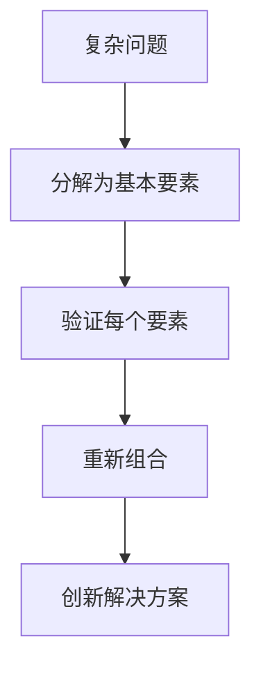

**应用方法：**
```
1. 把问题分解为最基本的事实
2. 验证每个事实是否成立
3. 从事实出发重新思考
4. 找到创新的解决方案
```

**示例：**
```
问题：如何降低服务器成本？
↓
基本事实：
- 服务器成本 = CPU + 内存 + 存储 + 带宽
- 我们的应用大部分时间 CPU 使用率 < 20%
↓
重新思考：
- 是否需要一直运行？
- 是否可以按需启动？
↓
解决方案：使用 Serverless，按请求付费
```

---

### 工具九：矛盾分析法

**核心思想：** 找出主要矛盾和矛盾的主要方面

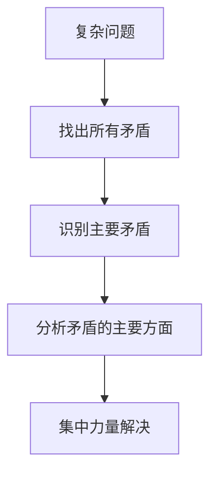

**应用方法：**
```
1. 列出问题中的所有矛盾
2. 找出哪个是主要矛盾
3. 分析主要矛盾的主要方面
4. 集中资源解决主要矛盾
```

---

### 工具十：实践验证

**核心思想：** 实践是检验真理的唯一标准

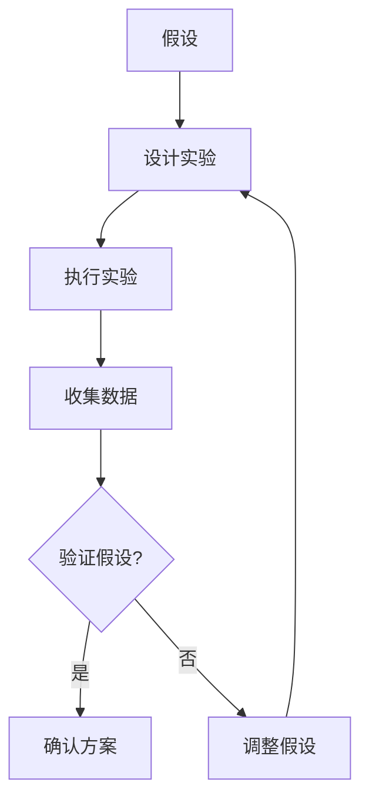

**应用方法：**
```
1. 提出假设
2. 设计小规模实验
3. 执行并收集数据
4. 分析结果
5. 验证或推翻假设
6. 迭代优化
```

---

## 📊 思维模式对比

| 思维模式 | 核心思想 | 适用场景 | 代表人物 |
|---------|---------|---------|---------|
| **逆向思维** | 从结果倒推 | 目标规划 | 丁元英 |
| **本质思维** | 追问为什么 | 问题分析 | 丁元英 |
| **系统思维** | 全局考虑 | 架构设计 | 丁元英 |
| **辩证思维** | 两面性 | 决策权衡 | 叶子农 |
| **因果思维** | 追溯原因 | 问题定位 | 叶子农 |
| **见路不走** | 从实际出发 | 方案设计 | 叶子农 |
| **第一性原理** | 回到本质 | 创新突破 | 丁元英 |

---

## 🎯 实战应用框架

### 问题解决框架

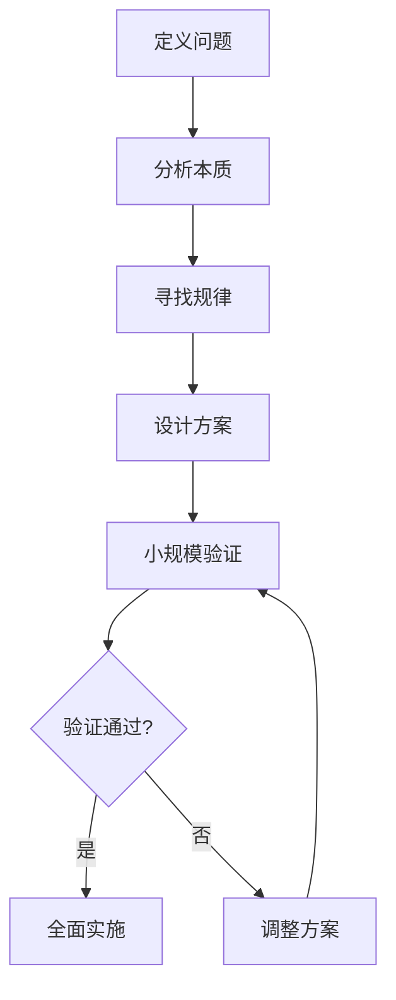

### 决策框架

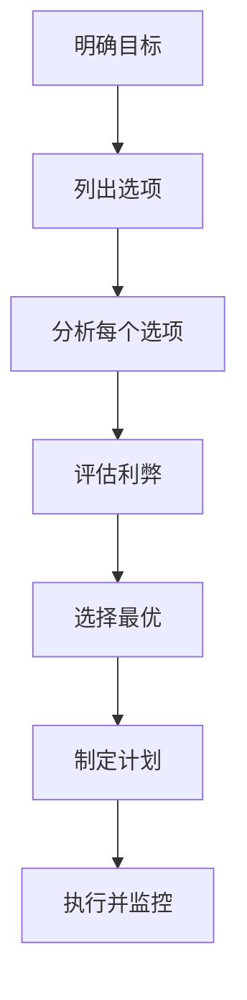

### 学习框架

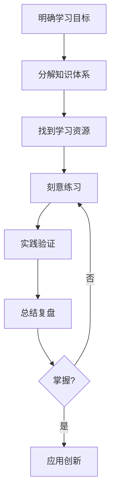

---

## 💡 核心心法

### 丁元英心法

1. **道法自然**：遵循事物的自然规律
2. **如来**：事物本来就是那个样子
3. **不以人的意志为转移**：客观规律不可违背
4. **等价交换**：价值交换是商业的本质
5. **文化属性**：文化决定行为模式

### 叶子农心法

1. **见路不走**：不执着于经验
2. **实事求是**：从实际出发
3. **因果律**：种因得果
4. **不二法门**：超越对立
5. **事物的本来面目**：回到本质

---

## 📋 思维检查清单

### 做决策前

- [ ] 我是否理解了问题的本质？
- [ ] 我是否考虑了所有相关因素？
- [ ] 我是否尊重了客观规律？
- [ ] 我是否从实际出发？
- [ ] 我是否考虑了长期影响？

### 遇到问题时

- [ ] 我是否找到了根本原因？
- [ ] 我是否考虑了因果链条？
- [ ] 我是否从多个角度看问题？
- [ ] 我是否参考了类似案例？
- [ ] 我是否设计了验证方案？

### 做完决策后

- [ ] 我是否设定了验证标准？
- [ ] 我是否准备了备选方案？
- [ ] 我是否安排了复盘时间？
- [ ] 我是否记录了决策过程？
- [ ] 我是否准备了迭代计划？

---

## 📚 推荐阅读

| 书名 | 作者 | 核心思想 |
|------|------|---------|
| 《遥远的救世主》 | 豆豆 | 文化属性、强势文化 |
| 《天幕红尘》 | 豆豆 | 见路不走、实事求是 |
| 《思考，快与慢》 | 丹尼尔·卡尼曼 | 双系统思维 |
| 《第五项修炼》 | 彼得·圣吉 | 系统思考 |
| 《金字塔原理》 | 芭芭拉·明托 | 结构化思维 |

---

**版本**: v1.0 | **更新日期**: 2026-04-30
