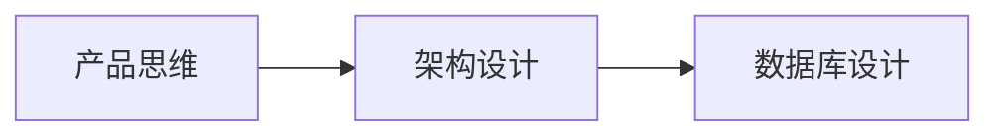
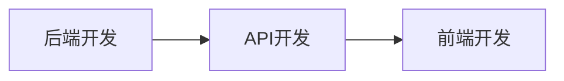
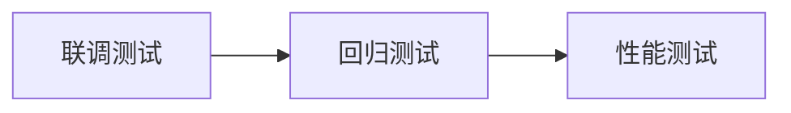
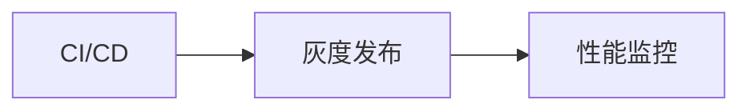

# 🚀 一人公司快速启动路线图

> **PHP 后端开发者** | **快速掌握全栈技能** | **落地商用 Web 项目**

---

## 📋 个人背景分析

**现有技能：**
- ✅ PHP 后端开发
- ✅ Laravel 框架
- ✅ MySQL 数据库

**需要补充：**
- ⬜ 产品思维（需求分析、PRD）
- ⬜ 前端开发（Vue 3）
- ⬜ 运维部署（Docker、CI/CD）
- ⬜ 测试能力（自动化测试）
- ⬜ 项目管理（敏捷开发）

---

## 🎯 学习路线图

### 阶段一：基础夯实（第 1-2 周）



**学习内容：**

| 主题 | 文档位置 | 学习时间 | 优先级 |
|------|---------|---------|--------|
| 需求评审 | `01-product/01-requirement-review.md` | 2小时 | P0 |
| 需求分析 | `01-product/02-requirement-analysis.md` | 4小时 | P0 |
| 系统架构 | `02-architecture/01-system-architecture.md` | 4小时 | P0 |
| 数据库设计 | `02-architecture/02-database-design.md` | 4小时 | P0 |

**学习目标：**
- [ ] 掌握 5W2H 需求分析法
- [ ] 能够编写用户故事和验收标准
- [ ] 理解 DDD 分层架构
- [ ] 能够设计规范的数据库表结构

**实战练习：**
```
为你的项目写一份完整的 PRD 文档：
1. 业务目标分析
2. 用户故事列表（至少 10 个）
3. 数据库 ER 图
4. 架构设计文档
```

---

### 阶段二：开发技能（第 3-4 周）



**学习内容：**

| 主题 | 文档位置 | 学习时间 | 优先级 |
|------|---------|---------|--------|
| 后端开发 | `03-development/02-backend-development.md` | 8小时 | P0 |
| API开发 | `03-development/03-api-development.md` | 6小时 | P0 |
| 前端开发 | `03-development/01-frontend-development.md` | 8小时 | P1 |

**学习目标：**
- [ ] 掌握 Laravel DDD 分层架构
- [ ] 能够设计 RESTful API
- [ ] 理解 Vue 3 Composition API
- [ ] 能够实现前后端分离

**实战练习：**
```
实现一个完整的用户管理模块：
1. 后端：User 模型、Service、Controller
2. API：用户 CRUD 接口
3. 前端：用户列表、表单页面
```

---

### 阶段三：质量保障（第 5-6 周）



**学习内容：**

| 主题 | 文档位置 | 学习时间 | 优先级 |
|------|---------|---------|--------|
| 联调测试 | `04-testing/01-integration-testing.md` | 4小时 | P0 |
| 回归测试 | `04-testing/02-regression-testing.md` | 4小时 | P1 |
| 性能测试 | `04-testing/03-performance-testing.md` | 4小时 | P2 |

**学习目标：**
- [ ] 掌握接口测试方法
- [ ] 能够编写自动化测试
- [ ] 理解性能测试流程

**实战练习：**
```
为用户管理模块编写测试：
1. 单元测试（Service 层）
2. 接口测试（API 层）
3. 使用 Pest PHP 编写
```

---

### 阶段四：运维部署（第 7-8 周）



**学习内容：**

| 主题 | 文档位置 | 学习时间 | 优先级 |
|------|---------|---------|--------|
| CI/CD | `05-devops/01-ci-cd.md` | 6小时 | P0 |
| 灰度发布 | `05-devops/02-canary-release.md` | 4小时 | P2 |
| 性能监控 | `05-devops/03-monitoring.md` | 4小时 | P2 |

**学习目标：**
- [ ] 掌握 Docker 容器化
- [ ] 能够配置 GitHub Actions
- [ ] 理解灰度发布策略

**实战练习：**
```
搭建完整的 CI/CD 流水线：
1. 编写 Dockerfile
2. 配置 docker-compose.yml
3. 创建 GitHub Actions 工作流
4. 部署到云服务器
```

---

### 阶段五：流程规范（第 9-10 周）

**学习内容：**

| 主题 | 文档位置 | 学习时间 | 优先级 |
|------|---------|---------|--------|
| 开发流程 | `06-workflow/01-development-workflow.md` | 2小时 | P1 |
| 代码审查 | `doc/prompts/cards/01-roles/code-reviewer.md` | 2小时 | P1 |

**学习目标：**
- [ ] 建立个人开发流程
- [ ] 掌握代码审查标准

---

## 📊 学习时间规划

### 10 周学习计划

| 周次 | 主题 | 每日学习时间 | 产出 |
|------|------|-------------|------|
| 1 | 需求分析 | 2小时 | PRD 文档 |
| 2 | 架构设计 | 2小时 | 架构文档 |
| 3 | 后端开发 | 3小时 | 后端代码 |
| 4 | API + 前端 | 3小时 | API + 页面 |
| 5 | 联调测试 | 2小时 | 测试用例 |
| 6 | 自动化测试 | 2小时 | 测试代码 |
| 7 | Docker 部署 | 3小时 | Docker 配置 |
| 8 | CI/CD 流水线 | 3小时 | GitHub Actions |
| 9 | 流程规范 | 2小时 | 开发规范 |
| 10 | 实战项目 | 4小时 | 完整项目 |

**总学习时间：** 约 80 小时

---

## 🎯 高效学习方法

### 1. 费曼学习法

```
学习 → 理解 → 教会别人 → 简化表达
```

**实践方法：**
- 每学完一个主题，写一篇博客
- 向虚拟的"小白"解释概念
- 用简单的语言重写文档

### 2. 项目驱动学习

```
学习 → 实践 → 反馈 → 迭代
```

**实践方法：**
- 以真实项目为目标
- 边学边做，即时验证
- 遇到问题再深入学习

### 3. 刻意练习

```
分解 → 专注 → 反馈 → 调整
```

**实践方法：**
- 将大技能分解为小技能
- 针对薄弱环节专项练习
- 寻求反馈并持续改进

### 4. 间隔重复

```
学习 → 复习 → 再复习 → 长期记忆
```

**实践方法：**
- 使用 Anki 制作知识卡片
- 每周复习一次
- 重要概念反复巩固

---

## 🚀 实战项目建议

### 推荐项目类型

| 项目类型 | 复杂度 | 学习价值 | 推荐度 |
|---------|--------|---------|--------|
| 个人博客 | 低 | 中 | ⭐⭐⭐ |
| 电商系统 | 高 | 高 | ⭐⭐⭐⭐⭐ |
| CRM 系统 | 中 | 高 | ⭐⭐⭐⭐ |
| SaaS 平台 | 高 | 高 | ⭐⭐⭐⭐⭐ |

### 推荐：电商系统

**为什么选择电商系统？**
1. 覆盖全栈技能
2. 业务复杂度适中
3. 市场需求大
4. 可以快速变现

**功能模块：**
```
1. 用户模块（注册、登录、个人中心）
2. 商品模块（商品管理、分类、搜索）
3. 订单模块（下单、支付、发货）
4. 营销模块（优惠券、满减）
5. 后台管理（Filament）
```

---

## 📚 学习资源

### 必读文档

| 文档 | 位置 | 说明 |
|------|------|------|
| 全流程规范 | `doc/allInOne/README.md` | 总览文档 |
| 后端开发 | `doc/allInOne/03-development/02-backend-development.md` | Laravel DDD |
| API 开发 | `doc/allInOne/03-development/03-api-development.md` | RESTful 设计 |
| CI/CD | `doc/allInOne/05-devops/01-ci-cd.md` | 自动化部署 |

### 推荐书籍

| 书名 | 作者 | 说明 |
|------|------|------|
| 《重构》 | Martin Fowler | 代码质量 |
| 《设计模式》 | GoF | 架构设计 |
| 《Laravel 设计模式》 | - | Laravel 最佳实践 |

### 推荐工具

| 工具 | 用途 | 推荐度 |
|------|------|--------|
| VS Code | 代码编辑 | ⭐⭐⭐⭐⭐ |
| Postman | API 测试 | ⭐⭐⭐⭐ |
| Docker Desktop | 容器化 | ⭐⭐⭐⭐⭐ |
| GitHub | 代码托管 | ⭐⭐⭐⭐⭐ |

---

## 📊 学习进度跟踪

### 每日打卡模板

```markdown
# 学习打卡 - {date}

## 今日学习
- [ ] {学习内容1}
- [ ] {学习内容2}

## 学习时长
{小时} 小时

## 学习笔记
{笔记内容}

## 遇到问题
{问题描述}

## 明日计划
{计划内容}
```

### 周度复盘模板

```markdown
# 周度复盘 - 第 {n} 周

## 本周完成
- [x] {完成项1}
- [x] {完成项2}

## 本周收获
{收获内容}

## 遇到的问题
{问题及解决方案}

## 下周计划
{计划内容}

## 学习效率评估
- 学习时长: {小时} 小时
- 产出质量: ⭐⭐⭐⭐⭐
- 效率评分: {分}/10
```

---

## 🎯 关键里程碑

| 里程碑 | 时间 | 交付物 | 检查标准 |
|--------|------|--------|---------|
| M1 | 第 2 周末 | PRD 文档 | 能够独立完成需求分析 |
| M2 | 第 4 周末 | 后端代码 | 能够实现完整 CRUD |
| M3 | 第 6 周末 | 测试代码 | 测试覆盖率达到 80% |
| M4 | 第 8 周末 | CI/CD 配置 | 能够自动部署 |
| M5 | 第 10 周末 | 完整项目 | 可上线的商用项目 |

---

## 💡 成功关键

1. **坚持学习**：每天至少 2 小时
2. **项目驱动**：以真实项目为目标
3. **及时反馈**：遇到问题立即解决
4. **持续改进**：每周复盘优化
5. **社区交流**：加入开发者社区

---

**版本**: v1.0 | **更新日期**: 2026-04-30 | **作者**: P9 架构师
