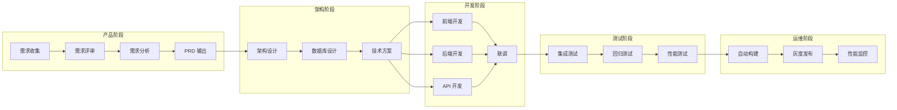
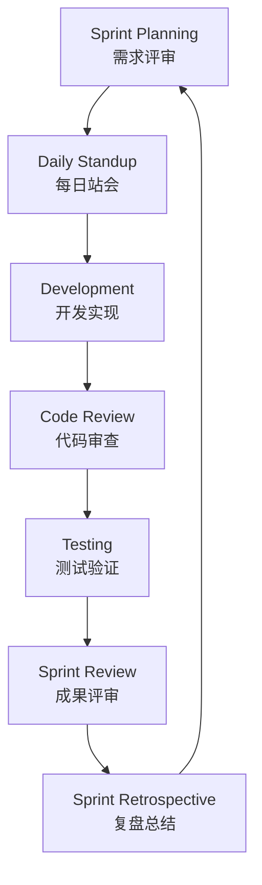

# 📘 一人公司软件开发全流程规范

> **阿里 P9 架构师方案** | **从需求到运维** | **系统化最佳实践**

---

## 📋 文档结构

```
doc/allInOne/
├── README.md                           # 本文档（总览）
│
├── 01-product/                         # 产品阶段
│   ├── 01-requirement-review.md        # 需求评审规范
│   └── 02-requirement-analysis.md      # 需求分析规范
│
├── 02-architecture/                    # 架构阶段
│   ├── 01-system-architecture.md       # 系统架构设计
│   └── 02-database-design.md           # 数据库设计规范
│
├── 03-development/                     # 开发阶段
│   ├── 01-frontend-development.md      # 前端开发规范
│   ├── 02-backend-development.md       # 后端开发规范
│   └── 03-api-development.md           # API 开发规范
│
├── 04-testing/                         # 测试阶段
│   ├── 01-integration-testing.md       # 联调测试规范
│   ├── 02-regression-testing.md        # 回归测试规范
│   └── 03-performance-testing.md       # 性能测试规范
│
├── 05-devops/                          # 运维阶段
│   ├── 01-ci-cd.md                     # 自动构建与部署
│   ├── 02-canary-release.md            # 灰度发布规范
│   └── 03-monitoring.md                # 性能监控规范
│
└── 06-workflow/                        # 工作流程
    └── 01-development-workflow.md      # 开发流程规范
```

---

## 🎯 全流程概览



---

## 📊 阶段产出物

| 阶段 | 产出物 | 文档位置 |
|------|--------|---------|
| **产品阶段** | PRD、用户故事、验收标准 | `01-product/` |
| **架构阶段** | 架构图、数据库设计、技术方案 | `02-architecture/` |
| **开发阶段** | 前端代码、后端代码、API 接口 | `03-development/` |
| **测试阶段** | 测试用例、测试报告、缺陷报告 | `04-testing/` |
| **运维阶段** | CI/CD 配置、监控告警、运维手册 | `05-devops/` |

---

## 🔄 迭代周期



**推荐迭代周期：** 2 周

| 活动 | 时间 | 参与者 |
|------|------|--------|
| Sprint Planning | 周一 10:00 | 全员 |
| Daily Standup | 每天 9:30 | 全员 |
| Code Review | 持续进行 | 开发者 |
| Sprint Review | 周五 14:00 | 全员 |
| Retrospective | 周五 15:00 | 全员 |

---

## 🛠️ 技术栈

| 层级 | 技术选型 | 说明 |
|------|---------|------|
| **前端** | Vue 3 + Vite + TailwindCSS | 现代化前端方案 |
| **后端** | Laravel 12 + PHP 8.2 | 成熟稳定的后端框架 |
| **数据库** | MySQL 8.0 + Redis 7.0 | 关系型 + 缓存 |
| **消息队列** | RabbitMQ | 异步任务处理 |
| **测试** | Pest PHP + PHPUnit | 现代化测试框架 |
| **CI/CD** | GitHub Actions | 自动化构建部署 |
| **监控** | Laravel Telescope + Horizon | 应用监控 |
| **容器** | Docker + Docker Compose | 容器化部署 |

---

## 📈 质量指标

| 指标 | 目标 | 说明 |
|------|------|------|
| **代码覆盖率** | ≥ 80% | 单元测试覆盖率 |
| **Bug 修复率** | ≥ 95% | 缺陷修复及时率 |
| **部署频率** | 每周 1-2 次 | 持续交付能力 |
| **故障恢复时间** | < 30 分钟 | MTTR 目标 |
| **API 响应时间** | < 200ms | P95 响应时间 |
| **系统可用性** | ≥ 99.9% | SLA 目标 |

---

## 🎭 角色职责

| 角色 | 职责 | 一人公司适配 |
|------|------|-------------|
| **产品经理** | 需求收集、PRD 编写 | 开发者兼任 |
| **架构师** | 系统设计、技术选型 | 开发者兼任 |
| **前端开发** | 界面实现、交互开发 | 开发者兼任 |
| **后端开发** | 业务逻辑、API 开发 | 开发者兼任 |
| **测试工程师** | 测试用例、质量保障 | 开发者兼任 |
| **运维工程师** | 部署运维、监控告警 | 开发者兼任 |

---

## 📚 快速导航

### 按角色

| 角色 | 推荐阅读 |
|------|---------|
| **产品经理** | `01-product/` |
| **架构师** | `02-architecture/` |
| **前端开发** | `03-development/01-frontend-development.md` |
| **后端开发** | `03-development/02-backend-development.md` |
| **测试工程师** | `04-testing/` |
| **运维工程师** | `05-devops/` |

### 按阶段

| 阶段 | 推荐阅读 |
|------|---------|
| **需求阶段** | `01-product/01-requirement-review.md` |
| **设计阶段** | `02-architecture/01-system-architecture.md` |
| **开发阶段** | `03-development/` |
| **测试阶段** | `04-testing/` |
| **运维阶段** | `05-devops/` |

---

**版本**: v1.0 | **更新日期**: 2026-04-30 | **作者**: P9 架构师
