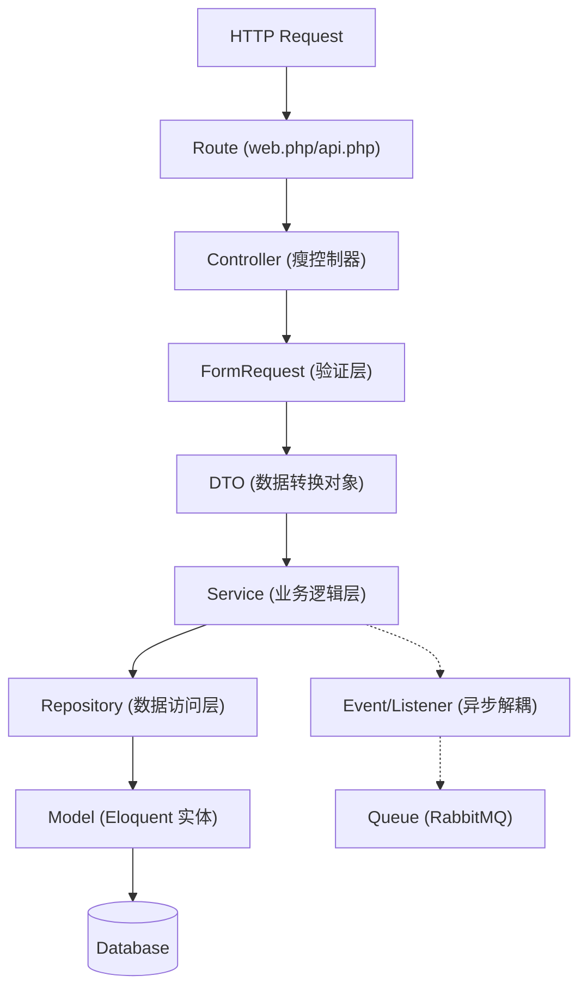

# 🏗️ 系统架构与技术选型规范文档 (System Architecture Specification)

**版本**: v1.0.0  
**技术栈**: Laravel 12 + Filament 3.x + MySQL 8.0 + Redis 7.0  
**设计者**: P9 全栈架构师  

---

## 1. 技术栈版本推荐与选型理由

为了确保“一人公司”开发模式下的稳定性与高性能，我们选择经过生产环境验证的成熟版本组合。

| 组件 | 推荐版本 | 选型理由 |
| :--- | :--- | :--- |
| **PHP** | **8.2 LTS** | Laravel 12 的最低要求。支持构造函数属性提升、`readonly` 类，对 DDD 值对象封装极其友好。 |
| **Laravel** | **12.x** | 采用最新的 LTS 分支，享受官方长期安全支持，集成更简洁的默认配置。 |
| **Filament** | **3.2+** | 基于 Livewire 3，性能大幅提升。其 Schema 语法和插件生态能极大缩短后台开发周期。 |
| **MySQL** | **8.0+** | 必须使用 8.0 以支持 **CTE（公用表表达式）**，这对分销体系的递归查询至关重要。 |
| **Redis** | **7.0** | 用于会话管理、缓存及队列驱动。7.0 在内存压缩和稳定性上表现优异。 |
| **RabbitMQ** | **3.12+** | 处理高并发订单、异步通知及日志审计。相比 Redis 队列，提供更可靠的消息持久化。 |
| **Queue Driver** | **horizon** | 配合 RabbitMQ 使用，提供可视化的队列监控面板，方便排查失败任务。 |

---

## 2. 认证与鉴权体系设计 (Auth & RBAC)

采用 **Multi-Auth** 策略，实现前台用户与后台管理的物理隔离。

### 2.1 账号体系划分
*   **前台 (Customer)**: 
    *   **模型**: `App\Models\Customer`
    *   **Guard**: `customer` (Session/Token)
    *   **场景**: C 端小程序、H5、API 接口。
*   **后台 (Admin)**:
    *   **模型**: `App\Models\Admin`
    *   **Guard**: `admin` (Session)
    *   **场景**: Filament 后台管理系统。

### 2.2 RBAC 权限控制方案
*   **核心包**: `spatie/laravel-permission`
*   **实现逻辑**:
    1.  **角色 (Roles)**: 定义如 `super_admin`, `finance_manager`, `store_keeper`。
    2.  **权限 (Permissions)**: 细化到按钮级，如 `order.refund`, `product.publish`。
    3.  **Filament 集成**: 利用 `Filament\Pages\Auth\Login` 自定义登录页，并在 `AdminPanelProvider` 中通过 `->authGuard('admin')` 绑定 Guard。

### 2.3 会话与安全
*   **前台**: 建议使用 Sanctum Token 认证，便于多端（iOS/Android/Web）共享状态。
*   **后台**: 使用 Session 认证，开启 `secure` 和 `http_only` 选项，防止 XSS 窃取 Cookie。

---

## 3. 代码调用链路与分层架构

遵循 **DDD（领域驱动设计）** 思想，采用六边形架构变体，确保业务逻辑与框架解耦。

### 3.1 完整调用链路图



### 3.2 各层级职责说明
1.  **Controller**: 仅负责接收请求、调用 Service、返回响应。**严禁**包含任何业务逻辑。
2.  **FormRequest/DTO**: 
    *   `FormRequest`: 负责参数校验（Validation）。
    *   `DTO`: 负责将数组数据转换为强类型对象，在 Service 之间传递，保证**不可变性**。
3.  **Service**: 系统的“大脑”。负责事务控制、跨模块协调（如：下单时扣减库存并增加积分）。
4.  **Repository**: 抽象数据访问细节。如果未来需要从 MySQL 迁移到 ES，只需修改此层。
5.  **Model**: 仅定义关联关系、Accessors/Mutators 和 Scopes。

---

## 4. 开发规范与协作 (DDD 目录结构)

为了支持电商、O2O、分销等多模块并行开发，采用 **模块化目录结构**。

### 4.1 目录结构规范
```text
app/
├── Domains/                  # 领域边界
│   ├── User/                 # 用户域 (RBAC, Customer)
│   ├── Product/              # 商品域 (SPU, SKU, Category)
│   ├── Trade/                # 交易域 (Order, Cart, Payment)
│   ├── O2O/                  # 预约域 (Appointment, Store)
│   └── Distribution/         # 分销域 (Commission, Relationship)
│
├── Infrastructure/           # 基础设施
│   ├── Repositories/         # 具体实现
│   └── Services/             # 第三方服务集成 (支付宝, 短信)
│
├── Filament/                 # 后台资源
│   ├── Resources/
│   └── Widgets/
│
└── Http/                     # 接入层
    ├── Controllers/
    └── Requests/
```

### 4.2 模块协作原则
*   **依赖倒置**: 上层模块（Trade）不能直接调用下层模块（Product）的 Service，应通过 **Domain Events** 或 **Interface** 进行解耦。
*   **命名规范**:
    *   Service: `Trade\OrderService`
    *   DTO: `Trade\Data\OrderCreateData`
    *   Event: `Trade\Events\OrderCreated`

### 4.3 数据库设计规范
*   **主键**: 统一使用 `BIGINT UNSIGNED AUTO_INCREMENT`。
*   **软删除**: 核心业务表（订单、商品）必须开启 `SoftDeletes`。
*   **金额字段**: 统一使用 `DECIMAL(10, 2)`，严禁使用 `FLOAT/DOUBLE`。

---

## 5. 运维与监控建议

*   **本地调试**: 启用 `laravel/telescope`，实时监控请求、异常和 SQL 性能。
*   **队列监控**: 部署 `laravel/horizon`，监控 RabbitMQ 队列积压情况。
*   **日志审计**: 支付回调、资产变动等敏感操作必须记录独立日志通道 (`payment.log`, `asset.log`)。

---

**附录**: 
*   [PRD 索引](../PRD/00-PRD-INDEX.md)
*   [提示词知识库](../../prompts/cards/)
