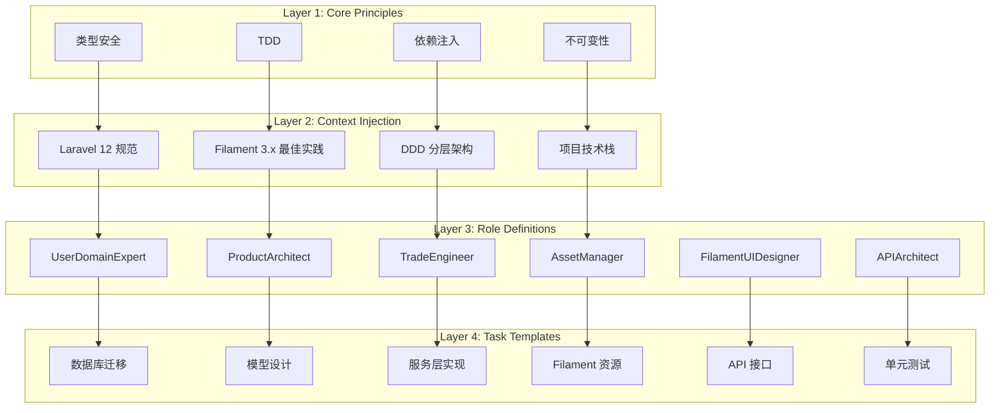
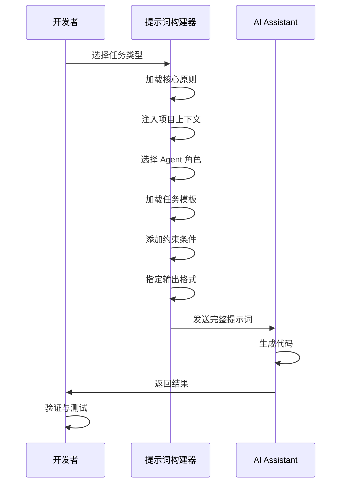
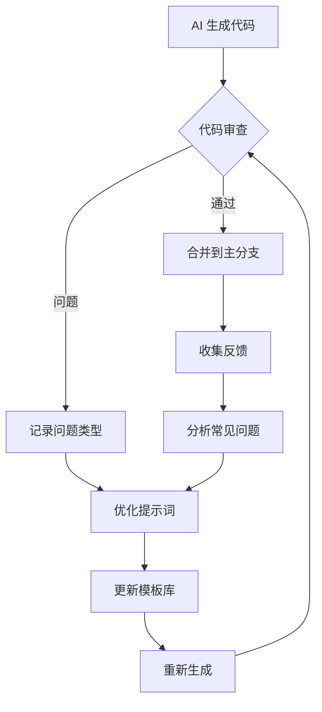

# 🏗️ Laravel + Filament AI 辅助开发提示词工程方案

## 📋 目录

1. [方案概述](#方案概述)
2. [核心设计理念](#核心设计理念)
3. [提示词体系架构](#提示词体系架构)
4. [模块化组件库](#模块化组件库)
5. [工作流程与组装逻辑](#工作流程与组装逻辑)
6. [AI IDE 适配指南](#ai-ide-适配指南)
7. [实战模板示例](#实战模板示例)
8. [质量保障机制](#质量保障机制)

---

## 方案概述

### 背景

本方案基于 **laravel-demo** 项目中已验证的最佳实践，包括：
- ✅ DDD（领域驱动设计）分层架构
- ✅ Filament 3.x 后台管理系统
- ✅ Multi-Auth 多认证体系
- ✅ SPU/SKU 商品模型
- ✅ 订单状态机与支付集成
- ✅ 资产复式记账系统

目标是为 **laravel-filament** 基础框架构建一套**可复用、可组合、高质量**的 AI 辅助开发提示词体系。

### 目标系统功能

| 模块 | 核心功能 | 技术要点 |
|------|---------|---------|
| **电商核心** | SPU/SKU、购物车、订单、支付 | DDD、状态机、幂等性 |
| **O2O 预约核销** | 预约管理、时间片、二维码、门店 | 时间算法、QR Code、地理定位 |
| **分销体系** | 多级分销、佣金计算、提现、海报 | 树形结构、递归算法、图片生成 |

### 设计原则

1. **类型安全优先**：所有代码必须声明严格类型
2. **测试驱动开发**：先写测试，再实现功能
3. **依赖注入**：通过构造函数注入服务
4. **不可变性**：DTO 对象设计为只读
5. **单一职责**：每个提示词聚焦一个任务

---

## 核心设计理念

### 1. 提示词即代码 (Prompt as Code)

将提示词视为可版本控制、可测试、可复用的"代码"，具备以下特性：

```yaml
特性:
  - 模块化: 拆分为独立可组合的片段
  - 参数化: 支持动态变量替换
  - 可测试: 有明确的输入输出预期
  - 可迭代: 根据反馈持续优化
```

### 2. 四层抽象模型

```
┌─────────────────────────────────────┐
│  Layer 4: Task Templates (任务模板)  │  ← 具体任务（如：创建订单服务）
├─────────────────────────────────────┤
│  Layer 3: Role Definitions (角色定义) │  ← Agent 角色（如：TradeEngineer）
├─────────────────────────────────────┤
│  Layer 2: Context Injection (上下文)  │  ← 项目规范、技术栈、约束条件
├─────────────────────────────────────┤
│  Layer 1: Core Principles (核心原则)  │  ← 类型安全、TDD、DI 等
└─────────────────────────────────────┘
```

### 3. 提示词组装公式

```
完整提示词 = 核心原则 + 角色定义 + 上下文注入 + 任务描述 + 约束条件 + 输出格式
```

---

## 提示词体系架构

### 整体架构图



### 目录结构设计

```
doc/prompts/
├── 00-core/                          # Layer 1: 核心原则
│   ├── type-safety.md
│   ├── tdd-guidelines.md
│   ├── dependency-injection.md
│   └── immutability.md
│
├── 01-context/                       # Layer 2: 上下文注入
│   ├── laravel-12-standards.md
│   ├── filament-best-practices.md
│   ├── ddd-architecture.md
│   └── tech-stack.md
│
├── 02-roles/                         # Layer 3: 角色定义
│   ├── UserDomainExpert.md
│   ├── ProductArchitect.md
│   ├── TradeEngineer.md
│   ├── AssetManager.md
│   ├── FilamentUIDesigner.md
│   └── APIArchitect.md
│
├── 03-tasks/                         # Layer 4: 任务模板
│   ├── database/
│   │   ├── migration-template.md
│   │   ├── seeders-template.md
│   │   └── relationships-template.md
│   │
│   ├── models/
│   │   ├── eloquent-model-template.md
│   │   ├── value-object-template.md
│   │   └── dto-template.md
│   │
│   ├── services/
│   │   ├── service-class-template.md
│   │   ├── repository-template.md
│   │   └── event-listener-template.md
│   │
│   ├── filament/
│   │   ├── resource-template.md
│   │   ├── widget-template.md
│   │   └── action-template.md
│   │
│   ├── api/
│   │   ├── controller-template.md
│   │   ├── form-request-template.md
│   │   └── api-resource-template.md
│   │
│   └── testing/
│       ├── feature-test-template.md
│       ├── unit-test-template.md
│       └── pest-testing-guide.md
│
├── 04-domains/                       # 领域特定提示词
│   ├── user-domain/
│   │   ├── auth-system.md
│   │   ├── rbac-permissions.md
│   │   └── customer-profile.md
│   │
│   ├── product-domain/
│   │   ├── spu-sku-model.md
│   │   ├── inventory-service.md
│   │   └── combo-system.md
│   │
│   ├── trade-domain/
│   │   ├── cart-service.md
│   │   ├── order-state-machine.md
│   │   └── payment-integration.md
│   │
│   ├── asset-domain/
│   │   ├── balance-management.md
│   │   ├── points-system.md
│   │   └── membership-levels.md
│   │
│   ├── o2o-domain/                   # O2O 特有领域
│   │   ├── appointment-system.md
│   │   ├── timeslot-management.md
│   │   ├── qrcode-verification.md
│   │   └── store-location.md
│   │
│   └── distribution-domain/          # 分销体系
│       ├── multi-level-tree.md
│       ├── commission-calculation.md
│       ├── withdrawal-review.md
│       └── poster-generation.md
│
├── 05-workflows/                     # 工作流编排
│   ├── new-feature-workflow.md
│   ├── bug-fix-workflow.md
│   ├── refactoring-workflow.md
│   └── code-review-workflow.md
│
└── README.md                         # 使用指南
```

---

## 模块化组件库

### 1. 核心原则组件 (Layer 1)

#### type-safety.md
```markdown
## 类型安全规范

**强制要求：**
- 所有 PHP 文件必须声明 `declare(strict_types=1);`
- 所有方法必须声明参数类型和返回类型
- 避免使用 `mixed` 类型，除非绝对必要
- 使用 Union Types 表达多种可能类型
- 优先使用 Readonly 类和 DTO

**示例：**
```php
<?php

declare(strict_types=1);

readonly class OrderData
{
    public function __construct(
        public string $orderSn,
        public int $customerId,
        public float $totalAmount,
        public array $items,
    ) {}
}
```
```

#### tdd-guidelines.md
```markdown
## TDD 开发流程

**红-绿-重构循环：**
1. **Red**: 编写失败的测试
2. **Green**: 编写最少代码使测试通过
3. **Refactor**: 重构代码保持测试通过

**测试优先级：**
- Feature Tests: 验证业务流程
- Unit Tests: 验证单一逻辑
- Pest PHP: 使用更简洁的语法

**覆盖率要求：**
- 核心业务逻辑：≥ 90%
- 服务层：≥ 80%
- 控制器：≥ 70%
```

### 2. 上下文注入组件 (Layer 2)

#### laravel-12-standards.md
```markdown
## Laravel 12 开发规范

**项目配置：**
- PHP 版本：8.2+
- 框架版本：Laravel 12.x
- 包管理器：Composer + NPM

**目录规范：**
- Models: `app/Models/`
- Services: `app/Services/`
- Repositories: `app/Repositories/`
- DTOs: `app/DataTransferObjects/`
- Value Objects: `app/ValueObjects/`
- Events: `app/Events/`
- Listeners: `app/Listeners/`

**命名约定：**
- 模型：单数，PascalCase（如：`OrderItem`）
- 控制器：复数 + Controller（如：`OrderItemsController`）
- 服务：功能 + Service（如：`OrderService`）
- 请求：动词 + Request（如：`StoreOrderRequest`）
```

#### ddd-architecture.md
```markdown
## DDD 分层架构

**层次划分：**
```
┌─────────────────────────┐
│   Presentation Layer    │  ← Controllers, Filament Resources
├─────────────────────────┤
│   Application Layer     │  ← Services, DTOs, Commands
├─────────────────────────┤
│   Domain Layer          │  ← Models, Value Objects, Events
├─────────────────────────┤
│   Infrastructure Layer  │  ← Repositories, External APIs
└─────────────────────────┘
```

**依赖规则：**
- 上层可以依赖下层
- 下层不能依赖上层
- Domain Layer 不依赖任何框架
- 使用接口解耦 Infrastructure Layer
```

### 3. 角色定义组件 (Layer 3)

#### TradeEngineer.md
```markdown
# 🤖 Agent: TradeEngineer (交易工程师)

## 职责
构建订单状态机、购物车逻辑、支付网关集成及幂等性处理。

## 核心技能
- **State Pattern**: 使用 `spatie/laravel-model-states` 管理订单流转
- **Database Transactions**: 确保下单、扣库、记流水原子性执行
- **Idempotency Keys**: 防止网络抖动导致的重复支付或下单
- **Event-Driven**: 订单事件驱动资产变动、通知发送

## 输出规范
1. 订单创建必须包含防重提交逻辑
2. 支付回调接口必须验证签名并记录原始报文
3. 所有资金操作必须在事务中完成
4. 订单状态变更必须触发相应事件

## 典型任务
- 设计订单状态机
- 实现购物车服务
- 集成支付网关（支付宝、微信）
- 处理支付回调
- 实现退款流程
```

#### FilamentUIDesigner.md
```markdown
# 🎨 Agent: FilamentUIDesigner (Filament UI 设计师)

## 职责
构建美观、易用的 Filament 后台管理界面，包括资源列表、表单、筛选器、操作按钮等。

## 核心技能
- **Resource Design**: 创建 Table、Form、RelationManager
- **Custom Actions**: 实现自定义操作按钮
- **Widgets**: 创建统计图表和数据看板
- **Permissions**: 集成 Spatie Permission 进行权限控制
- **UX Optimization**: 优化用户体验和交互流程

## 输出规范
1. 所有字段必须有清晰的 Label
2. 必填字段必须标注 `required()`
3. 敏感操作必须有确认对话框
4. 列表页必须支持筛选和排序
5. 大数据量必须使用分页或懒加载

## 典型任务
- 创建 CRUD 资源页面
- 设计数据统计看板
- 实现批量操作
- 定制表单字段
- 添加导出功能
```

### 4. 任务模板组件 (Layer 4)

#### migration-template.md
```markdown
# 数据库迁移模板

## 任务描述
创建 `{table_name}` 表的迁移文件。

## 上下文信息
- 表名：`{table_name}`
- 所属领域：`{domain}`
- 关联表：`{related_tables}`

## 要求
1. 使用合适的字段类型
2. 添加必要的索引
3. 设置外键约束
4. 添加字段注释
5. 考虑软删除（如需要）

## 输出格式
```php
<?php

declare(strict_types=1);

use Illuminate\Database\Migrations\Migration;
use Illuminate\Database\Schema\Blueprint;
use Illuminate\Support\Facades\Schema;

return new class extends Migration
{
    public function up(): void
    {
        Schema::create('{table_name}', function (Blueprint $table) {
            $table->id();
            
            // TODO: 添加字段
            
            $table->timestamps();
            $table->softDeletes(); // 如需要
            
            // 索引
            $table->index(['field1', 'field2']);
            
            // 外键
            $table->foreignId('related_id')
                ->constrained('related_table')
                ->onDelete('cascade');
        });
    }

    public function down(): void
    {
        Schema::dropIfExists('{table_name}');
    }
};
```

## 示例参考
参考项目中的 `database/migrations/2026_04_22_150001_create_spus_table.php`
```

#### service-class-template.md
```markdown
# 服务类实现模板

## 任务描述
创建 `{service_name}` 服务类，实现 `{business_logic}` 功能。

## 角色
@{role}

## 上下文
- 所属领域：`{domain}`
- 依赖服务：`{dependencies}`
- 相关模型：`{models}`

## 开发原则
- ✅ 使用构造函数注入依赖
- ✅ 所有公共方法必须有类型声明
- ✅ 复杂逻辑拆分为私有方法
- ✅ 使用事务保证数据一致性
- ✅ 抛出明确的异常消息

## 输出格式
```php
<?php

declare(strict_types=1);

namespace App\Services;

use App\Models\{Model};
use Illuminate\Support\Facades\DB;
use RuntimeException;

class {ServiceName}
{
    public function __construct(
        protected {Dependency} ${dependency},
    ) {}

    /**
     * {method_description}
     *
     * @throws RuntimeException
     */
    public function {method_name}({parameters}): {return_type}
    {
        return DB::transaction(function () use ({variables}) {
            // TODO: 实现业务逻辑
            
            return $result;
        });
    }
}
```

## 测试要求
编写对应的 PHPUnit/Pest 测试用例，覆盖：
- 正常流程
- 异常情况
- 边界条件
```

---

## 工作流程与组装逻辑

### 完整开发工作流


### 提示词组装流程



### 新特征开发工作流模板

#### new-feature-workflow.md
```markdown
# 新功能开发工作流

## 步骤 1: 需求澄清
**提示词：**
```
作为 {Role}，请帮我分析以下需求：
{feature_description}

请输出：
1. 涉及的领域模型
2. 需要的数据库表
3. 核心业务流程
4. 可能的边界情况
```

## 步骤 2: 数据库设计
**提示词：**
```
@ProductArchitect 

基于上述分析，请设计数据库迁移文件。

要求：
- 遵循 Laravel 迁移规范
- 添加必要的索引和外键
- 考虑性能优化
```

## 步骤 3: 模型实现
**提示词：**
```
@ProductArchitect

请创建 Eloquent 模型，包括：
- fillable 属性
- casts 转换
- 关联关系
- Accessors/Mutators
- Scopes
```

## 步骤 4: 服务层开发
**提示词：**
```
@TradeEngineer

实现核心业务逻辑服务类。

要求：
- 使用依赖注入
- 事务保护
- 异常处理
- 事件触发
```

## 步骤 5: Filament 资源
**提示词：**
```
@FilamentUIDesigner

创建后台管理资源，包括：
- Table 列定义
- Form 表单字段
- Filters 筛选器
- Actions 操作按钮
```

## 步骤 6: 测试编写
**提示词：**
```
作为 QA Engineer，请编写测试用例。

覆盖场景：
- 正常流程
- 异常处理
- 边界条件
- 并发安全
```

## 步骤 7: 代码审查
**提示词：**
```
请审查以下代码，检查：
- 类型安全
- 命名规范
- 代码复用
- 性能问题
- 安全隐患
```
```

---

## AI IDE 适配指南

### 1. Lingma (通义灵码)

**特点：**
- 支持 MCP (Model Context Protocol)
- 深度集成 VSCode/JetBrains
- 支持自定义 Skills

**适配策略：**

```json
// .mcp.json
{
    "mcpServers": {
        "laravel-boost": {
            "command": "php",
            "args": ["artisan", "boost:mcp"]
        }
    }
}
```

**提示词格式：**
```markdown
# Lingma 专用提示词结构

## 角色
@{Role}

## 任务
{task_description}

## 上下文
- 项目：laravel-filament
- 技术栈：Laravel 12 + Filament 3.x
- 规范：参考 doc/prompts/01-context/

## 约束
- 严格类型声明
- TDD 开发
- 依赖注入

## 输出
生成完整的 PHP 代码，包含：
1. 文件路径
2. 完整代码
3. 使用说明
```

**Skills 配置：**
```json
// boost.json
{
    "skills": [
        "laravel-best-practices",
        "laravel-architecture-patterns",
        "filament-development",
        "pest-testing",
        "php-best-practices"
    ]
}
```

### 2. Trae CN

**特点：**
- 国产 AI IDE
- 支持中文提示词
- 内置代码生成能力

**适配策略：**

```markdown
# Trae CN 专用提示词结构

## 背景
我正在开发一个 Laravel 12 + Filament 电商系统。

## 角色设定
你是一位资深的 Laravel 架构师，精通 DDD 和 Filament。

## 任务描述
{详细描述任务}

## 技术要求
1. 使用 PHP 8.2+ 特性
2. 遵循 PSR-12 编码规范
3. 使用严格类型声明
4. 采用依赖注入

## 参考代码
请参考项目中的类似实现：
- {file_path_1}
- {file_path_2}

## 输出要求
- 提供完整的代码文件
- 包含详细的中文注释
- 说明关键设计决策
```

### 3. Cursor

**特点：**
- 强大的代码理解能力
- 支持 @ 符号引用文件
- Composer 功能

**适配策略：**

```markdown
# Cursor 专用提示词结构

## Context
@00-core/type-safety.md
@01-context/laravel-12-standards.md
@02-roles/TradeEngineer.md

## Task
{task_description}

## References
@app/Services/OrderService.php
@app/Models/Order.php

## Instructions
基于以上上下文和参考代码，实现新功能。

## Constraints
- 保持代码风格一致
- 遵循现有架构模式
- 添加完整的类型声明
```

### 4. GitHub Copilot

**特点：**
- 实时代码补全
- Chat 对话模式
- .workspace 配置

**适配策略：**

```markdown
# Copilot 专用提示词

在文件开头添加上下文注释：

```php
/**
 * Context: Laravel 12 + Filament 3.x
 * Role: TradeEngineer
 * Task: Implement order cancellation logic
 * Requirements:
 * - Type safe
 * - Transaction wrapped
 * - Event driven
 * Reference: app/Services/OrderService.php
 */
```

然后在代码中使用自然语言注释引导：

```php
// Cancel the order and refund the payment
public function cancelOrder(Order $order): void
{
    // Copilot will generate the implementation
}
```

---

## 实战模板示例

### 示例 1: 创建 O2O 预约系统

#### 完整提示词

```markdown
# 任务：实现 O2O 服务预约系统

## 角色
@ProductArchitect @TradeEngineer @FilamentUIDesigner

## 背景
我们需要为电商平台添加 O2O 服务预约功能，用户可以预约门店服务，生成二维码用于核销。

## 需求详情

### 核心功能
1. 用户可以选择服务、门店、时间段进行预约
2. 系统需要检查时间片可用性
3. 预约成功后生成核销二维码
4. 门店员工可以扫码核销
5. 支持预约取消和改期

### 数据模型
- appointments (预约主表)
- appointment_timeslots (时间片)
- appointment_verifications (核销记录)
- stores (门店表，已存在)
- services (服务表，已存在)

## 任务分解

### Step 1: 数据库设计 (@ProductArchitect)
创建以下迁移文件：
1. create_appointments_table
2. create_appointment_timeslots_table
3. create_appointment_verifications_table

要求：
- 使用 UUID 作为主键
- 添加必要的索引
- 设置外键约束
- 考虑并发控制

### Step 2: 模型实现 (@ProductArchitect)
创建 Eloquent 模型：
- Appointment
- AppointmentTimeslot
- AppointmentVerification

包含：
- 关联关系
- Scopes (available, expired, verified)
- Accessors (qr_code_url, status_label)

### Step 3: 服务层 (@TradeEngineer)
实现 AppointmentService：
- bookAppointment() - 预约服务
- cancelAppointment() - 取消预约
- rescheduleAppointment() - 改期
- verifyAppointment() - 核销
- checkTimeslotAvailability() - 检查时间片

要求：
- 使用事务保证一致性
- 乐观锁处理并发
- 触发领域事件

### Step 4: Filament 资源 (@FilamentUIDesigner)
创建后台管理界面：
- AppointmentResource (预约管理)
- 列表页：显示预约状态、时间、门店
- 详情页：显示核销记录、用户信息
- Actions: 手动核销、取消预约、导出

### Step 5: API 接口 (@APIArchitect)
创建 RESTful API：
- POST /api/appointments - 创建预约
- GET /api/appointments/{id} - 获取详情
- POST /api/appointments/{id}/cancel - 取消
- POST /api/appointments/{id}/verify - 核销

## 技术规范
- PHP 8.2+ 严格类型
- Laravel 12 最佳实践
- DDD 分层架构
- TDD 开发
- 完整的类型声明

## 输出要求
按步骤依次生成代码，每步包含：
1. 文件路径
2. 完整代码
3. 简要说明
4. 测试要点

## 参考文件
- app/Models/Order.php (订单模型参考)
- app/Services/OrderService.php (服务层参考)
- app/Filament/Resources/OrderResource.php (Filament 参考)
```

### 示例 2: 实现多级分销系统

#### 完整提示词

```markdown
# 任务：构建多级分销佣金系统

## 角色
@AssetManager @ProductArchitect @FilamentUIDesigner

## 背景
实现三级分销体系，推广者可以获得下级消费的佣金奖励。

## 核心需求

### 分销关系
- 支持最多 3 级分销关系
- 树形结构存储上下级关系
- 自动绑定推广关系（通过邀请码或分享链接）

### 佣金计算
- 不同等级有不同的佣金比例
- 订单完成后计算佣金
- 支持佣金冻结期和提现

### 提现管理
- 申请提现
- 管理员审核
- 打款记录

## 数据模型设计

### 表结构
1. distribution_relationships (分销关系表)
   - parent_id, child_id, level (1/2/3)
   
2. commissions (佣金记录表)
   - order_id, user_id, amount, status (pending/frozen/available/paid)
   
3. withdrawals (提现申请表)
   - user_id, amount, status, audit_info

## 实现步骤

### Step 1: 迁移文件 (@ProductArchitect)
创建上述 3 个表的迁移文件。

### Step 2: 模型与关联 (@ProductArchitect)
- DistributionRelationship (自关联)
- Commission (关联订单和用户)
- Withdrawal (关联用户)

### Step 3: 分销服务 (@AssetManager)
实现 DistributionService：
- bindRelationship() - 绑定分销关系
- calculateCommission() - 计算佣金
- freezeCommission() - 冻结佣金
- releaseCommission() - 释放佣金
- requestWithdrawal() - 申请提现

### Step 4: 事件监听 (@AssetManager)
监听 OrderCompleted 事件：
- 向上追溯 3 级分销关系
- 计算各级佣金
- 创建佣金记录

### Step 5: Filament 管理 (@FilamentUIDesigner)
- CommissionResource (佣金管理)
- WithdrawalResource (提现审核)
- 统计看板：佣金总额、待审核提现

## 特殊要求
- 使用闭包表或路径枚举优化树形查询
- 佣金计算必须精确到分
- 提现审核需要记录审核人和时间
- 所有资金操作使用事务

## 参考
- app/Services/AssetService.php (资产交易参考)
- app/Models/Customer.php (用户模型参考)
```

---

## 质量保障机制

### 1. 代码审查清单

```markdown
# AI 生成代码审查清单

## 类型安全
- [ ] 是否声明 `declare(strict_types=1);`
- [ ] 所有方法是否有参数类型和返回类型
- [ ] 是否避免使用 `mixed` 类型

## 架构规范
- [ ] 是否遵循 DDD 分层
- [ ] 是否使用依赖注入
- [ ] 是否有不必要的耦合

## 安全性
- [ ] 是否有 SQL 注入风险
- [ ] 是否有 XSS 漏洞
- [ ] 敏感操作是否有权限检查

## 性能
- [ ] 是否有 N+1 查询问题
- [ ] 是否添加了必要的索引
- [ ] 是否有缓存策略

## 测试
- [ ] 是否有对应的测试用例
- [ ] 测试覆盖率是否达标
- [ ] 是否覆盖了边界情况

## 文档
- [ ] 是否有 PHPDoc 注释
- [ ] 复杂逻辑是否有说明
- [ ] API 是否有文档
```

### 2. 自动化验证脚本

```bash
#!/bin/bash
# scripts/validate-ai-code.sh

echo "🔍 验证 AI 生成的代码..."

# 1. 检查严格类型
echo "检查严格类型声明..."
grep -r "declare(strict_types=1);" app/ --include="*.php" | wc -l

# 2. 运行静态分析
echo "运行 PHPStan..."
./vendor/bin/phpstan analyse app/ --level=9

# 3. 运行测试
echo "运行测试套件..."
./vendor/bin/pest --coverage

# 4. 检查代码风格
echo "检查代码风格..."
./vendor/bin/pint --test

echo "✅ 验证完成"
```

### 3. 持续优化机制



---

## 总结

### 核心价值

1. **标准化**：统一的提示词结构，保证代码质量一致性
2. **可复用**：模块化设计，快速拼装适应不同场景
3. **可演进**：持续优化的提示词库，越用越好用
4. **高效率**：减少重复沟通，提升开发速度

### 下一步行动

1. **初始化提示词库**：按照目录结构创建基础文件
2. **团队培训**：让团队成员熟悉提示词使用方法
3. **试点项目**：选择一个模块进行全流程验证
4. **持续迭代**：根据实际使用情况优化提示词

### 成功指标

- ⏱️ 开发效率提升 50%+
- 🐛 Bug 率降低 30%+
- 📊 代码审查通过率提升 40%+
- 😊 开发者满意度 ≥ 4.5/5.0

---

**最后更新**: 2026-04-23  
**维护者**: AI Architecture Team  
**版本**: v1.0.0
