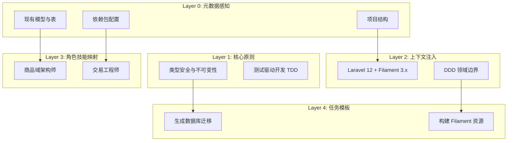
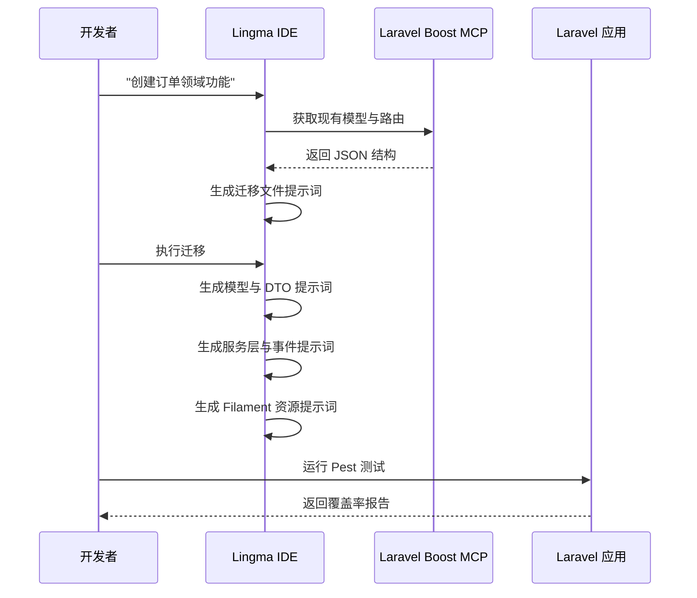

# 🏗️ Laravel + Filament AI 辅助开发提示词工程方案 (P9 优化版)

> **设计理念**：针对“一人公司”场景，从“标准化”转向“自动化”。通过深度集成 Lingma MCP 与 Laravel Boost，实现从需求到运维的“零摩擦”开发流。

## 1. 核心架构升级：五层认知模型

在原有的四层基础上，增加 **Layer 0: Meta-Data (元数据感知)**，让 AI 具备“读心术”。



## 2. 模块化组件库 (Lingma 适配版)

### 2.1 Layer 0: 元数据注入模板
**用途**：在执行任何任务前，先让 AI 扫描项目现状，避免幻觉。

```markdown
## 项目上下文注入
- **当前路径**: {{file_path}}
- **技术栈**: Laravel {{laravel_version}}, Filament {{filament_version}}
- **现有领域模型**: @list_dir('app/Models')
- **数据库结构**: @run_in_terminal('php artisan db:show --json')
```

### 2.2 Layer 3: 角色技能映射 (Skills Mapping)

| 角色 | 对应 Boost Skill | 触发关键词 |
| :--- | :--- | :--- |
| **商品域架构师** | `laravel-best-practices` | "设计模型", "迁移文件", "关联关系" |
| **Filament UI 设计师** | `filament-development` | "后台页面", "表格列", "表单字段" |
| **交易工程师** | `laravel-architecture-patterns` | "订单逻辑", "状态机", "支付回调" |
| **资产管家** | `eloquent-best-practices` | "余额变动", "积分计算", "复式记账" |

## 3. 领域特定提示词模板

### 3.1 O2O 预约系统：时间片冲突检测算法

```markdown
# 任务：实现时间片冲突检测

## 角色
@交易工程师 @商品域架构师

## 约束条件
- **算法要求**：使用 SQL 级锁机制防止重复预约。
- **业务逻辑**：当 `已预约数量 >= 最大容量` 时，该时间片视为不可用。
- **并发控制**：在查询 `appointment_timeslots` 表时必须使用 `lockForUpdate()`。

## 输出要求
在 `AppointmentService` 中生成一个 `checkAvailability()` 方法，该方法需：
1. 接收 `service_id`（服务ID）、`store_id`（门店ID）和 `start_time`（开始时间）。
2. 查询是否存在重叠的时间片。
3. 返回布尔值或在冲突时抛出 `TimeslotOccupiedException` 异常。
```

### 3.2 分销体系：多级佣金递归计算

```markdown
# 任务：多级佣金递归计算

## 角色
@资产管家

## 业务逻辑
- **层级定义**：支持 3 级分销（直接、间接、远程）。
- **费率配置**：在 `config/distribution.php` 中动态配置。
- **触发时机**：监听 `OrderCompleted`（订单完成）事件。

## 实现指南
1. 使用 MySQL 8.0+ 的 **递归 CTE**（公用表表达式）高效获取上级关系链。
2. 基于订单的 `profit_margin`（利润空间）而非总金额计算佣金。
3. 将记录存入 `commissions` 表，初始状态标记为 `frozen`（冻结中）。

## 代码模式参考
```php
// 使用 Laravel Eloquent 的 CTE 支持
$uplines = DistributionRelationship::withUplines($userId, 3)->get();
```
```

## 4. Filament 3.x 专项优化模板

### 4.1 现代化资源生成 (基于 Schema)

```markdown
# 任务：为 {Model} 生成 Filament 资源

## 角色
@Filament UI 设计师

## 功能要求
- 使用 **Filament 3.x Schema** 语法（如 `TextEntry::make()`, `SelectEntry::make()`）。
- 在详情页实现 **Infolist**（信息列表）。
- 添加 **批量操作**：导出 Excel、更改状态。
- **筛选器**：日期范围、状态下拉框、UUID 搜索。

## 代码结构示例
```php
public static function table(Table $table): Table
{
    return $table
        ->columns([
            TextColumn::make('order_sn')->copyable()->searchable(),
            BadgeColumn::make('status')->colors([...]),
        ])
        ->filters([
            SelectFilter::make('status')->options([...]),
        ]);
}
```
```

## 5. 自动化工作流编排

### 5.1 新功能开发流水线 (一人公司极速版)



## 6. 运维与质量保障 (Ops & QA)

### 6.1 自动化代码审查提示词

```markdown
# AI 代码审查清单

1. **安全性**：在 Filament Actions 中是否使用了 `Gate::authorize()` 进行鉴权？
2. **性能**：表格定义中是否存在 N+1 查询问题？（建议使用 `withCount`）
3. **类型安全**：所有方法签名是否都进行了严格类型声明？
4. **事务一致性**：资产变动是否包裹在 `DB::transaction()` 中？
```

### 6.2 异常监控与日志提示

```markdown
# 任务：实现错误追踪与监控

## 角色
@交易工程师

## 实施要求
- 集成 **Laravel Telescope** 用于本地调试。
- 将所有支付回调日志记录到专用的 `payment_logs` 通道。
- 创建一个 Filament Widget（小部件），展示 `failed_jobs` 表中的失败任务数量。
```

## 7. 总结：P9 架构师的最终建议

1. **从“写代码”转向“审代码”**：利用 Lingma 的生成能力，将 80% 的精力花在审查 AI 生成的业务逻辑边界条件上。
2. **建立“提示词资产库”**：将调试成功的提示词存入 `doc/prompts/library`，并打上标签（如 `#o2o`, `#payment`）。
3. **拥抱 Filament 生态**：优先使用 Filament 官方插件（如 `filament/spatie-laravel-media-library-plugin`），减少重复造轮子。

---
**版本**: v2.0.0 (专为独立开发者效能优化)
**目标 IDE**: Lingma / Cursor
**框架**: Laravel 12 + Filament 3.x