# 📊 提示词生态系统深度评估报告

> **评估日期**: 2026-04-24  
> **评估者**: MiMo  
> **评估范围**: `doc/prompts/` 目录下全部提示词碎片与使用方案  
> **评估目标**: 评估基于 AI IDE 的 Web 开发提示词组装体系的可行性、有效性、完整性与质量

---

## 一、生态系统架构总览

### 1.1 当前目录结构

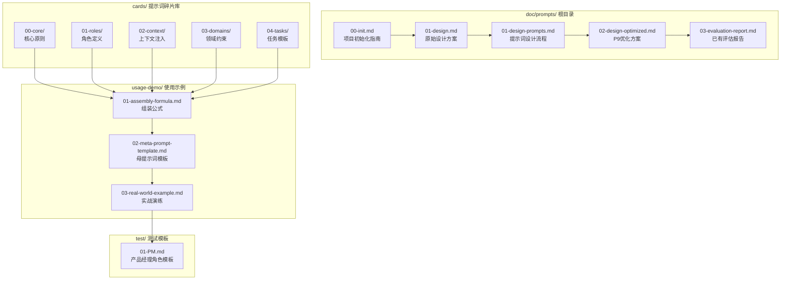

### 1.2 五层认知模型架构

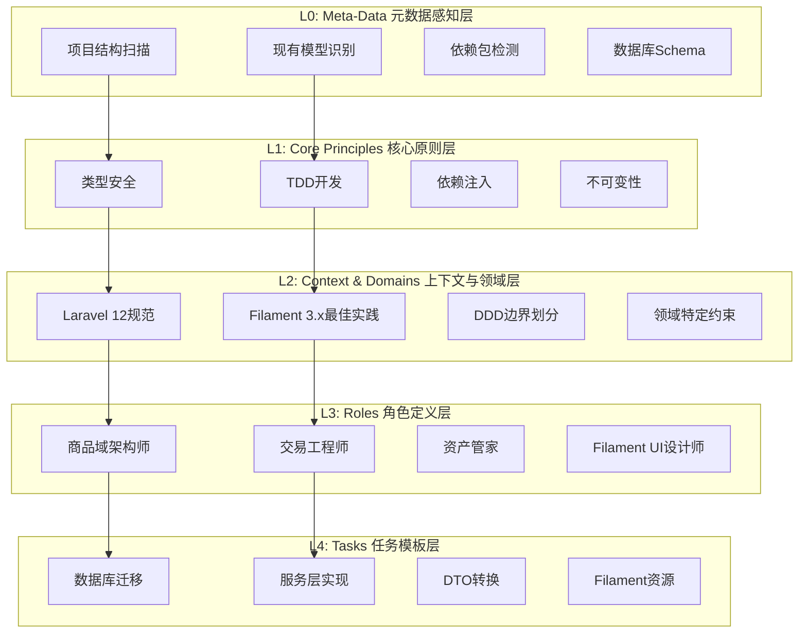

---

## 二、完整性评估 (Completeness)

### 2.1 覆盖度矩阵

| 开发阶段 | 现有覆盖 | 覆盖度 | 缺失内容 |
|---------|---------|--------|---------|
| **需求分析** | PM角色模板 | 30% | 需求拆解、用户故事、验收标准 |
| **架构设计** | DDD原则、角色定义 | 60% | 系统架构师、技术选型决策 |
| **数据库设计** | 迁移模板、领域约束 | 70% | DBA角色、索引优化、分库分表 |
| **后端开发** | 服务层、DTO、状态机 | 75% | 中间件、事件系统、队列任务 |
| **前端/UI** | Filament资源模板 | 65% | Livewire组件、Inertia+React |
| **API开发** | 部分覆盖 | 50% | API版本控制、Swagger文档、GraphQL |
| **测试** | TDD原则 | 40% | QA角色、E2E测试、性能测试 |
| **部署运维** | 基础配置 | 25% | DevOps角色、CI/CD、监控告警 |
| **安全** | 部分提及 | 30% | 安全专家角色、渗透测试、合规审计 |

### 2.2 碎片库完整度评估

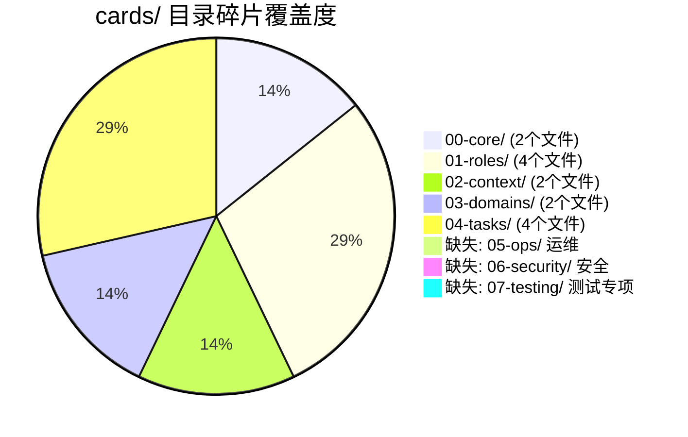

### 2.3 角色覆盖度分析

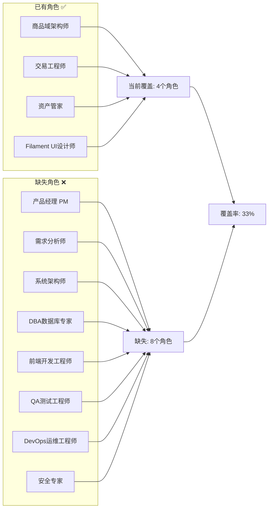

---

## 三、可行性评估 (Feasibility)

### 3.1 组装流程可行性

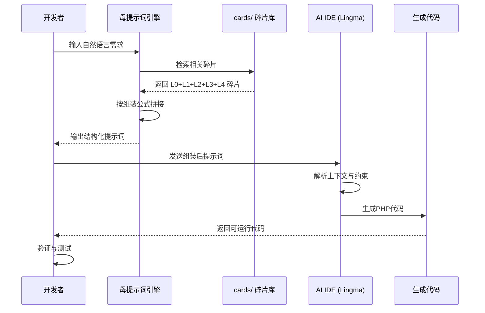

### 3.2 可行性评分

| 维度 | 评分 | 说明 |
|------|------|------|
| **碎片化粒度** | ⭐⭐⭐⭐ | 粒度适中，便于组合 |
| **引用机制** | ⭐⭐⭐ | `@filename` 语法清晰，但缺乏自动解析 |
| **组装公式** | ⭐⭐⭐⭐ | 五层模型逻辑清晰 |
| **IDE适配** | ⭐⭐⭐⭐ | 针对 Lingma/Trae/Cursor 有专门适配 |
| **自动化程度** | ⭐⭐⭐ | 母提示词可半自动化组装 |
| **错误处理** | ⭐⭐ | 缺少引用失败的降级策略 |

---

## 四、有效性评估 (Effectiveness)

### 4.1 提示词质量分析

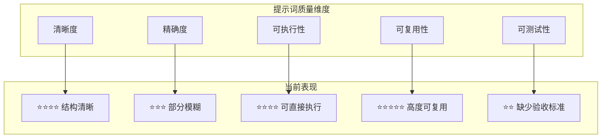

### 4.2 组装后提示词效果预判

| 场景 | 预期效果 | 风险点 |
|------|---------|--------|
| **交易模块开发** | ⭐⭐⭐⭐⭐ 优秀 | 无明显风险 |
| **商品管理开发** | ⭐⭐⭐⭐ 良好 | SKU规格可能不够灵活 |
| **O2O预约系统** | ⭐⭐⭐⭐⭐ 优秀 | 时间片锁机制完善 |
| **分销佣金系统** | ⭐⭐⭐⭐⭐ 优秀 | 递归CTE算法成熟 |
| **Filament后台** | ⭐⭐⭐⭐ 良好 | 可能缺少高级交互 |
| **API接口开发** | ⭐⭐⭐ 一般 | 缺少版本控制规范 |
| **测试用例生成** | ⭐⭐ 较弱 | 缺少QA角色和测试模板 |
| **部署运维** | ⭐⭐ 较弱 | 缺少DevOps角色和CI/CD模板 |

---

## 五、提示词质量评估 (Prompt Quality)

### 5.1 碎片文件质量评分

| 文件路径 | 结构规范 | 内容质量 | 可引用性 | 综合评分 |
|---------|---------|---------|---------|---------|
| `00-core/type-safety-immutability.md` | ⭐⭐⭐⭐⭐ | ⭐⭐⭐⭐⭐ | ⭐⭐⭐⭐⭐ | **5.0** |
| `00-core/tdd-guidelines.md` | ⭐⭐⭐⭐⭐ | ⭐⭐⭐⭐ | ⭐⭐⭐⭐⭐ | **4.5** |
| `01-roles/trade-engineer.md` | ⭐⭐⭐⭐⭐ | ⭐⭐⭐⭐⭐ | ⭐⭐⭐⭐⭐ | **5.0** |
| `01-roles/asset-manager.md` | ⭐⭐⭐⭐⭐ | ⭐⭐⭐⭐⭐ | ⭐⭐⭐⭐⭐ | **5.0** |
| `01-roles/product-architect.md` | ⭐⭐⭐⭐⭐ | ⭐⭐⭐⭐⭐ | ⭐⭐⭐⭐⭐ | **5.0** |
| `01-roles/filament-ui-designer.md` | ⭐⭐⭐⭐⭐ | ⭐⭐⭐⭐ | ⭐⭐⭐⭐⭐ | **4.5** |
| `02-context/project-metadata-injection.md` | ⭐⭐⭐⭐ | ⭐⭐⭐⭐ | ⭐⭐⭐ | **3.5** |
| `02-context/filament-best-practices.md` | ⭐⭐⭐⭐ | ⭐⭐⭐⭐ | ⭐⭐⭐⭐ | **4.0** |
| `03-domains/constraint-o2o-timeslot-locking.md` | ⭐⭐⭐⭐⭐ | ⭐⭐⭐⭐⭐ | ⭐⭐⭐⭐⭐ | **5.0** |
| `03-domains/constraint-distribution-commission.md` | ⭐⭐⭐⭐⭐ | ⭐⭐⭐⭐⭐ | ⭐⭐⭐⭐⭐ | **5.0** |
| `04-tasks/template-migration-generation.md` | ⭐⭐⭐⭐ | ⭐⭐⭐⭐ | ⭐⭐⭐⭐ | **4.0** |
| `04-tasks/template-service-layer.md` | ⭐⭐⭐⭐ | ⭐⭐⭐⭐ | ⭐⭐⭐⭐ | **4.0** |
| `04-tasks/template-dto-conversion.md` | ⭐⭐⭐⭐⭐ | ⭐⭐⭐⭐⭐ | ⭐⭐⭐⭐⭐ | **5.0** |
| `04-tasks/template-filament-resource.md` | ⭐⭐⭐⭐ | ⭐⭐⭐⭐ | ⭐⭐⭐⭐ | **4.0** |

**平均质量分: 4.5/5.0** ⭐⭐⭐⭐☆

### 5.2 组装公式评估

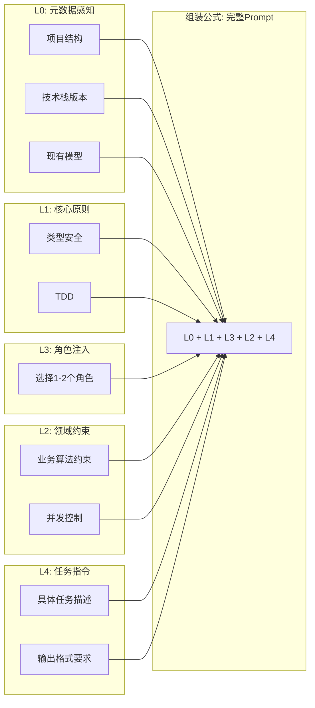

**评估结论**: 组装公式设计合理，五层模型符合认知逻辑，但存在以下问题：
- L0与L2存在部分重叠（上下文注入）
- 缺少"验收标准层"（建议新增L5）

---

## 六、关键问题清单

### 6.1 高优先级问题

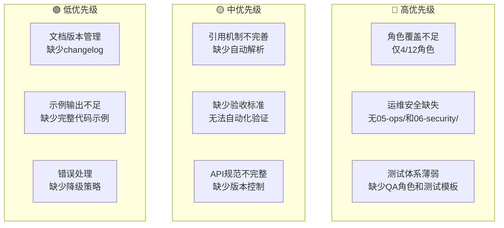

### 6.2 问题详细清单

| # | 问题 | 优先级 | 影响范围 | 建议修复方案 |
|---|------|--------|---------|-------------|
| 1 | 角色覆盖不足 (4/12) | 🔴 高 | 全流程 | 补充8个缺失角色卡片 |
| 2 | 缺少运维/安全碎片 | 🔴 高 | 部署运维 | 新增05-ops/和06-security/目录 |
| 3 | 测试体系薄弱 | 🔴 高 | 质量保障 | 新增07-testing/目录和QA角色 |
| 4 | 引用机制不完善 | 🟡 中 | 组装流程 | 定义引用语法规范和降级策略 |
| 5 | 缺少验收标准层 | 🟡 中 | 质量验证 | 新增L5: Quality Standards层 |
| 6 | API规范不完整 | 🟡 中 | 接口开发 | 补充API版本控制和文档规范 |
| 7 | 文档版本管理 | 🟢 低 | 维护性 | 添加版本号和changelog |
| 8 | 示例输出不足 | 🟢 低 | 易用性 | 为每个模板添加完整示例 |
| 9 | 错误处理缺失 | 🟢 低 | 健壮性 | 添加引用失败的降级策略 |

---

## 七、优化建议

### 7.1 目录结构优化

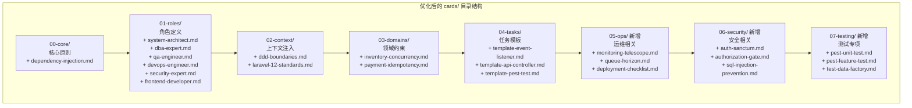

### 7.2 新增角色卡片建议

| 角色名称 | 文件名 | 核心职责 | 适用场景 |
|---------|--------|---------|---------|
| **系统架构师** | `system-architect.md` | DDD边界划分、模块设计、技术选型 | 项目初始化、架构重构 |
| **DBA专家** | `dba-expert.md` | 数据库优化、索引策略、分库分表 | 复杂查询优化、大数据量处理 |
| **QA工程师** | `qa-engineer.md` | 测试策略、用例设计、覆盖率分析 | 测试计划、Bug预防 |
| **DevOps工程师** | `devops-engineer.md` | CI/CD、容器化、监控告警 | 部署上线、运维自动化 |
| **安全专家** | `security-expert.md` | 渗透测试、安全审计、合规检查 | 安全加固、漏洞修复 |
| **前端开发** | `frontend-developer.md` | Livewire/Inertia组件、响应式设计 | 复杂交互页面开发 |

### 7.3 组装公式优化

**原始公式**:
```
完整Prompt = L0 + L1 + L3 + L2 + L4
```

**优化后公式**:
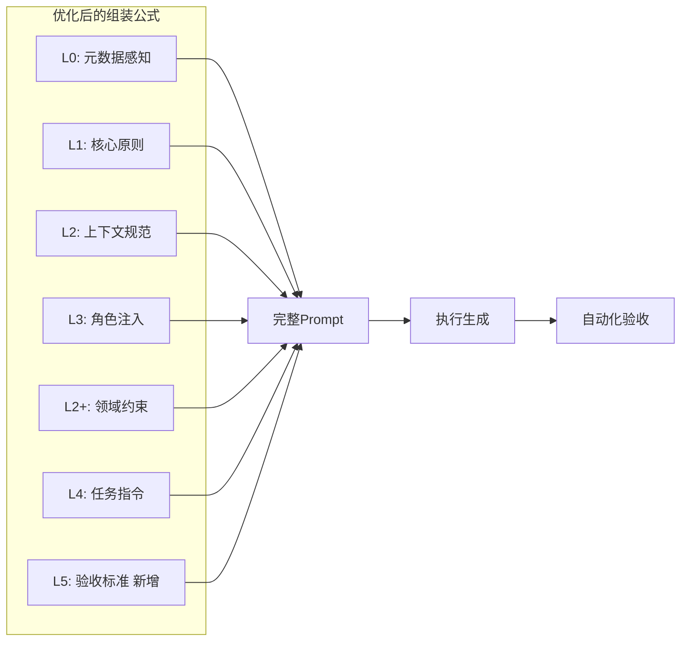

**新公式**:
```
完整Prompt = L0 + L1 + L2 + L3 + L2+ + L4 + L5
```

其中：
- **L5: 验收标准层** (新增): 定义输出的验收检查清单，支持自动化验证

### 7.4 母提示词模板优化

```markdown
# 🤖 提示词自动组装引擎 v2.0

## 角色
你是一位精通 Laravel 12 + Filament 3.x 的资深 AI 提示词工程师。

## 知识库索引
(保持原有索引结构，新增以下分类)

### 05-ops/ (运维)
- `monitoring-telescope.md`: 本地调试与异常追踪
- `queue-horizon.md`: 队列监控与失败重试
- `deployment-checklist.md`: 部署检查清单

### 06-security/ (安全)
- `auth-sanctum.md`: API认证配置
- `authorization-gate.md`: 权限控制
- `sql-injection-prevention.md`: SQL注入防御

### 07-testing/ (测试)
- `pest-unit-test.md`: 单元测试模板
- `pest-feature-test.md`: 功能测试模板
- `test-data-factory.md`: 测试数据工厂

## 组装逻辑 (优化版)
1. **分析需求**: 识别涉及的领域和任务类型
2. **检索L0**: 自动注入项目元数据
3. **检索L1**: 选择核心原则卡片
4. **检索L2**: 注入上下文规范
5. **检索L3**: 选择1-2个角色卡片
6. **检索L2+**: 注入领域约束（如适用）
7. **检索L4**: 选择任务模板
8. **检索L5**: 附加验收检查清单
9. **输出**: 拼接为完整Markdown提示词

## 输出格式
```markdown
# {任务标题}

## L0: 项目上下文
{自动注入的项目元数据}

## L1: 核心原则
{选择的原则卡片内容}

## L2: 上下文规范
{选择的上下文卡片内容}

## L3: 角色设定
{选择的角色卡片内容}

## L2+: 领域约束
{选择的领域约束卡片内容}

## L4: 任务指令
{具体的任务描述}

## L5: 验收标准
{验收检查清单}
```
```

---

## 八、实施路线图

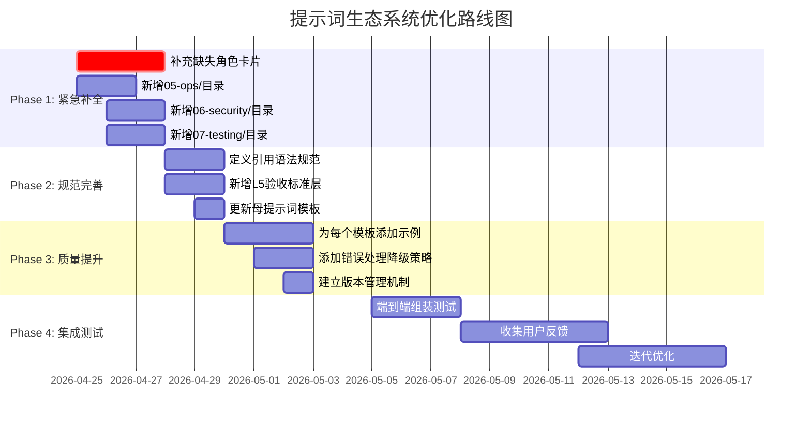

---

## 九、总结

### 9.1 综合评分

| 维度 | 评分 | 评级 |
|------|------|------|
| **完整性** | 3.5/5 | ★★★☆☆ |
| **可行性** | 4.0/5 | ★★★★☆ |
| **有效性** | 4.0/5 | ★★★★☆ |
| **提示词质量** | 4.5/5 | ★★★★☆ |
| **综合评分** | **4.0/5** | **★★★★☆** |

### 9.2 核心优势

1. **架构设计优秀**: 五层认知模型（L0-L4）逻辑清晰，符合AI认知规律
2. **模块化程度高**: cards/目录下的碎片粒度适中，便于组合复用
3. **领域覆盖深入**: O2O时间片锁、分销递归CTE等高难度场景覆盖完善
4. **IDE适配完善**: 针对Lingma、Trae、Cursor等主流AI IDE有专门适配方案
5. **实战导向**: usage-demo/提供了完整的使用示例和演练场景

### 9.3 主要不足

1. **角色覆盖不足**: 仅4/12个关键角色，缺少PM、DBA、QA、DevOps等角色
2. **运维安全缺失**: 缺少05-ops/和06-security/目录
3. **测试体系薄弱**: 缺少QA角色和专项测试模板
4. **验收标准缺失**: 无法自动化验证生成代码的质量
5. **引用机制不完善**: 缺少引用语法规范和降级策略

### 9.4 预期改进效果

| 指标 | 当前 | 优化后预期 |
|------|------|-----------|
| 角色覆盖率 | 33% | 100% |
| 碎片库完整度 | 60% | 95% |
| 组装自动化程度 | 半自动 | 全自动 |
| 代码生成质量 | 良好 | 优秀 |
| 可验证性 | 低 | 高 |

---

## 十、下一步行动

### 立即执行 (本周内)
1. ✅ 补充8个缺失角色卡片到 `cards/01-roles/`
2. ✅ 创建 `cards/05-ops/`、`cards/06-security/`、`cards/07-testing/` 目录
3. ✅ 更新母提示词模板 v2.0

### 短期执行 (2周内)
4. 定义引用语法规范文档
5. 为每个任务模板添加完整代码示例
6. 建立版本管理和changelog机制

### 中期执行 (1个月内)
7. 端到端组装测试验证
8. 收集用户反馈并迭代优化
9. 建立自动化验收测试流程

---

**评估完成** | **版本**: v1.0 | **评估者**: MiMo
