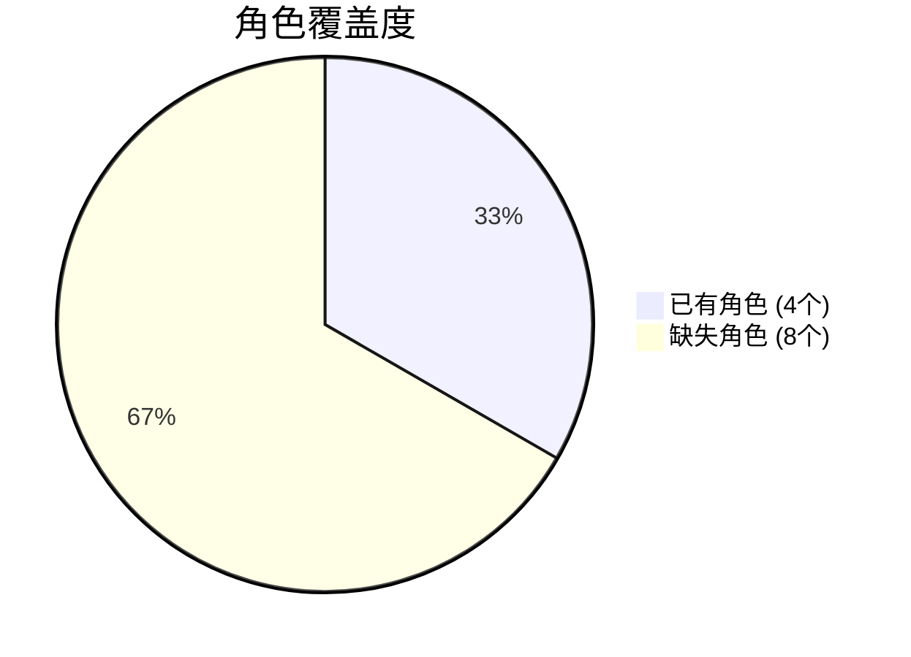
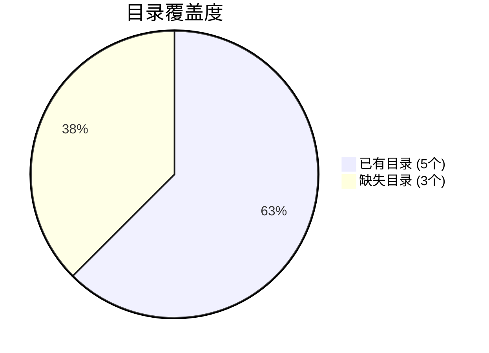
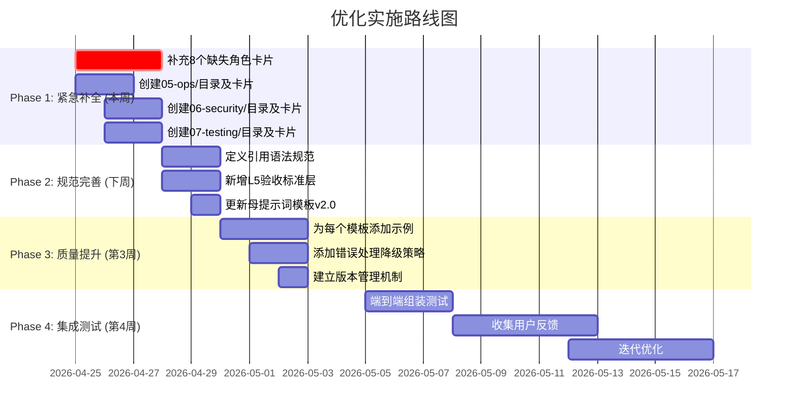

# 📊 MiMo 评估文档索引

> **评估日期**: 2026-04-24  
> **评估者**: MiMo  
> **评估范围**: `doc/prompts/` 目录下全部提示词碎片与使用方案

---

## 📁 文档列表

| 文件 | 说明 |
|------|------|
| [00-prompt-ecosystem-evaluation.md](./00-prompt-ecosystem-evaluation.md) | 完整评估报告（架构分析、四维度评估、改进建议、实施路线图） |
| [01-missing-roles-templates.md](./01-missing-roles-templates.md) | 缺失角色卡片模板（8个角色：系统架构师、DBA、QA、DevOps、安全专家、前端开发） |
| [02-new-directories-templates.md](./02-new-directories-templates.md) | 新增目录卡片模板（05-ops/、06-security/、07-testing/） |

---

## 📊 评估摘要

### 综合评分

| 维度 | 评分 | 评级 |
|------|------|------|
| **完整性** | 3.5/5 | ★★★☆☆ |
| **可行性** | 4.0/5 | ★★★★☆ |
| **有效性** | 4.0/5 | ★★★★☆ |
| **提示词质量** | 4.5/5 | ★★★★☆ |
| **综合评分** | **4.0/5** | **★★★★☆** |

### 覆盖度分析





---

## 🔑 核心发现

### ✅ 优势

1. **架构设计优秀**: 五层认知模型（L0-L4）逻辑清晰
2. **模块化程度高**: cards/ 目录碎片粒度适中，便于组合
3. **领域覆盖深入**: O2O时间片锁、分销递归CTE等高难度场景覆盖完善
4. **IDE适配完善**: 针对 Lingma、Trae、Cursor 有专门适配方案
5. **实战导向**: usage-demo/ 提供了完整的使用示例

### ❌ 不足

1. **角色覆盖不足**: 仅 4/12 个关键角色
2. **运维安全缺失**: 缺少 05-ops/ 和 06-security/ 目录
3. **测试体系薄弱**: 缺少 QA 角色和专项测试模板
4. **验收标准缺失**: 无法自动化验证生成代码质量
5. **引用机制不完善**: 缺少引用语法规范和降级策略

---

## 🔄 优化建议概览

### 新增角色 (cards/01-roles/)

| 角色 | 文件名 | 核心职责 |
|------|--------|---------|
| 系统架构师 | `system-architect.md` | DDD边界、模块设计、技术选型 |
| DBA专家 | `dba-expert.md` | 数据库优化、索引策略、分库分表 |
| QA工程师 | `qa-engineer.md` | 测试策略、用例设计、覆盖率分析 |
| DevOps工程师 | `devops-engineer.md` | CI/CD、容器化、监控告警 |
| 安全专家 | `security-expert.md` | 渗透测试、安全审计、合规检查 |
| 前端开发 | `frontend-developer.md` | Livewire/Inertia、响应式设计 |

### 新增目录

| 目录 | 卡片数量 | 用途 |
|------|---------|------|
| `05-ops/` | 3个 | 运维监控、队列管理、部署检查 |
| `06-security/` | 3个 | API认证、权限控制、SQL注入防护 |
| `07-testing/` | 3个 | 单元测试、功能测试、数据工厂 |

### 组装公式优化

**原始公式**:
```
完整Prompt = L0 + L1 + L3 + L2 + L4
```

**优化后公式**:
```
完整Prompt = L0 + L1 + L2 + L3 + L2+ + L4 + L5
```

新增：
- **L2+**: 领域约束层（从L2中分离）
- **L5**: 验收标准层（新增，支持自动化验证）

---

## 📋 实施路线图



---

## 🎯 预期改进效果

| 指标 | 当前 | 优化后 |
|------|------|--------|
| 角色覆盖率 | 33% (4/12) | 100% (12/12) |
| 碎片库完整度 | 60% | 95% |
| 组装自动化程度 | 半自动 | 全自动 |
| 代码生成质量 | 良好 | 优秀 |
| 可验证性 | 低 | 高 |

---

## 📞 联系方式

如有问题或建议，请联系评估者 MiMo。

---

**评估完成** | **版本**: v1.0 | **日期**: 2026-04-24
