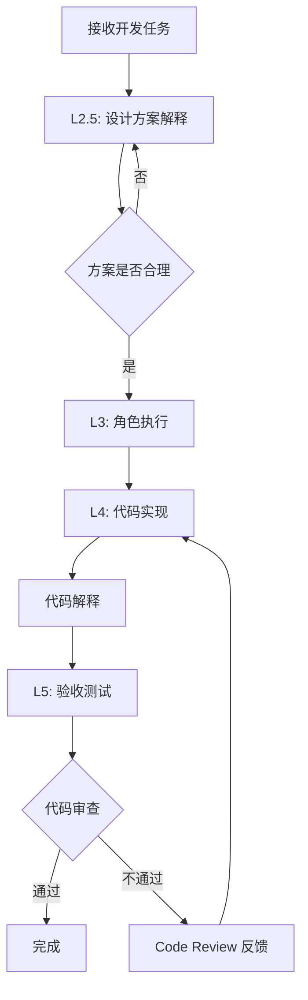

# 提示词组装公式 (Prompt Assembly Formula)

> **v3.0: 强制面试模式 + 设计原理解释 + Code Review**

---

## 📋 核心理念

**每一次开发任务都是一次技术面试**

> "不仅要写出代码，更要讲清楚为什么这样设计"

---

## 📋 组装公式

### 七层组装模型（v3.0 - 强制面试模式）

```
完整 Prompt = L0 + L1 + L2 + L2.5(强制) + L3 + L4(含解释) + L5
```

| 层级 | 名称 | 来源目录 | 必需 | 说明 |
|------|------|---------|------|------|
| **L0** | 元数据感知 | 自动注入 | ✅ | 项目结构、技术栈、现有模型 |
| **L1** | 核心原则 | `00-core/` | ✅ | 类型安全、TDD、DI、异常处理 |
| **L2** | 上下文规范 | `02-context/` | ✅ | Laravel/Filament 规范 |
| **L2.5** | 设计原理解释 | `01-roles/tech-interviewer.md` | ✅ | **强制**：讲清楚方案和原理 |
| **L3** | 角色注入 | `01-roles/` | ✅ | 1-2个专业角色 |
| **L4** | 任务模板（含解释） | `04-tasks/` | ✅ | 实现 + 设计原理说明 |
| **L5** | 验收标准 | 自动生成 | ✅ | 质量检查清单 + 设计评审 |

---

## 🎯 强制面试模式

### 核心规则

```yaml
rules:
  - rule: "每次开发前必须解释设计方案"
    description: "在写代码前，先说明整体设计思路"
    
  - rule: "每个关键决策必须解释原因"
    description: "为什么选择这个方案而不是其他方案"
    
  - rule: "必须说明数据流向"
    description: "数据从哪里来，到哪里去，如何转换"
    
  - rule: "必须说明异常处理"
    description: "边界情况、错误处理、降级策略"
    
  - rule: "必须说明性能考虑"
    description: "时间复杂度、空间复杂度、并发处理"
```

### 输出格式

```markdown
## 🎯 设计方案

### 1. 需求理解
{用自己的话复述需求，确认理解正确}

### 2. 整体架构
{画出架构图或数据流图}

### 3. 核心设计决策
| 决策点 | 选择方案 | 为什么选择 | 为什么不用其他方案 |
|--------|---------|-----------|-------------------|
| {决策1} | {方案A} | {原因} | {方案B的缺点} |

### 4. 数据模型设计
{ER图或表结构设计}

### 5. 接口设计
{API接口定义}

### 6. 异常处理
{边界情况和错误处理策略}

### 7. 性能考虑
{时间复杂度、并发处理、缓存策略}

---

## 💻 代码实现

### 1. 核心代码
{实现代码}

### 2. 代码解释
{解释关键代码的设计思路}
```

---

## 🔄 完整工作流程



---

## 📝 组装示例

### 示例 1: 创建订单服务

**输入需求**: "创建一个订单服务，处理订单创建和支付流程"

**组装结果**:
```markdown
# 任务：创建订单服务类

## L0: 项目上下文
- 技术栈: Laravel 12 + Filament 3.x
- 现有模型: @list_dir('app/Models')
- 数据库: MySQL 8.0

## L1: 核心原则
@type-safety-immutability
@dependency-injection
@event-driven

## L2: 上下文规范
@laravel-12-standards

## L2.5: 设计原理解释（强制）
@tech-interviewer

**在编写代码前，请先解释：**

### 1. 需求理解
请用自己的话描述这个需求的核心目标。

### 2. 整体架构
请画出订单创建的数据流图。

### 3. 核心设计决策
| 决策点 | 你的选择 | 为什么 |
|--------|---------|--------|
| 事务策略 | ? | ? |
| 并发控制 | ? | ? |
| 订单号生成 | ? | ? |
| 库存扣减时机 | ? | ? |

### 4. 异常处理
如何处理以下情况？
- 库存不足
- 并发下单
- 支付回调丢失
- Redis 故障

## L3: 角色设定
### 交易工程师 (TradeEngineer)
你是一位精通 DDD 的交易系统专家。

## L4: 任务指令
请创建 `OrderService` 服务类，实现以下功能：

### 1. 创建订单 (createOrder)
- 接收 `CreateOrderData` DTO
- 验证库存可用性
- 计算订单总额
- 创建订单记录
- 扣减库存
- 触发 `OrderCreated` 事件
- 返回 `Order` 模型

### 2. 支付订单 (payOrder)
- 验证订单状态为 `pending`
- 调用支付网关
- 更新订单状态为 `paid`
- 记录支付时间
- 触发 `OrderPaid` 事件

### 3. 取消订单 (cancelOrder)
- 验证订单状态为 `pending`
- 恢复库存
- 更新订单状态为 `cancelled`
- 触发 `OrderCancelled` 事件

**代码实现后，请解释：**
- 为什么选择这种事务策略？
- 如何保证幂等性？
- 性能考虑是什么？

## L5: 验收标准
- [ ] 设计方案完整且合理
- [ ] 所有设计决策都有解释
- [ ] 所有方法都有完整的类型声明
- [ ] 使用构造函数注入依赖
- [ ] 资金操作在事务中执行
- [ ] 状态变更触发相应事件
- [ ] 异常处理完善
- [ ] 代码可读性和可维护性良好
```

---

## 🔧 组装检查清单

### 组装前
- [ ] 明确任务类型和涉及的领域
- [ ] 选择合适的角色（1-2个）
- [ ] 确认是否需要领域约束

### 组装后
- [ ] L0 层包含项目上下文
- [ ] L1 层包含核心原则
- [ ] L2 层包含上下文规范
- [ ] L2.5 层包含设计原理解释要求（**强制**）
- [ ] L3 层包含角色设定
- [ ] L4 层包含具体任务指令 + 代码解释要求
- [ ] L5 层包含验收标准 + 设计评审
- [ ] 整体格式清晰，无遗漏

---

**版本**: v3.0 | **更新日期**: 2026-04-27
