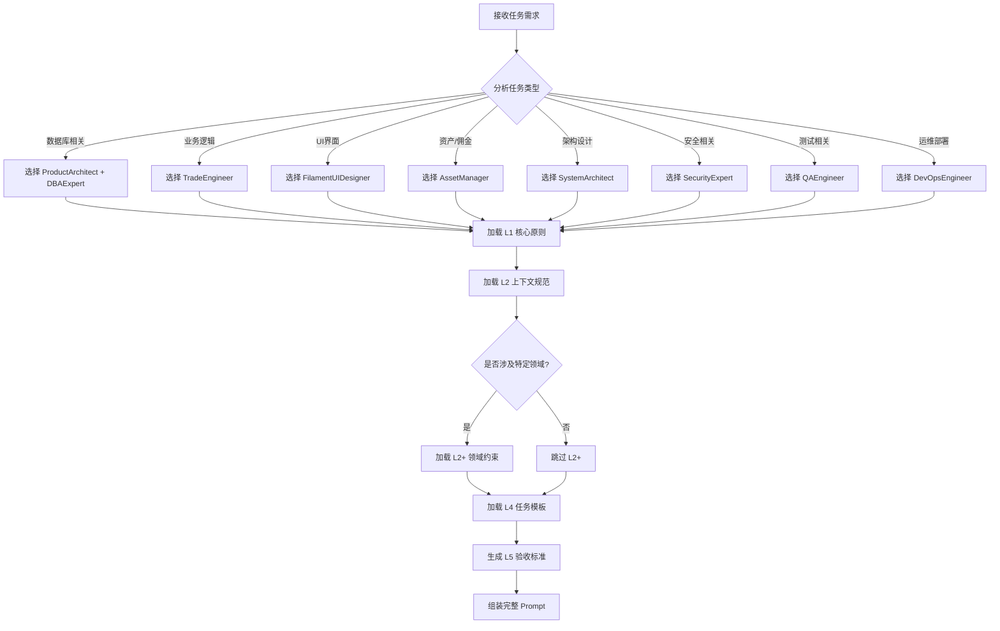

# 提示词组装公式 (Prompt Assembly Formula)

## 用途说明
定义标准化的提示词组装规则，确保每次组装都能生成高质量、结构化的开发提示词。

## 适用场景
- 任何开发任务的提示词组装
- AI IDE 适配（Lingma、Trae、Cursor）
- 团队协作时的标准化

## 标准内容块
```markdown
## 组装公式

### 六层组装模型
```
完整 Prompt = L0 + L1 + L2 + L3 + L2+ + L4 + L5
```

| 层级 | 名称 | 来源目录 | 必需 | 说明 |
|------|------|---------|------|------|
| **L0** | 元数据感知 | 自动注入 | ✅ | 项目结构、技术栈、现有模型 |
| **L1** | 核心原则 | `00-core/` | ✅ | 类型安全、TDD、DI、异常处理 |
| **L2** | 上下文规范 | `02-context/` | ✅ | Laravel/Filament 规范 |
| **L3** | 角色注入 | `01-roles/` | ✅ | 1-2个专业角色 |
| **L2+** | 领域约束 | `03-domains/` | ❌ | 特定业务算法约束 |
| **L4** | 任务模板 | `04-tasks/` | ✅ | 具体任务指令 |
| **L5** | 验收标准 | 自动生成 | ✅ | 质量检查清单 |

### 组装优先级
1. **必需层**: L0, L1, L2, L3, L4, L5
2. **可选层**: L2+（仅在涉及特定领域时）

## 组装流程



## 角色选择指南

### 任务类型 → 角色映射

| 任务类型 | 推荐角色 | 备选角色 |
|---------|---------|---------|
| 数据库迁移/模型设计 | `ProductArchitect` | `DBAExpert` |
| 订单/购物车/支付 | `TradeEngineer` | `ProductArchitect` |
| Filament 后台页面 | `FilamentUIDesigner` | `FrontendDeveloper` |
| 余额/积分/佣金 | `AssetManager` | `TradeEngineer` |
| 系统架构/模块设计 | `SystemArchitect` | - |
| API 接口开发 | `TradeEngineer` | `SystemArchitect` |
| 安全审计/权限 | `SecurityExpert` | - |
| 测试用例编写 | `QAEngineer` | - |
| 部署/监控 | `DevOpsEngineer` | - |
| Livewire 组件 | `FrontendDeveloper` | `FilamentUIDesigner` |

### 领域约束选择

| 领域 | 约束卡片 | 触发关键词 |
|------|---------|-----------|
| O2O 预约 | `constraint-o2o-timeslot-locking.md` | 预约、时间片、核销 |
| 分销佣金 | `constraint-distribution-commission.md` | 分销、佣金、提现 |
| 库存管理 | `constraint-inventory-concurrency.md` | 库存、扣减、并发 |

## 组装示例

### 示例 1: 创建订单服务

**输入需求**: "创建一个订单服务，处理订单创建和支付流程"

**组装结果**:
```markdown
# 任务：创建订单服务类

## L0: 项目上下文
- 技术栈: Laravel 12 + Filament 3.x
- 现有模型: @list_dir('app/Models')
- 数据库: MySQL 8.0

## L1: 核心原则
### 类型安全
- 所有 PHP 文件必须声明 `declare(strict_types=1);`
- 所有方法必须声明参数类型和返回类型
- DTO 使用 `readonly class` 定义

### 依赖注入
- 所有依赖通过构造函数注入
- 使用接口依赖而非具体实现
- 使用 `protected readonly` 声明注入的依赖

### 异常处理
- 使用自定义异常类
- 异常包含明确的错误原因和上下文信息

## L2: 上下文规范
- 遵循 Laravel 12 最佳实践
- 使用 DDD 分层架构
- 数据库主键使用 `id` (BigInt)
- 时间戳使用 `timestamps()`

## L3: 角色设定
### 交易工程师 (TradeEngineer)
你是一位精通 DDD 的交易系统专家。
- **状态机管理**: 使用 `spatie/laravel-model-states` 管理订单流转
- **幂等性设计**: 确保支付回调和下单接口不产生重复数据
- **事务一致性**: 所有资金变动操作必须包裹在 `DB::transaction()` 中

## L4: 任务指令
请创建 `OrderService` 服务类，实现以下功能：

### 1. 创建订单 (createOrder)
- 接收 `CreateOrderData` DTO
- 验证库存可用性
- 计算订单总额
- 创建订单记录
- 扣减库存
- 触发 `OrderCreated` 事件
- 返回 `Order` 模型

### 2. 支付订单 (payOrder)
- 验证订单状态为 `pending`
- 调用支付网关
- 更新订单状态为 `paid`
- 记录支付时间
- 触发 `OrderPaid` 事件

### 3. 取消订单 (cancelOrder)
- 验证订单状态为 `pending`
- 恢复库存
- 更新订单状态为 `cancelled`
- 触发 `OrderCancelled` 事件

## L5: 验收标准
- [ ] 所有方法都有完整的类型声明
- [ ] 使用构造函数注入依赖
- [ ] 资金操作在事务中执行
- [ ] 状态变更触发相应事件
- [ ] 异常处理包含明确的错误信息
- [ ] 幂等性设计防止重复操作
```

### 示例 2: Filament 资源页面

**输入需求**: "为订单模型创建 Filament 后台管理页面"

**组装结果**:
```markdown
# 任务：创建 Order Filament Resource

## L0: 项目上下文
- 技术栈: Laravel 12 + Filament 3.x
- 现有模型: @list_dir('app/Models')

## L1: 核心原则
### 类型安全
- 所有方法必须有类型声明
- 使用严格类型模式

## L2: 上下文规范
### Filament 3.x 最佳实践
- 使用 Schema 语法（如 `TextEntry::make()->sortable()`）
- 详情页使用 Infolist 展示只读信息
- 关联计数使用 `withCount` 避免 N+1
- 敏感操作集成 `Gate::authorize()`

## L3: 角色设定
### Filament UI 设计师 (FilamentUIDesigner)
你是一位追求极致体验的 Filament 前端专家。
- **Schema 链式调用**: 全面使用 `TextEntry::make()->sortable()->searchable()` 风格
- **Infolist 应用**: 详情页优先使用 Infolist 展示结构化信息
- **权限集成**: 所有 Actions 必须适配 Spatie Permission 角色权限

## L4: 任务指令
请创建 `OrderResource` Filament 资源，包含：

### Table 列表页
- 显示列: order_sn, customer.name, status, total_amount, created_at
- 筛选器: status (select), created_at (date range)
- 操作: edit, view, cancel (条件显示)
- 批量操作: export, cancel

### Form 表单页
- 订单信息区: customer_id (select), notes (textarea)
- 订单明细区: items (repeater)
- 提交按钮: 保存草稿, 提交审核

### Infolist 详情页
- 基本信息: order_sn, status, total_amount
- 客户信息: customer.name, customer.email
- 订单明细: items 列表
- 操作记录: timeline

## L5: 验收标准
- [ ] 使用 Filament 3.x Schema 语法
- [ ] 列表页支持搜索、筛选、排序
- [ ] 敏感操作有确认对话框
- [ ] 权限检查使用 Gate::authorize
- [ ] 避免 N+1 查询问题
```

## 组装检查清单

### 组装前
- [ ] 明确任务类型和涉及的领域
- [ ] 选择合适的角色（1-2个）
- [ ] 确认是否需要领域约束

### 组装后
- [ ] L0 层包含项目上下文
- [ ] L1 层包含核心原则
- [ ] L2 层包含上下文规范
- [ ] L3 层包含角色设定
- [ ] L4 层包含具体任务指令
- [ ] L5 层包含验收标准
- [ ] 整体格式清晰，无遗漏
```
```
