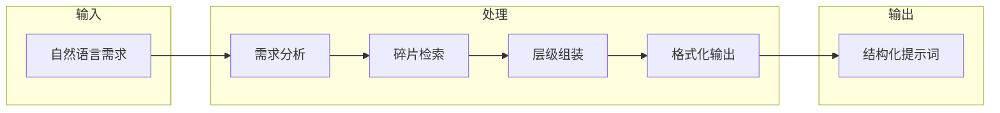

# 提示词组合器 (Prompt Composer)

## 用途说明
提供一个可视化的提示词组合指南，帮助开发者快速理解如何将各个碎片组合成完整的提示词。

## 适用场景
- 新团队成员培训
- 提示词组装参考
- 质量检查清单

## 标准内容块
```markdown
## 组合器工作原理

### 输入 → 处理 → 输出



### 碎片组合矩阵

| 需求关键词 | L3 角色 | L1 原则 | L2+ 领域 | L4 模板 |
|-----------|---------|---------|----------|---------|
| 创建表、迁移、模型 | ProductArchitect + DBAExpert | type-safety, di | - | migration |
| 订单、支付、状态 | TradeEngineer | type-safety, di, error-handling | - | service-layer |
| Filament、后台、管理 | FilamentUIDesigner | type-safety | - | filament-resource |
| 预约、时间片、核销 | TradeEngineer | type-safety, di, error-handling | o2o-timeslot | service-layer |
| 分销、佣金、提现 | AssetManager | type-safety, di, error-handling | distribution | service-layer |
| API、接口、路由 | TradeEngineer | type-safety, di | - | - |
| 测试、用例、覆盖 | QAEngineer | tdd | - | pest-test |
| 部署、上线、CI/CD | DevOpsEngineer | - | - | deployment |
| 安全、权限、认证 | SecurityExpert | - | - | - |

## 快速组装指南

### 场景 1: 创建新功能模块

**步骤**:
1. 选择角色: `SystemArchitect` (架构) + `ProductArchitect` (实现)
2. 加载原则: `type-safety`, `dependency-injection`, `error-handling`
3. 加载上下文: `project-metadata-injection`, `filament-best-practices`
4. 选择模板: `migration-generation` → `service-layer` → `filament-resource`
5. 生成验收标准

**组装结果**:
```
L0: 项目元数据
L1: type-safety + di + error-handling
L2: laravel-standards + filament-practices
L3: SystemArchitect + ProductArchitect
L4: migration → service → resource
L5: 验收清单
```

### 场景 2: 修复 Bug

**步骤**:
1. 选择角色: 根据问题域选择 (如 `TradeEngineer`)
2. 加载原则: `type-safety`, `error-handling`
3. 加载上下文: `project-metadata-injection`
4. 不需要任务模板
5. 生成验收标准

**组装结果**:
```
L0: 项目元数据
L1: type-safety + error-handling
L2: 问题相关上下文
L3: 相关角色
L4: 具体修复指令
L5: 验收清单
```

### 场景 3: 代码审查

**步骤**:
1. 选择角色: `QAEngineer` 或 `SecurityExpert`
2. 加载原则: `type-safety`, `tdd`
3. 加载上下文: 相关规范
4. 不需要任务模板
5. 生成审查清单

**组装结果**:
```
L0: 项目元数据
L1: type-safety + tdd
L2: 相关规范
L3: QAEngineer / SecurityExpert
L4: 审查指令
L5: 审查清单
```

## 组装质量检查

### ✅ 正确组装示例

```markdown
# 任务：创建订单支付服务

## L0: 项目上下文
- 技术栈: Laravel 12 + Filament 3.x
- 现有模型: Order, Payment, Customer

## L1: 核心原则
### 类型安全
- declare(strict_types=1)
- 完整的参数和返回类型声明

### 依赖注入
- 构造函数注入
- 接口依赖

### 异常处理
- 自定义异常类
- 明确的错误信息

## L2: 上下文规范
- Laravel 12 最佳实践
- RESTful API 设计

## L3: 角色设定
### 交易工程师 (TradeEngineer)
精通订单状态机、支付集成和幂等性设计。

## L4: 任务指令
创建 PaymentService，实现：
1. processPayment - 处理支付
2. handleCallback - 处理回调
3. refund - 退款处理

## L5: 验收标准
- [ ] 支付操作在事务中执行
- [ ] 回调验证签名
- [ ] 幂等性设计
- [ ] 完整的异常处理
```

### ❌ 错误组装示例

```markdown
# 错误示例：缺少 L0 和 L5

## 角色
你是一个开发者。

## 任务
创建一个支付服务。

## 要求
- 使用事务
- 处理异常
```

**问题**:
- 缺少 L0 项目上下文
- 缺少 L1 核心原则
- 缺少 L2 上下文规范
- 角色定义过于简单
- 任务描述不清晰
- 缺少 L5 验收标准

## 组装检查清单

### 组装前
- [ ] 明确任务目标
- [ ] 识别任务类型
- [ ] 选择合适的角色

### 组装中
- [ ] L0: 注入项目上下文
- [ ] L1: 选择 1-3 个核心原则
- [ ] L2: 加载相关规范
- [ ] L3: 定义 1-2 个角色
- [ ] L4: 编写具体任务指令
- [ ] L5: 生成验收标准

### 组装后
- [ ] 格式清晰
- [ ] 内容完整
- [ ] 无遗漏层级
- [ ] 可执行性强
```
```
