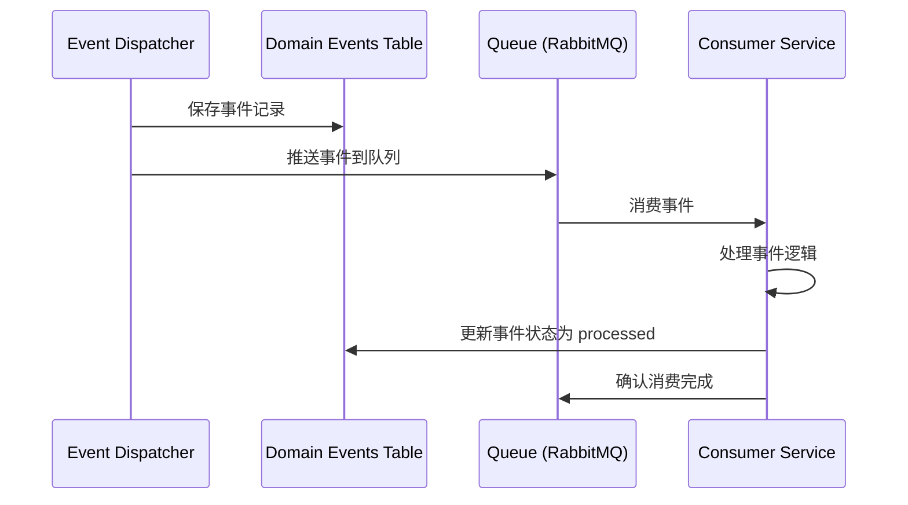

# 📋 跨模块事件契约 (Domain Event Contracts)

**版本**: v2.0.0  
**目的**: 定义模块间通信的标准化事件格式，确保事件驱动架构的一致性

---

## 1. 事件命名规范

### 1.1 命名格式
```
{模块名}{实体名}{动作}
```

### 1.2 动作后缀
| 后缀 | 说明 | 示例 |
|------|------|------|
| `Created` | 实体创建 | `OrderCreated` |
| `Updated` | 实体更新 | `OrderUpdated` |
| `Deleted` | 实体删除 | `OrderDeleted` |
| `Paid` | 支付完成 | `OrderPaid` |
| `Shipped` | 发货完成 | `OrderShipped` |
| `Completed` | 流程完成 | `OrderCompleted` |
| `Cancelled` | 流程取消 | `OrderCancelled` |
| `Refunded` | 退款完成 | `OrderRefunded` |

---

## 2. 事件负载规范

### 2.1 通用字段
所有事件必须包含以下字段：

```yaml
event_id: string          # UUID 唯一标识
event_name: string        # 事件名称
event_version: string     # 事件版本（如 "1.0"）
event_time: datetime      # 事件发生时间
module: string            # 来源模块
entity: string            # 实体名称
entity_id: int            # 实体 ID
action: string            # 动作类型
```

### 2.2 业务字段
根据事件类型添加业务字段。

---

## 3. 核心事件定义

### 3.1 电商模块事件

#### OrderCreated - 订单创建
```yaml
event_name: "OrderCreated"
module: "ecommerce"
entity: "Order"
action: "created"

payload:
  order_id: int
  order_sn: string
  user_id: int
  total_amount: decimal
  items: array
    - sku_id: int
      quantity: int
      price: decimal
  created_at: datetime

consumers:
  - module: "drp"
    action: "锁定库存"
  - module: "crm"
    action: "更新客户订单统计"
```

#### OrderPaid - 订单支付
```yaml
event_name: "OrderPaid"
module: "ecommerce"
entity: "Order"
action: "paid"

payload:
  order_id: int
  order_sn: string
  user_id: int
  payment_id: int
  pay_amount: decimal
  payment_method: string
  paid_at: datetime

consumers:
  - module: "drp"
    action: "扣减库存"
  - module: "finance"
    action: "生成收款记录"
  - module: "distribution"
    action: "计算佣金（待完成状态）"
  - module: "crm"
    action: "更新客户消费统计"
```

#### OrderCompleted - 订单完成
```yaml
event_name: "OrderCompleted"
module: "ecommerce"
entity: "Order"
action: "completed"

payload:
  order_id: int
  order_sn: string
  user_id: int
  total_amount: decimal
  completed_at: datetime
  auto_completed: boolean

consumers:
  - module: "distribution"
    action: "计算分销佣金"
  - module: "crm"
    action: "更新客户订单统计"
  - module: "finance"
    action: "生成应收账款"
```

#### OrderRefunded - 订单退款
```yaml
event_name: "OrderRefunded"
module: "ecommerce"
entity: "Order"
action: "refunded"

payload:
  order_id: int
  order_sn: string
  user_id: int
  refund_amount: decimal
  refund_reason: string
  refunded_by: int
  refunded_at: datetime

consumers:
  - module: "drp"
    action: "恢复库存"
  - module: "distribution"
    action: "取消/扣减佣金"
  - module: "finance"
    action: "生成退款记录"
  - module: "crm"
    action: "更新客户退款统计"
```

---

### 3.2 O2O 模块事件

#### AppointmentConfirmed - 预约确认
```yaml
event_name: "AppointmentConfirmed"
module: "o2o"
entity: "Appointment"
action: "confirmed"

payload:
  appointment_id: int
  user_id: int
  store_id: int
  service_id: int
  timeslot_id: int
  appointment_time: datetime
  confirmed_at: datetime

consumers:
  - module: "crm"
    action: "更新客户预约记录"
```

#### AppointmentCompleted - 预约完成（核销）
```yaml
event_name: "AppointmentCompleted"
module: "o2o"
entity: "Appointment"
action: "completed"

payload:
  appointment_id: int
  user_id: int
  store_id: int
  service_id: int
  completed_at: datetime
  verified_by: int

consumers:
  - module: "crm"
    action: "更新客户消费记录"
  - module: "finance"
    action: "生成服务收入"
```

---

### 3.3 分销模块事件

#### CommissionCreated - 佣金创建
```yaml
event_name: "CommissionCreated"
module: "distribution"
entity: "Commission"
action: "created"

payload:
  commission_id: int
  user_id: int
  order_id: int
  amount: decimal
  level: int
  status: string
  created_at: datetime

consumers:
  - module: "crm"
    action: "更新客户佣金统计"
```

#### CommissionReleased - 佣金释放
```yaml
event_name: "CommissionReleased"
module: "distribution"
entity: "Commission"
action: "released"

payload:
  commission_id: int
  user_id: int
  amount: decimal
  released_at: datetime

consumers:
  - module: "finance"
    action: "更新可提现余额"
```

---

### 3.4 财务模块事件

#### PaymentOrderPaid - 付款单支付
```yaml
event_name: "PaymentOrderPaid"
module: "finance"
entity: "PaymentOrder"
action: "paid"

payload:
  payment_order_id: int
  order_no: string
  amount: decimal
  payee_type: string
  payee_id: int
  paid_at: datetime

consumers:
  - module: "distribution"
    action: "处理提现完成"
```

---

## 4. 事件存储与传播

### 4.1 事件表结构
```sql
CREATE TABLE domain_events (
    id BIGINT UNSIGNED AUTO_INCREMENT PRIMARY KEY,
    event_id CHAR(36) NOT NULL,
    event_name VARCHAR(255) NOT NULL,
    event_version VARCHAR(10) NOT NULL DEFAULT '1.0',
    module VARCHAR(100) NOT NULL,
    entity VARCHAR(100) NOT NULL,
    entity_id BIGINT UNSIGNED NOT NULL,
    action VARCHAR(50) NOT NULL,
    payload JSON NOT NULL,
    status ENUM('pending', 'processed', 'failed') DEFAULT 'pending',
    processed_at TIMESTAMP NULL,
    created_at TIMESTAMP DEFAULT CURRENT_TIMESTAMP,
    
    UNIQUE KEY uk_event_id (event_id),
    INDEX idx_status_created (status, created_at),
    INDEX idx_module_entity (module, entity, entity_id)
) ENGINE=InnoDB DEFAULT CHARSET=utf8mb4;
```

### 4.2 事件传播流程


---

## 5. 事件版本管理

### 5.1 版本号规则
```
{主版本}.{次版本}

主版本: 事件结构发生不兼容变更
次版本: 新增可选字段
```

### 5.2 版本兼容性
- 新版本事件必须向后兼容
- 消费者必须处理未知字段（忽略）
- 事件版本通过 `event_version` 字段传递

---

## 6. 错误处理

### 6.1 事件处理失败
- 事件状态标记为 `failed`
- 记录失败原因
- 支持手动重试或自动重试（指数退避）

### 6.2 事件丢失检测
- 定期检查 `pending` 状态超过阈值的事件
- 告警并支持手动补偿

---

**版本**: v2.0.0 | **更新日期**: 2026-04-27
