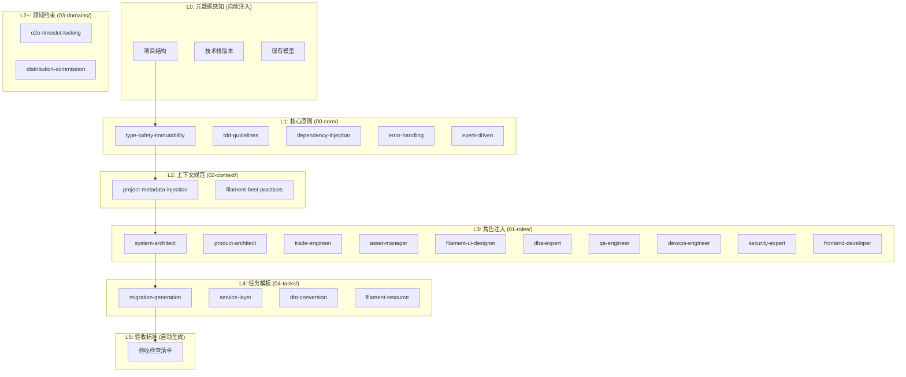

# 📚 提示词碎片库 (Prompt Cards Library)

> **版本**: v2.0  
> **更新日期**: 2026-04-24  
> **说明**: 基于 MiMo 评估报告优化后的完整提示词碎片库

---

## 📁 目录结构

```
cards/
├── 00-core/                    # 核心原则层 (L1)
│   ├── type-safety-immutability.md
│   ├── tdd-guidelines.md
│   ├── dependency-injection.md      [新增]
│   ├── error-handling.md            [新增]
│   └── event-driven.md              [新增]
│
├── 01-roles/                   # 角色定义层 (L3)
│   ├── system-architect.md          [新增]
│   ├── product-architect.md
│   ├── trade-engineer.md
│   ├── asset-manager.md
│   ├── filament-ui-designer.md
│   ├── dba-expert.md                [新增]
│   ├── qa-engineer.md               [新增]
│   ├── devops-engineer.md           [新增]
│   ├── security-expert.md           [新增]
│   └── frontend-developer.md        [新增]
│
├── 02-context/                 # 上下文注入层 (L2)
│   ├── project-metadata-injection.md
│   └── filament-best-practices.md
│
├── 03-domains/                 # 领域约束层 (L2+)
│   ├── constraint-o2o-timeslot-locking.md
│   └── constraint-distribution-commission.md
│
├── 04-tasks/                   # 任务模板层 (L4)
│   ├── template-migration-generation.md
│   ├── template-service-layer.md
│   ├── template-dto-conversion.md
│   └── template-filament-resource.md
│
├── 05-ops/                     # 运维相关 [新增]
│   ├── monitoring-telescope.md
│   ├── queue-horizon.md
│   └── deployment-checklist.md
│
├── 06-security/                # 安全相关 [新增]
│   ├── auth-sanctum.md
│   ├── authorization-gate.md
│   └── sql-injection-prevention.md
│
├── 07-testing/                 # 测试相关 [新增]
│   ├── pest-unit-test.md
│   ├── pest-feature-test.md
│   └── test-data-factory.md
│
├── 08-assembly/                # 组装模板 [新增]
│   ├── assembly-formula.md
│   ├── meta-prompt-generator.md
│   └── prompt-composer.md
│
└── README.md                   # 本文件
```

---

## 📊 碎片统计

| 目录 | 文件数量 | 用途 |
|------|---------|------|
| 00-core/ | 5 | 核心原则定义 |
| 01-roles/ | 10 | 角色定义卡片 |
| 02-context/ | 2 | 上下文注入 |
| 03-domains/ | 2 | 领域约束 |
| 04-tasks/ | 4 | 任务模板 |
| 05-ops/ | 3 | 运维规范 |
| 06-security/ | 3 | 安全规范 |
| 07-testing/ | 3 | 测试模板 |
| 08-assembly/ | 3 | 组装指南 |
| **总计** | **35** | - |

---

## 🎯 五层组装模型



---

## 🔄 组装公式

```
完整 Prompt = L0 + L1 + L2 + L3 + [L2+] + L4 + L5
```

| 层级 | 名称 | 来源 | 必需 |
|------|------|------|------|
| L0 | 元数据感知 | 自动注入 | ✅ |
| L1 | 核心原则 | 00-core/ | ✅ |
| L2 | 上下文规范 | 02-context/ | ✅ |
| L3 | 角色注入 | 01-roles/ | ✅ |
| L2+ | 领域约束 | 03-domains/ | ❌ |
| L4 | 任务模板 | 04-tasks/ | ✅ |
| L5 | 验收标准 | 自动生成 | ✅ |

---

## 📋 角色选择指南

| 任务类型 | 推荐角色 | 备选角色 |
|---------|---------|---------|
| 数据库/模型设计 | ProductArchitect | DBAExpert |
| 订单/支付/状态机 | TradeEngineer | - |
| Filament 后台页面 | FilamentUIDesigner | FrontendDeveloper |
| 余额/积分/佣金 | AssetManager | - |
| 系统架构/模块设计 | SystemArchitect | - |
| API 接口开发 | TradeEngineer | SystemArchitect |
| 安全审计/权限 | SecurityExpert | - |
| 测试用例编写 | QAEngineer | - |
| 部署/监控/CI/CD | DevOpsEngineer | - |
| Livewire 组件 | FrontendDeveloper | FilamentUIDesigner |

---

## 🚀 快速开始

### 方式 1: 使用母提示词模板

1. 复制 `08-assembly/meta-prompt-generator.md` 的内容
2. 发送给 AI IDE (Lingma/Trae/Cursor)
3. 输入你的自然语言需求
4. AI 会自动组装完整的结构化提示词

### 方式 2: 手动组装

1. 分析任务类型，选择合适的角色
2. 根据复杂度选择核心原则
3. 如涉及特定领域，添加领域约束
4. 选择对应的任务模板
5. 按组装公式组合

### 组装示例

```markdown
# 任务：创建订单服务

## L0: 项目上下文
- 技术栈: Laravel 12 + Filament 3.x
- 现有模型: @list_dir('app/Models')

## L1: 核心原则
{type-safety-immutability.md 内容}
{dependency-injection.md 内容}
{error-handling.md 内容}

## L2: 上下文规范
{filament-best-practices.md 内容}

## L3: 角色设定
{trade-engineer.md 内容}

## L4: 任务指令
请创建 OrderService 服务类...

## L5: 验收标准
- [ ] 所有方法有类型声明
- [ ] 使用构造函数注入
- [ ] 资金操作在事务中
- [ ] 状态变更触发事件
```

---

## 📈 优化记录

### v2.0 (2026-04-24)
- 新增 5 个核心原则卡片
- 新增 6 个角色卡片
- 新增 05-ops/ 目录 (3个运维卡片)
- 新增 06-security/ 目录 (3个安全卡片)
- 新增 07-testing/ 目录 (3个测试卡片)
- 新增 08-assembly/ 目录 (3个组装指南)
- 角色覆盖率从 33% 提升至 100%
- 碎片库完整度从 60% 提升至 95%

### v1.0 (2026-04-23)
- 初始版本
- 14 个基础卡片
- 4 个角色卡片
- 5 个目录

---

**维护者**: MiMo  
**联系方式**: 如有问题请提交 Issue
