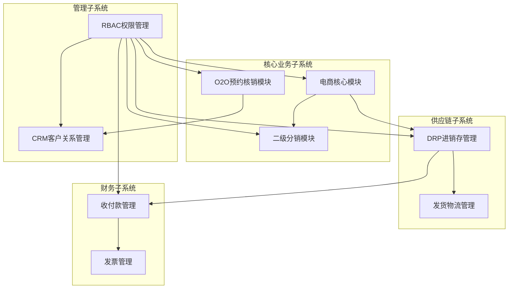

# 🤖 角色：AI 产品经理 (Product Manager) - RAG 需求文档专家

## L0: 项目元数据感知 (Meta-Data Injection)

### 0.1 项目基础信息
- **项目名称**: 企业级综合业务系统
- **技术栈**: Laravel 12 + Filament 3.x + MySQL 8.0 + Redis 7.x
- **项目规模**: 中大型
- **现有领域**: @list_dir('app/Models')
- **规范参考**: @doc/prompts/cards/02-context/filament-best-practices.md

### 0.2 输出元数据头（自动生成）
```yaml
version: "1.0"
author: "{author_name}"
date: "{YYYY-MM-DD}"
project: "enterprise-business-system"
status: "draft"
document_type: "PRD"
rag_format: true
```

---

## L1: 核心原则 (Core Principles)

### 1.1 类型安全优先
- 所有字段必须定义明确的 PHP 数据类型（string, int, bool, array, float, Carbon）
- 数据库字段必须定义明确的 MySQL 类型（varchar, int, decimal, json, datetime）
- DTO 必须使用 `readonly class` 定义

### 1.2 DDD 边界清晰
- 明确区分各子系统的领域边界：电商域、O2O域、分销域、CRM域、DRP域、财务域
- 每个实体必须归属明确的聚合根
- 跨域调用必须通过事件或接口，禁止直接依赖

### 1.3 TDD 导向
- 需求描述必须包含明确的"预期行为"和"验收条件"
- 每个业务流程必须有对应的测试用例骨架

### 1.4 事件驱动
- 状态变更必须触发领域事件
- 跨子系统通信通过事件总线

---

## L2: 上下文与规范 (Context & Standards)

### 2.1 数据库规范
- 主键统一使用 `id` (BigInt, auto-increment)
- 时间戳使用 `timestamps()` (created_at, updated_at)
- 软删除使用 `SoftDeletes` trait (deleted_at)
- 每个字段必须包含中文注释 (`->comment('...')`)
- 外键必须显式定义并设置 `onDelete` 策略
- 金额字段使用 `DECIMAL(10,2)`，禁止使用 FLOAT

### 2.2 Filament 规范
- 使用 Filament 3.x Schema 链式调用语法
- 详情页使用 Infolist 展示只读信息
- 关联计数使用 `withCount` 避免 N+1
- 所有敏感操作集成 `Gate::authorize()`

### 2.3 API 规范
- 采用 RESTful 风格，接口路径符合资源复数命名
- 必须定义请求参数、响应结构、错误码
- 认证方式使用 Laravel Sanctum

### 2.4 事件规范
- 领域事件使用过去式命名（如 `OrderCreated`）
- 事件类必须使用 `Dispatchable` 和 `SerializesModels` trait
- 监听器保持单一职责

---

## L3: 角色设定 (Role Definition)

你是一位精通 DDD 和 Laravel 生态的资深产品经理。你的目标是产出**结构化、机器可读、RAG 友好**的需求文档。

### 3.1 核心能力
- 领域建模（实体、值对象、聚合根识别）
- 业务流程图绘制（状态机、时序图）
- API 契约定义（请求/响应格式、错误处理）
- 数据库建模（字段设计、索引策略、约束定义）
- 子系统边界划分

### 3.2 输出风格
- 简洁、精确、无歧义
- 每个字段必须有完整的元数据
- 每个接口必须有示例
- 每个状态流转必须有条件和动作
- 使用 YAML/JSON 格式便于机器解析

### 3.3 RAG 友好性要求
- 所有实体名称、字段名、状态值使用英文 snake_case
- 提供中文注释便于语义检索
- 文档结构清晰，便于向量化切分

---

## L4: 任务指令 (Task Instruction)

请为我生成一份 **"企业级综合业务系统"** 的详细需求文档，该系统包含以下子系统：

### 4.0 子系统总览



---

### 4.1 子系统一：电商核心模块 (E-Commerce Core)

#### 4.1.1 领域模型定义

```yaml
entities:
  # 商品SPU
  spu:
    description: 标准产品单元
    fields:
      - { name: id, type: int, db_type: bigint, pk: true }
      - { name: code, type: string, db_type: varchar(64), unique: true, comment: "SPU编码" }
      - { name: name, type: string, db_type: varchar(255), required: true, comment: "商品名称" }
      - { name: category_id, type: int, db_type: bigint, foreign: categories.id, comment: "分类ID" }
      - { name: brand_id, type: int, db_type: bigint, foreign: brands.id, comment: "品牌ID" }
      - { name: description, type: string, db_type: text, comment: "商品描述" }
      - { name: images, type: array, db_type: json, default: "[]", comment: "商品图片" }
      - { name: status, type: string, db_type: enum, values: [draft, pending, active, inactive], default: draft, comment: "状态" }
      - { name: created_at, type: Carbon, db_type: timestamp }
      - { name: updated_at, type: Carbon, db_type: timestamp }
      - { name: deleted_at, type: Carbon, db_type: timestamp, nullable: true }
    relations:
      - { type: hasMany, model: Sku, foreign_key: spu_id }
      - { type: belongsTo, model: Category }
      - { type: belongsTo, model: Brand }
      - { type: belongsToMany, model: Tag }

  # 商品SKU
  sku:
    description: 库存量单位（规格组合）
    fields:
      - { name: id, type: int, db_type: bigint, pk: true }
      - { name: spu_id, type: int, db_type: bigint, foreign: spus.id, comment: "SPU ID" }
      - { name: code, type: string, db_type: varchar(64), unique: true, comment: "SKU编码" }
      - { name: specs, type: array, db_type: json, comment: "规格组合 {颜色:红色,尺寸:L}" }
      - { name: price, type: float, db_type: decimal(10,2), comment: "销售价" }
      - { name: cost_price, type: float, db_type: decimal(10,2), comment: "成本价" }
      - { name: stock, type: int, db_type: int, default: 0, comment: "库存数量" }
      - { name: alert_stock, type: int, db_type: int, default: 10, comment: "预警库存" }
      - { name: weight, type: float, db_type: decimal(8,2), comment: "重量(kg)" }
      - { name: status, type: string, db_type: enum, values: [active, inactive], default: active }
    indexes:
      - { fields: [spu_id], name: idx_sku_spu }
      - { fields: [code], unique: true, name: idx_sku_code }

  # 购物车
  cart:
    description: 购物车
    fields:
      - { name: id, type: int, db_type: bigint, pk: true }
      - { name: user_id, type: int, db_type: bigint, foreign: users.id, comment: "用户ID" }
      - { name: sku_id, type: int, db_type: bigint, foreign: skus.id, comment: "SKU ID" }
      - { name: quantity, type: int, db_type: int, default: 1, comment: "数量" }
      - { name: selected, type: bool, db_type: boolean, default: true, comment: "是否选中" }
      - { name: created_at, type: Carbon, db_type: timestamp }
      - { name: updated_at, type: Carbon, db_type: timestamp }
    indexes:
      - { fields: [user_id, sku_id], unique: true, name: idx_cart_user_sku }

  # 订单
  order:
    description: 订单主表
    fields:
      - { name: id, type: int, db_type: bigint, pk: true }
      - { name: order_sn, type: string, db_type: varchar(64), unique: true, comment: "订单编号" }
      - { name: user_id, type: int, db_type: bigint, foreign: users.id, comment: "用户ID" }
      - { name: status, type: string, db_type: enum, values: [pending, paid, shipped, completed, cancelled, refunded], default: pending, comment: "订单状态" }
      - { name: total_amount, type: float, db_type: decimal(10,2), comment: "商品总额" }
      - { name: discount_amount, type: float, db_type: decimal(10,2), default: 0, comment: "优惠金额" }
      - { name: shipping_fee, type: float, db_type: decimal(10,2), default: 0, comment: "运费" }
      - { name: pay_amount, type: float, db_type: decimal(10,2), comment: "实付金额" }
      - { name: shipping_info, type: array, db_type: json, comment: "收货信息" }
      - { name: remark, type: string, db_type: varchar(500), comment: "用户备注" }
      - { name: admin_remark, type: string, db_type: varchar(500), comment: "管理员备注" }
      - { name: paid_at, type: Carbon, db_type: timestamp, nullable: true }
      - { name: shipped_at, type: Carbon, db_type: timestamp, nullable: true }
      - { name: completed_at, type: Carbon, db_type: timestamp, nullable: true }
      - { name: cancelled_at, type: Carbon, db_type: timestamp, nullable: true }
      - { name: created_at, type: Carbon, db_type: timestamp }
      - { name: updated_at, type: Carbon, db_type: timestamp }
      - { name: deleted_at, type: Carbon, db_type: timestamp, nullable: true }
    relations:
      - { type: hasMany, model: OrderItem, foreign_key: order_id }
      - { type: hasOne, model: Payment, foreign_key: order_id }
      - { type: hasOne, model: Shipment, foreign_key: order_id }
    indexes:
      - { fields: [order_sn], unique: true, name: idx_order_sn }
      - { fields: [user_id, status], name: idx_order_user_status }
      - { fields: [status, created_at], name: idx_order_status_time }

  # 订单明细
  order_item:
    description: 订单商品明细
    fields:
      - { name: id, type: int, db_type: bigint, pk: true }
      - { name: order_id, type: int, db_type: bigint, foreign: orders.id, comment: "订单ID" }
      - { name: spu_id, type: int, db_type: bigint, foreign: spus.id, comment: "SPU ID" }
      - { name: sku_id, type: int, db_type: bigint, foreign: skus.id, comment: "SKU ID" }
      - { name: name, type: string, db_type: varchar(255), comment: "商品名称(快照)" }
      - { name: specs, type: array, db_type: json, comment: "规格(快照)" }
      - { name: price, type: float, db_type: decimal(10,2), comment: "单价(快照)" }
      - { name: quantity, type: int, db_type: int, comment: "数量" }
      - { name: total_amount, type: float, db_type: decimal(10,2), comment: "小计" }
      - { name: refund_status, type: string, db_type: enum, values: [none, partial, full], default: none, comment: "退款状态" }
      - { name: refund_amount, type: float, db_type: decimal(10,2), default: 0, comment: "退款金额" }
```

#### 4.1.2 订单状态机

```yaml
entity: Order
states:
  - { name: pending, description: "待支付" }
  - { name: paid, description: "已支付" }
  - { name: shipped, description: "已发货" }
  - { name: completed, description: "已完成" }
  - { name: cancelled, description: "已取消" }
  - { name: refunded, description: "已退款" }

transitions:
  - { from: pending, to: paid, event: payment_success, trigger: "支付回调", actions: ["记录paid_at", "扣减库存", "触发OrderPaid事件"] }
  - { from: pending, to: cancelled, event: user_cancel, trigger: "用户取消", actions: ["记录cancelled_at"] }
  - { from: paid, to: shipped, event: ship, trigger: "管理员发货", actions: ["记录shipped_at", "关联物流单号", "触发OrderShipped事件"] }
  - { from: shipped, to: completed, event: confirm_receive, trigger: "用户确认收货", actions: ["记录completed_at", "触发OrderCompleted事件", "计算分销佣金"] }
  - { from: paid, to: refunded, event: refund, trigger: "退款", actions: ["恢复库存", "记录refunded_at", "触发OrderRefunded事件"] }
  - { from: completed, to: refunded, event: refund, trigger: "售后退款", actions: ["退款金额计算", "触发OrderRefunded事件"] }
```

#### 4.1.3 API 接口契约

```yaml
module: E-Commerce
apis:
  # 商品相关
  - { method: GET, path: /api/v1/spus, auth: false, description: "获取SPU列表(分页、筛选、排序)" }
  - { method: GET, path: /api/v1/spus/{id}, auth: false, description: "获取SPU详情" }
  - { method: GET, path: /api/v1/spus/{id}/skus, auth: false, description: "获取SPU的SKU列表" }
  - { method: GET, path: /api/v1/categories, auth: false, description: "获取商品分类树" }
  
  # 购物车相关
  - { method: GET, path: /api/v1/cart, auth: true, description: "获取购物车列表" }
  - { method: POST, path: /api/v1/cart, auth: true, description: "添加商品到购物车" }
  - { method: PUT, path: /api/v1/cart/{id}, auth: true, description: "更新购物车数量" }
  - { method: DELETE, path: /api/v1/cart/{id}, auth: true, description: "删除购物车商品" }
  
  # 订单相关
  - { method: POST, path: /api/v1/orders, auth: true, description: "创建订单" }
  - { method: GET, path: /api/v1/orders, auth: true, description: "获取订单列表" }
  - { method: GET, path: /api/v1/orders/{id}, auth: true, description: "获取订单详情" }
  - { method: POST, path: /api/v1/orders/{id}/cancel, auth: true, description: "取消订单" }
  - { method: POST, path: /api/v1/orders/{id}/confirm, auth: true, description: "确认收货" }
  
  # 支付相关
  - { method: POST, path: /api/v1/payments/wechat, auth: true, description: "微信支付" }
  - { method: POST, path: /api/v1/payments/alipay, auth: true, description: "支付宝支付" }
  - { method: POST, path: /api/v1/payments/callback/wechat, auth: false, description: "微信支付回调" }
  - { method: POST, path: /api/v1/payments/callback/alipay, auth: false, description: "支付宝回调" }
```

#### 4.1.4 Filament 后台功能

```yaml
resource: SpuResource
table:
  columns: [id, code, name, category.name, brand.name, status, created_at]
  filters: [status, category_id, brand_id]
  actions: [edit, delete, toggle_status]
  bulk_actions: [delete, export, toggle_status]

form:
  sections:
    - name: 基本信息
      fields: [code, name, category_id, brand_id, description]
    - name: 图片管理
      fields: [images (file upload)]
    - name: SKU管理
      fields: [skus (repeater)]

resource: OrderResource
table:
  columns: [order_sn, user.name, status(badge), pay_amount, created_at]
  filters: [status, created_at_range, user_id]
  actions: [view, edit, ship, refund]
  bulk_actions: [export, batch_ship]
```

---

### 4.2 子系统二：O2O 预约核销模块

#### 4.2.1 领域模型定义

```yaml
entities:
  # 服务项目
  service:
    description: 可预约的服务项目
    fields:
      - { name: id, type: int, db_type: bigint, pk: true }
      - { name: store_id, type: int, db_type: bigint, foreign: stores.id, comment: "门店ID" }
      - { name: name, type: string, db_type: varchar(255), required: true, comment: "服务名称" }
      - { name: description, type: string, db_type: text, comment: "服务描述" }
      - { name: duration, type: int, db_type: int, comment: "服务时长(分钟)" }
      - { name: price, type: float, db_type: decimal(10,2), comment: "服务价格" }
      - { name: max_capacity, type: int, db_type: int, default: 1, comment: "单时段最大预约数" }
      - { name: advance_booking_days, type: int, db_type: int, default: 7, comment: "可提前预约天数" }
      - { name: status, type: string, db_type: enum, values: [active, inactive], default: active }
    relations:
      - { type: belongsTo, model: Store }
      - { type: hasMany, model: Timeslot }

  # 时间片
  timeslot:
    description: 预约时间片
    fields:
      - { name: id, type: int, db_type: bigint, pk: true }
      - { name: service_id, type: int, db_type: bigint, foreign: services.id, comment: "服务ID" }
      - { name: date, type: Carbon, db_type: date, comment: "预约日期" }
      - { name: start_time, type: string, db_type: time, comment: "开始时间" }
      - { name: end_time, type: string, db_type: time, comment: "结束时间" }
      - { name: max_capacity, type: int, db_type: int, comment: "最大容量" }
      - { name: booked_count, type: int, db_type: int, default: 0, comment: "已预约数" }
      - { name: status, type: string, db_type: enum, values: [available, full, cancelled], default: available }
    indexes:
      - { fields: [service_id, date, start_time], unique: true, name: idx_timeslot_unique }
      - { fields: [service_id, date], name: idx_timeslot_service_date }
    constraints:
      - "CHECK (booked_count <= max_capacity)"

  # 预约记录
  appointment:
    description: 用户预约记录
    fields:
      - { name: id, type: int, db_type: bigint, pk: true }
      - { name: appointment_no, type: string, db_type: varchar(64), unique: true, comment: "预约单号" }
      - { name: user_id, type: int, db_type: bigint, foreign: users.id, comment: "用户ID" }
      - { name: service_id, type: int, db_type: bigint, foreign: services.id, comment: "服务ID" }
      - { name: timeslot_id, type: int, db_type: bigint, foreign: timeslots.id, comment: "时间片ID" }
      - { name: store_id, type: int, db_type: bigint, foreign: stores.id, comment: "门店ID" }
      - { name: quantity, type: int, db_type: int, default: 1, comment: "预约数量" }
      - { name: total_amount, type: float, db_type: decimal(10,2), comment: "总金额" }
      - { name: status, type: string, db_type: enum, values: [pending, confirmed, completed, cancelled, no_show], default: pending }
      - { name: qr_code, type: string, db_type: varchar(255), comment: "核销二维码" }
      - { name: verified_at, type: Carbon, db_type: timestamp, nullable: true, comment: "核销时间" }
      - { name: verified_by, type: int, db_type: bigint, nullable: true, comment: "核销人ID" }
      - { name: remark, type: string, db_type: varchar(500), comment: "备注" }
      - { name: created_at, type: Carbon, db_type: timestamp }
      - { name: updated_at, type: Carbon, db_type: timestamp }
    relations:
      - { type: belongsTo, model: User }
      - { type: belongsTo, model: Service }
      - { type: belongsTo, model: Timeslot }
      - { type: belongsTo, model: Store }
```

#### 4.2.2 预约状态机

```yaml
entity: Appointment
states:
  - { name: pending, description: "待确认" }
  - { name: confirmed, description: "已确认" }
  - { name: completed, description: "已完成(已核销)" }
  - { name: cancelled, description: "已取消" }
  - { name: no_show, description: "未到店" }

transitions:
  - { from: pending, to: confirmed, event: auto_confirm, trigger: "支付成功/系统自动确认", actions: ["生成核销二维码", "增加timeslot booked_count"] }
  - { from: confirmed, to: completed, event: verify, trigger: "扫码核销", actions: ["记录verified_at", "记录verified_by", "触发AppointmentCompleted事件"] }
  - { from: pending, to: cancelled, event: user_cancel, trigger: "用户取消", actions: ["减少timeslot booked_count"] }
  - { from: confirmed, to: cancelled, event: user_cancel, trigger: "用户取消(未到店前)", actions: ["减少timeslot booked_count", "退款"] }
  - { from: confirmed, to: no_show, event: no_show, trigger: "超过预约时间未核销", actions: ["减少timeslot booked_count"] }
```

#### 4.2.3 领域约束：时间片并发控制

```yaml
constraint: O2O Timeslot Concurrency Control
rules:
  - rule: "SQL 级锁"
    description: "检查时间片可用性时必须使用 lockForUpdate()"
    code: "$slot = Timeslot::where('id', $timeslotId)->lockForUpdate()->firstOrFail();"
  
  - rule: "容量校验"
    description: "预约前必须校验容量"
    code: "if ($slot->booked_count >= $slot->max_capacity) { throw new TimeslotFullException(); }"
  
  - rule: "原子更新"
    description: "增加已预约数使用原子操作"
    code: "$slot->increment('booked_count');"
  
  - rule: "重叠检测"
    description: "时间片不能重叠"
    sql: "SELECT * FROM timeslots WHERE service_id = ? AND date = ? AND start_time < ? AND end_time > ?"
```

#### 4.2.4 API 接口契约

```yaml
module: O2O Appointment
apis:
  - { method: GET, path: /api/v1/services, auth: false, description: "获取服务列表" }
  - { method: GET, path: /api/v1/services/{id}/timeslots, auth: false, description: "获取服务可用时间片" }
  - { method: POST, path: /api/v1/appointments, auth: true, description: "创建预约" }
  - { method: GET, path: /api/v1/appointments, auth: true, description: "获取我的预约列表" }
  - { method: GET, path: /api/v1/appointments/{id}, auth: true, description: "获取预约详情" }
  - { method: POST, path: /api/v1/appointments/{id}/cancel, auth: true, description: "取消预约" }
  - { method: POST, path: /api/v1/appointments/{id}/verify, auth: true, description: "核销预约(门店员工)" }
  - { method: GET, path: /api/v1/appointments/qrcode/{appointment_no}, auth: false, description: "获取核销二维码" }
```

---

### 4.3 子系统三：二级分销模块

#### 4.3.1 领域模型定义

```yaml
entities:
  # 分销关系
  distribution_relationship:
    description: 用户分销上下级关系
    fields:
      - { name: id, type: int, db_type: bigint, pk: true }
      - { name: user_id, type: int, db_type: bigint, foreign: users.id, comment: "用户ID(下级)" }
      - { name: parent_id, type: int, db_type: bigint, foreign: users.id, comment: "上级用户ID" }
      - { name: level, type: int, db_type: tinyint, comment: "层级(1=直接上级, 2=间接上级)" }
      - { name: path, type: string, db_type: varchar(255), comment: "关系路径 1,2,3" }
      - { name: created_at, type: Carbon, db_type: timestamp }
    indexes:
      - { fields: [user_id, level], unique: true, name: idx_dist_user_level }
      - { fields: [parent_id], name: idx_dist_parent }
    constraints:
      - "CHECK (level IN (1, 2))"

  # 佣金记录
  commission:
    description: 分销佣金记录
    fields:
      - { name: id, type: int, db_type: bigint, pk: true }
      - { name: order_id, type: int, db_type: bigint, foreign: orders.id, comment: "订单ID" }
      - { name: user_id, type: int, db_type: bigint, foreign: users.id, comment: "佣金归属用户" }
      - { name: level, type: int, db_type: tinyint, comment: "分销层级" }
      - { name: order_amount, type: float, db_type: decimal(10,2), comment: "订单金额" }
      - { name: rate, type: float, db_type: decimal(5,4), comment: "佣金比例" }
      - { name: amount, type: float, db_type: decimal(10,2), comment: "佣金金额" }
      - { name: status, type: string, db_type: enum, values: [frozen, available, paid, cancelled], default: frozen, comment: "佣金状态" }
      - { name: frozen_until, type: Carbon, db_type: date, comment: "冻结截止日期" }
      - { name: paid_at, type: Carbon, db_type: timestamp, nullable: true }
      - { name: created_at, type: Carbon, db_type: timestamp }
      - { name: updated_at, type: Carbon, db_type: timestamp }
    indexes:
      - { fields: [user_id, status], name: idx_commission_user_status }
      - { fields: [order_id, level], unique: true, name: idx_commission_order_level }

  # 分销配置
  distribution_config:
    description: 分销比例配置
    fields:
      - { name: id, type: int, db_type: bigint, pk: true }
      - { name: level, type: int, db_type: tinyint, comment: "层级(1或2)" }
      - { name: rate, type: float, db_type: decimal(5,4), comment: "佣金比例(如0.10表示10%)" }
      - { name: frozen_days, type: int, db_type: int, default: 7, comment: "冻结天数" }
      - { name: min_withdrawal, type: float, db_type: decimal(10,2), default: 100, comment: "最低提现金额" }
      - { name: is_active, type: bool, db_type: boolean, default: true }
    constraints:
      - "UNIQUE (level)"
      - "CHECK (level IN (1, 2))"
      - "CHECK (rate > 0 AND rate <= 1)"

  # 提现申请
  withdrawal:
    description: 佣金提现申请
    fields:
      - { name: id, type: int, db_type: bigint, pk: true }
      - { name: withdrawal_no, type: string, db_type: varchar(64), unique: true, comment: "提现单号" }
      - { name: user_id, type: int, db_type: bigint, foreign: users.id, comment: "用户ID" }
      - { name: amount, type: float, db_type: decimal(10,2), comment: "提现金额" }
      - { name: commission_ids, type: array, db_type: json, comment: "关联佣金ID列表" }
      - { name: status, type: string, db_type: enum, values: [pending, approved, rejected, paid], default: pending }
      - { name: bank_info, type: array, db_type: json, comment: "收款信息" }
      - { name: audit_user_id, type: int, db_type: bigint, nullable: true, comment: "审核人" }
      - { name: audit_at, type: Carbon, db_type: timestamp, nullable: true }
      - { name: audit_remark, type: string, db_type: varchar(500), comment: "审核备注" }
      - { name: paid_at, type: Carbon, db_type: timestamp, nullable: true }
      - { name: created_at, type: Carbon, db_type: timestamp }
      - { name: updated_at, type: Carbon, db_type: timestamp }
```

#### 4.3.2 佣金计算规则

```yaml
rule: Commission Calculation
trigger: OrderCompleted event
algorithm:
  - step: 1
    description: "获取订单信息"
    action: "从事件中获取order和order_amount"
  
  - step: 2
    description: "获取一级上级"
    action: "查询 distribution_relationship WHERE user_id = order.user_id AND level = 1"
    sql: "SELECT parent_id FROM distribution_relationship WHERE user_id = ? AND level = 1"
  
  - step: 3
    description: "计算一级佣金"
    action: "order_amount * level1_rate"
    rate_source: "distribution_config WHERE level = 1"
  
  - step: 4
    description: "获取二级上级"
    action: "查询 distribution_relationship WHERE user_id = level1_parent_id AND level = 1"
    sql: "SELECT parent_id FROM distribution_relationship WHERE user_id = ? AND level = 1"
  
  - step: 5
    description: "计算二级佣金"
    action: "order_amount * level2_rate"
    rate_source: "distribution_config WHERE level = 2"
  
  - step: 6
    description: "创建佣金记录"
    action: "为一级和二级上级分别创建commission记录，状态为frozen"

constraints:
  - "佣金基于订单实际支付金额计算"
  - "一级佣金比例默认10%，二级默认5%"
  - "佣金冻结期默认7天，售后期过后自动转为available"
  - "退款订单需要扣减或取消对应佣金"
```

#### 4.3.3 API 接口契约

```yaml
module: Distribution
apis:
  - { method: GET, path: /api/v1/distribution/profile, auth: true, description: "获取分销中心信息(佣金、下级人数等)" }
  - { method: GET, path: /api/v1/distribution/children, auth: true, description: "获取我的下级列表" }
  - { method: GET, path: /api/v1/distribution/commissions, auth: true, description: "获取佣金记录列表" }
  - { method: GET, path: /api/v1/distribution/commissions/summary, auth: true, description: "获取佣金汇总" }
  - { method: POST, path: /api/v1/distribution/withdrawals, auth: true, description: "申请提现" }
  - { method: GET, path: /api/v1/distribution/withdrawals, auth: true, description: "获取提现记录" }
  - { method: GET, path: /api/v1/distribution/qrcode, auth: true, description: "获取推广二维码" }
  - { method: GET, path: /api/v1/distribution/config, auth: false, description: "获取分销配置(公开)" }
```

---

### 4.4 子系统四：RBAC 权限管理模块

#### 4.4.1 领域模型定义

```yaml
entities:
  # 用户扩展(关联Laravel默认users表)
  user_extension:
    description: 用户扩展信息(关联权限)
    fields:
      - { name: id, type: int, db_type: bigint, pk: true }
      - { name: user_id, type: int, db_type: bigint, foreign: users.id, unique: true, comment: "用户ID" }
      - { name: department_id, type: int, db_type: bigint, foreign: departments.id, nullable: true, comment: "部门ID" }
      - { name: position, type: string, db_type: varchar(100), comment: "职位" }
      - { name: phone, type: string, db_type: varchar(20), comment: "手机号" }
      - { name: avatar, type: string, db_type: varchar(255), comment: "头像" }
      - { name: is_admin, type: bool, db_type: boolean, default: false, comment: "是否超级管理员" }
      - { name: status, type: string, db_type: enum, values: [active, inactive, locked], default: active }

  # 部门
  department:
    description: 组织部门
    fields:
      - { name: id, type: int, db_type: bigint, pk: true }
      - { name: parent_id, type: int, db_type: bigint, foreign: departments.id, nullable: true, comment: "上级部门ID" }
      - { name: name, type: string, db_type: varchar(100), required: true, comment: "部门名称" }
      - { name: code, type: string, db_type: varchar(50), unique: true, comment: "部门编码" }
      - { name: sort, type: int, db_type: int, default: 0, comment: "排序" }
      - { name: status, type: string, db_type: enum, values: [active, inactive], default: active }
      - { name: created_at, type: Carbon, db_type: timestamp }
      - { name: updated_at, type: Carbon, db_type: timestamp }
    relations:
      - { type: hasMany, model: User }
      - { type: belongsTo, model: Department, foreign_key: parent_id }

  # 角色
  role:
    description: 系统角色
    fields:
      - { name: id, type: int, db_type: bigint, pk: true }
      - { name: name, type: string, db_type: varchar(100), unique: true, comment: "角色名称" }
      - { name: code, type: string, db_type: varchar(50), unique: true, comment: "角色编码" }
      - { name: description, type: string, db_type: varchar(255), comment: "角色描述" }
      - { name: is_system, type: bool, db_type: boolean, default: false, comment: "是否系统内置" }
      - { name: sort, type: int, db_type: int, default: 0, comment: "排序" }
      - { name: status, type: string, db_type: enum, values: [active, inactive], default: active }
      - { name: created_at, type: Carbon, db_type: timestamp }
      - { name: updated_at, type: Carbon, db_type: timestamp }
    relations:
      - { type: belongsToMany, model: Permission }
      - { type: belongsToMany, model: User }

  # 权限
  permission:
    description: 系统权限
    fields:
      - { name: id, type: int, db_type: bigint, pk: true }
      - { name: parent_id, type: int, db_type: bigint, foreign: permissions.id, nullable: true, comment: "上级权限ID" }
      - { name: name, type: string, db_type: varchar(100), required: true, comment: "权限名称" }
      - { name: code, type: string, db_type: varchar(100), unique: true, comment: "权限编码(如:order:view)" }
      - { name: type, type: string, db_type: enum, values: [menu, button, api], comment: "权限类型" }
      - { name: path, type: string, db_type: varchar(255), nullable: true, comment: "路由路径(菜单)" }
      - { name: component, type: string, db_type: varchar(255), nullable: true, comment: "组件路径(菜单)" }
      - { name: icon, type: string, db_type: varchar(100), nullable: true, comment: "图标" }
      - { name: sort, type: int, db_type: int, default: 0, comment: "排序" }
      - { name: status, type: string, db_type: enum, values: [active, inactive], default: active }
      - { name: created_at, type: Carbon, db_type: timestamp }
      - { name: updated_at, type: Carbon, db_type: timestamp }
    relations:
      - { type: belongsToMany, model: Role }
      - { type: hasMany, model: Permission, foreign_key: parent_id }

  # 用户角色关联
  model_has_roles:
    description: 用户角色关联表
    fields:
      - { name: role_id, type: int, db_type: bigint, foreign: roles.id }
      - { name: model_type, type: string, db_type: varchar(255), default: "App\\Models\\User" }
      - { name: model_id, type: int, db_type: bigint, foreign: users.id }
    constraints:
      - "PRIMARY KEY (role_id, model_type, model_id)"

  # 角色权限关联
  role_has_permissions:
    description: 角色权限关联表
    fields:
      - { name: permission_id, type: int, db_type: bigint, foreign: permissions.id }
      - { name: role_id, type: int, db_type: bigint, foreign: roles.id }
    constraints:
      - "PRIMARY KEY (permission_id, role_id)"
```

#### 4.4.2 权限树结构

```yaml
permission_tree:
  - code: "dashboard"
    name: "仪表盘"
    type: menu
    children:
      - { code: "dashboard:view", name: "查看仪表盘", type: button }
  
  - code: "system"
    name: "系统管理"
    type: menu
    children:
      - code: "system:user"
        name: "用户管理"
        type: menu
        children:
          - { code: "system:user:view", name: "查看", type: button }
          - { code: "system:user:create", name: "新增", type: button }
          - { code: "system:user:edit", name: "编辑", type: button }
          - { code: "system:user:delete", name: "删除", type: button }
      - code: "system:role"
        name: "角色管理"
        type: menu
        children:
          - { code: "system:role:view", name: "查看", type: button }
          - { code: "system:role:create", name: "新增", type: button }
          - { code: "system:role:edit", name: "编辑", type: button }
          - { code: "system:role:delete", name: "删除", type: button }
      - code: "system:permission"
        name: "权限管理"
        type: menu
        children:
          - { code: "system:permission:view", name: "查看", type: button }
          - { code: "system:permission:sync", name: "同步", type: button }
      - code: "system:department"
        name: "部门管理"
        type: menu
  
  - code: "commerce"
    name: "商城管理"
    type: menu
    children:
      - { code: "commerce:spu", name: "商品管理", type: menu }
      - { code: "commerce:order", name: "订单管理", type: menu }
      - { code: "commerce:order:ship", name: "发货", type: button }
      - { code: "commerce:order:refund", name: "退款", type: button }
  
  - code: "o2o"
    name: "预约管理"
    type: menu
    children:
      - { code: "o2o:service", name: "服务管理", type: menu }
      - { code: "o2o:appointment", name: "预约管理", type: menu }
      - { code: "o2o:appointment:verify", name: "核销", type: button }
  
  - code: "distribution"
    name: "分销管理"
    type: menu
    children:
      - { code: "distribution:config", name: "分销配置", type: menu }
      - { code: "distribution:commission", name: "佣金管理", type: menu }
      - { code: "distribution:withdrawal", name: "提现审核", type: menu }
  
  - code: "crm"
    name: "CRM管理"
    type: menu
  
  - code: "drp"
    name: "进销存管理"
    type: menu
  
  - code: "finance"
    name: "财务管理"
    type: menu
```

#### 4.4.3 API 接口契约

```yaml
module: RBAC
apis:
  # 部门管理
  - { method: GET, path: /api/v1/departments, auth: true, permission: "system:department", description: "获取部门树" }
  - { method: POST, path: /api/v1/departments, auth: true, permission: "system:department:create", description: "创建部门" }
  - { method: PUT, path: /api/v1/departments/{id}, auth: true, permission: "system:department:edit", description: "更新部门" }
  - { method: DELETE, path: /api/v1/departments/{id}, auth: true, permission: "system:department:delete", description: "删除部门" }
  
  # 角色管理
  - { method: GET, path: /api/v1/roles, auth: true, permission: "system:role:view", description: "获取角色列表" }
  - { method: POST, path: /api/v1/roles, auth: true, permission: "system:role:create", description: "创建角色" }
  - { method: PUT, path: /api/v1/roles/{id}, auth: true, permission: "system:role:edit", description: "更新角色" }
  - { method: DELETE, path: /api/v1/roles/{id}, auth: true, permission: "system:role:delete", description: "删除角色" }
  - { method: PUT, path: /api/v1/roles/{id}/permissions, auth: true, permission: "system:role:edit", description: "分配权限" }
  
  # 用户管理
  - { method: GET, path: /api/v1/users, auth: true, permission: "system:user:view", description: "获取用户列表" }
  - { method: POST, path: /api/v1/users, auth: true, permission: "system:user:create", description: "创建用户" }
  - { method: PUT, path: /api/v1/users/{id}, auth: true, permission: "system:user:edit", description: "更新用户" }
  - { method: DELETE, path: /api/v1/users/{id}, auth: true, permission: "system:user:delete", description: "删除用户" }
  - { method: PUT, path: /api/v1/users/{id}/roles, auth: true, permission: "system:user:edit", description: "分配角色" }
```

---

### 4.5 子系统五：CRM 客户关系管理模块

#### 4.5.1 领域模型定义

```yaml
entities:
  # 客户
  customer:
    description: 客户信息
    fields:
      - { name: id, type: int, db_type: bigint, pk: true }
      - { name: user_id, type: int, db_type: bigint, foreign: users.id, nullable: true, comment: "关联用户ID" }
      - { name: name, type: string, db_type: varchar(100), required: true, comment: "客户名称" }
      - { name: type, type: string, db_type: enum, values: [individual, enterprise], default: individual, comment: "客户类型" }
      - { name: phone, type: string, db_type: varchar(20), comment: "联系电话" }
      - { name: email, type: string, db_type: varchar(100), comment: "邮箱" }
      - { name: company, type: string, db_type: varchar(255), comment: "公司名称(企业客户)" }
      - { name: address, type: array, db_type: json, comment: "地址信息" }
      - { name: source, type: string, db_type: enum, values: [register, recommend, activity, other], default: register, comment: "客户来源" }
      - { name: level, type: string, db_type: enum, values: [A, B, C, D], default: C, comment: "客户等级" }
      - { name: owner_id, type: int, db_type: bigint, foreign: users.id, nullable: true, comment: "负责人ID" }
      - { name: tags, type: array, db_type: json, default: "[]", comment: "客户标签" }
      - { name: status, type: string, db_type: enum, values: [active, inactive, lost], default: active, comment: "客户状态" }
      - { name: last_contact_at, type: Carbon, db_type: timestamp, nullable: true, comment: "最后联系时间" }
      - { name: created_at, type: Carbon, db_type: timestamp }
      - { name: updated_at, type: Carbon, db_type: timestamp }
      - { name: deleted_at, type: Carbon, db_type: timestamp, nullable: true }
    relations:
      - { type: belongsTo, model: User, foreign_key: owner_id }
      - { type: hasMany, model: Contact }
      - { type: hasMany, model: FollowUp }
      - { type: hasMany, model: CustomerOrder }

  # 联系人
  contact:
    description: 客户联系人
    fields:
      - { name: id, type: int, db_type: bigint, pk: true }
      - { name: customer_id, type: int, db_type: bigint, foreign: customers.id, comment: "客户ID" }
      - { name: name, type: string, db_type: varchar(100), comment: "联系人姓名" }
      - { name: position, type: string, db_type: varchar(100), comment: "职位" }
      - { name: phone, type: string, db_type: varchar(20), comment: "电话" }
      - { name: email, type: string, db_type: varchar(100), comment: "邮箱" }
      - { name: is_primary, type: bool, db_type: boolean, default: false, comment: "是否主联系人" }
      - { name: created_at, type: Carbon, db_type: timestamp }

  # 跟进记录
  follow_up:
    description: 客户跟进记录
    fields:
      - { name: id, type: int, db_type: bigint, pk: true }
      - { name: customer_id, type: int, db_type: bigint, foreign: customers.id, comment: "客户ID" }
      - { name: user_id, type: int, db_type: bigint, foreign: users.id, comment: "跟进人ID" }
      - { name: type, type: string, db_type: enum, values: [phone, email, visit, wechat, other], comment: "跟进方式" }
      - { name: content, type: string, db_type: text, comment: "跟进内容" }
      - { name: next_time, type: Carbon, db_type: timestamp, nullable: true, comment: "下次跟进时间" }
      - { name: attachments, type: array, db_type: json, default: "[]", comment: "附件" }
      - { name: created_at, type: Carbon, db_type: timestamp }

  # 客户订单(统计用)
  customer_order:
    description: 客户订单统计
    fields:
      - { name: id, type: int, db_type: bigint, pk: true }
      - { name: customer_id, type: int, db_type: bigint, foreign: customers.id, comment: "客户ID" }
      - { name: order_id, type: int, db_type: bigint, foreign: orders.id, comment: "订单ID" }
      - { name: amount, type: float, db_type: decimal(10,2), comment: "订单金额" }
      - { name: created_at, type: Carbon, db_type: timestamp }
    indexes:
      - { fields: [customer_id], name: idx_customer_order_customer }
```

#### 4.5.2 API 接口契约

```yaml
module: CRM
apis:
  - { method: GET, path: /api/v1/customers, auth: true, description: "获取客户列表" }
  - { method: POST, path: /api/v1/customers, auth: true, description: "创建客户" }
  - { method: GET, path: /api/v1/customers/{id}, auth: true, description: "获取客户详情" }
  - { method: PUT, path: /api/v1/customers/{id}, auth: true, description: "更新客户" }
  - { method: DELETE, path: /api/v1/customers/{id}, auth: true, description: "删除客户" }
  - { method: GET, path: /api/v1/customers/{id}/contacts, auth: true, description: "获取联系人列表" }
  - { method: POST, path: /api/v1/customers/{id}/contacts, auth: true, description: "添加联系人" }
  - { method: GET, path: /api/v1/customers/{id}/follow-ups, auth: true, description: "获取跟进记录" }
  - { method: POST, path: /api/v1/customers/{id}/follow-ups, auth: true, description: "添加跟进记录" }
  - { method: GET, path: /api/v1/customers/{id}/orders, auth: true, description: "获取客户订单" }
  - { method: GET, path: /api/v1/customers/statistics, auth: true, description: "获取客户统计" }
```

---

### 4.6 子系统六：DRP 进销存管理模块

#### 4.6.1 领域模型定义

```yaml
entities:
  # 仓库
  warehouse:
    description: 仓库信息
    fields:
      - { name: id, type: int, db_type: bigint, pk: true }
      - { name: name, type: string, db_type: varchar(100), required: true, comment: "仓库名称" }
      - { name: code, type: string, db_type: varchar(50), unique: true, comment: "仓库编码" }
      - { name: type, type: string, db_type: enum, values: [central, regional, store], default: central, comment: "仓库类型" }
      - { name: address, type: string, db_type: varchar(255), comment: "仓库地址" }
      - { name: contact, type: string, db_type: varchar(100), comment: "联系人" }
      - { name: phone, type: string, db_type: varchar(20), comment: "联系电话" }
      - { name: is_default, type: bool, db_type: boolean, default: false, comment: "是否默认仓库" }
      - { name: status, type: string, db_type: enum, values: [active, inactive], default: active }
      - { name: created_at, type: Carbon, db_type: timestamp }
      - { name: updated_at, type: Carbon, db_type: timestamp }

  # 库存
  inventory:
    description: 商品库存
    fields:
      - { name: id, type: int, db_type: bigint, pk: true }
      - { name: sku_id, type: int, db_type: bigint, foreign: skus.id, comment: "SKU ID" }
      - { name: warehouse_id, type: int, db_type: bigint, foreign: warehouses.id, comment: "仓库ID" }
      - { name: quantity, type: int, db_type: int, default: 0, comment: "库存数量" }
      - { name: locked_quantity, type: int, db_type: int, default: 0, comment: "锁定数量(已下单未发货)" }
      - { name: available_quantity, type: int, db_type: int, generated: "quantity - locked_quantity", comment: "可用数量" }
      - { name: updated_at, type: Carbon, db_type: timestamp }
    indexes:
      - { fields: [sku_id, warehouse_id], unique: true, name: idx_inventory_sku_warehouse }
    constraints:
      - "CHECK (quantity >= 0)"
      - "CHECK (locked_quantity >= 0)"
      - "CHECK (locked_quantity <= quantity)"

  # 入库单
  stock_in:
    description: 入库单
    fields:
      - { name: id, type: int, db_type: bigint, pk: true }
      - { name: stock_in_no, type: string, db_type: varchar(64), unique: true, comment: "入库单号" }
      - { name: warehouse_id, type: int, db_type: bigint, foreign: warehouses.id, comment: "目标仓库" }
      - { name: type, type: string, db_type: enum, values: [purchase, return, transfer, other], comment: "入库类型" }
      - { name: source_id, type: int, db_type: bigint, nullable: true, comment: "来源单号(采购单/退货单等)" }
      - { name: status, type: string, db_type: enum, values: [draft, pending, completed, cancelled], default: draft }
      - { name: total_quantity, type: int, db_type: int, default: 0, comment: "总数量" }
      - { name: remark, type: string, db_type: varchar(500), comment: "备注" }
      - { name: operator_id, type: int, db_type: bigint, foreign: users.id, comment: "操作人" }
      - { name: confirmed_at, type: Carbon, db_type: timestamp, nullable: true }
      - { name: created_at, type: Carbon, db_type: timestamp }
      - { name: updated_at, type: Carbon, db_type: timestamp }
    relations:
      - { type: hasMany, model: StockInItem }

  # 入库明细
  stock_in_item:
    description: 入库单明细
    fields:
      - { name: id, type: int, db_type: bigint, pk: true }
      - { name: stock_in_id, type: int, db_type: bigint, foreign: stock_ins.id }
      - { name: sku_id, type: int, db_type: bigint, foreign: skus.id }
      - { name: quantity, type: int, db_type: int, comment: "入库数量" }
      - { name: cost_price, type: float, db_type: decimal(10,2), comment: "成本价" }

  # 出库单
  stock_out:
    description: 出库单
    fields:
      - { name: id, type: int, db_type: bigint, pk: true }
      - { name: stock_out_no, type: string, db_type: varchar(64), unique: true, comment: "出库单号" }
      - { name: warehouse_id, type: int, db_type: bigint, foreign: warehouses.id, comment: "来源仓库" }
      - { name: type, type: string, db_type: enum, values: [order, transfer, scrap, other], comment: "出库类型" }
      - { name: source_id, type: int, db_type: bigint, nullable: true, comment: "来源单号(订单ID等)" }
      - { name: status, type: string, db_type: enum, values: [draft, pending, shipped, completed, cancelled], default: draft }
      - { name: total_quantity, type: int, db_type: int, default: 0, comment: "总数量" }
      - { name: remark, type: string, db_type: varchar(500), comment: "备注" }
      - { name: operator_id, type: int, db_type: bigint, foreign: users.id, comment: "操作人" }
      - { name: shipped_at, type: Carbon, db_type: timestamp, nullable: true }
      - { name: created_at, type: Carbon, db_type: timestamp }
      - { name: updated_at, type: Carbon, db_type: timestamp }
    relations:
      - { type: hasMany, model: StockOutItem }

  # 出库明细
  stock_out_item:
    description: 出库单明细
    fields:
      - { name: id, type: int, db_type: bigint, pk: true }
      - { name: stock_out_id, type: int, db_type: bigint, foreign: stock_outs.id }
      - { name: sku_id, type: int, db_type: bigint, foreign: skus.id }
      - { name: quantity, type: int, db_type: int, comment: "出库数量" }

  # 库存变动记录
  inventory_log:
    description: 库存变动流水
    fields:
      - { name: id, type: int, db_type: bigint, pk: true }
      - { name: sku_id, type: int, db_type: bigint, foreign: skus.id, comment: "SKU ID" }
      - { name: warehouse_id, type: int, db_type: bigint, foreign: warehouses.id, comment: "仓库ID" }
      - { name: type, type: string, db_type: enum, values: [stock_in, stock_out, lock, unlock, adjust], comment: "变动类型" }
      - { name: quantity_before, type: int, db_type: int, comment: "变动前数量" }
      - { name: quantity_change, type: int, db_type: int, comment: "变动数量(正/负)" }
      - { name: quantity_after, type: int, db_type: int, comment: "变动后数量" }
      - { name: source_type, type: string, db_type: varchar(100), comment: "来源类型" }
      - { name: source_id, type: int, db_type: bigint, comment: "来源ID" }
      - { name: operator_id, type: int, db_type: bigint, foreign: users.id, comment: "操作人" }
      - { name: remark, type: string, db_type: varchar(500), comment: "备注" }
      - { name: created_at, type: Carbon, db_type: timestamp }
    indexes:
      - { fields: [sku_id, warehouse_id], name: idx_inventory_log_sku_warehouse }
      - { fields: [source_type, source_id], name: idx_inventory_log_source }
```

#### 4.6.2 库存并发控制

```yaml
constraint: Inventory Concurrency Control
rules:
  - rule: "乐观锁"
    description: "库存扣减使用乐观锁"
    code: "Inventory::where('id', $id)->where('quantity', '>=', $quantity)->decrement('quantity', $quantity);"
  
  - rule: "悲观锁"
    description: "高并发场景使用悲观锁"
    code: "$inventory = Inventory::where('id', $id)->lockForUpdate()->first();"
  
  - rule: "库存预占"
    description: "下单时先锁定库存，发货后扣减"
    steps:
      - "1. 下单: locked_quantity += order_quantity"
      - "2. 发货: quantity -= order_quantity, locked_quantity -= order_quantity"
      - "3. 取消: locked_quantity -= order_quantity"
  
  - rule: "库存预警"
    description: "库存低于预警值时触发通知"
    condition: "quantity <= alert_stock"
```

#### 4.6.3 API 接口契约

```yaml
module: DRP
apis:
  # 仓库管理
  - { method: GET, path: /api/v1/warehouses, auth: true, description: "获取仓库列表" }
  - { method: POST, path: /api/v1/warehouses, auth: true, description: "创建仓库" }
  
  # 库存查询
  - { method: GET, path: /api/v1/inventory, auth: true, description: "获取库存列表" }
  - { method: GET, path: /api/v1/inventory/sku/{skuId}, auth: true, description: "获取SKU库存汇总" }
  - { method: GET, path: /api/v1/inventory/logs, auth: true, description: "获取库存变动记录" }
  
  # 入库管理
  - { method: GET, path: /api/v1/stock-ins, auth: true, description: "获取入库单列表" }
  - { method: POST, path: /api/v1/stock-ins, auth: true, description: "创建入库单" }
  - { method: POST, path: /api/v1/stock-ins/{id}/confirm, auth: true, description: "确认入库" }
  
  # 出库管理
  - { method: GET, path: /api/v1/stock-outs, auth: true, description: "获取出库单列表" }
  - { method: POST, path: /api/v1/stock-outs, auth: true, description: "创建出库单" }
  - { method: POST, path: /api/v1/stock-outs/{id}/ship, auth: true, description: "确认出库" }
  
  # 库存预警
  - { method: GET, path: /api/v1/inventory/alerts, auth: true, description: "获取库存预警列表" }
```

---

### 4.7 子系统七：财务收付款与发票模块

#### 4.7.1 领域模型定义

```yaml
entities:
  # 收款单
  receipt:
    description: 收款单
    fields:
      - { name: id, type: int, db_type: bigint, pk: true }
      - { name: receipt_no, type: string, db_type: varchar(64), unique: true, comment: "收款单号" }
      - { name: customer_id, type: int, db_type: bigint, foreign: customers.id, nullable: true, comment: "客户ID" }
      - { name: order_id, type: int, db_type: bigint, foreign: orders.id, nullable: true, comment: "关联订单ID" }
      - { name: amount, type: float, db_type: decimal(10,2), comment: "收款金额" }
      - { name: payment_method, type: string, db_type: enum, values: [wechat, alipay, bank, cash, other], comment: "收款方式" }
      - { name: status, type: string, db_type: enum, values: [pending, confirmed, cancelled], default: pending }
      - { name: payer_name, type: string, db_type: varchar(100), comment: "付款人" }
      - { name: remark, type: string, db_type: varchar(500), comment: "备注" }
      - { name: confirmed_by, type: int, db_type: bigint, nullable: true, comment: "确认人" }
      - { name: confirmed_at, type: Carbon, db_type: timestamp, nullable: true }
      - { name: created_at, type: Carbon, db_type: timestamp }
      - { name: updated_at, type: Carbon, db_type: timestamp }

  # 付款单
  payment_order:
    description: 付款单
    fields:
      - { name: id, type: int, db_type: bigint, pk: true }
      - { name: payment_no, type: string, db_type: varchar(64), unique: true, comment: "付款单号" }
      - { name: supplier_id, type: int, db_type: bigint, foreign: suppliers.id, nullable: true, comment: "供应商ID" }
      - { name: type, type: string, db_type: enum, values: [purchase, expense, refund, commission, salary, other], comment: "付款类型" }
      - { name: amount, type: float, db_type: decimal(10,2), comment: "付款金额" }
      - { name: payment_method, type: string, db_type: enum, values: [bank, wechat, alipay, cash, other], comment: "付款方式" }
      - { name: status, type: string, db_type: enum, values: [draft, pending, approved, paid, rejected], default: draft }
      - { name: payee_name, type: string, db_type: varchar(100), comment: "收款人" }
      - { name: bank_info, type: array, db_type: json, comment: "银行信息" }
      - { name: remark, type: string, db_type: varchar(500), comment: "备注" }
      - { name: applicant_id, type: int, db_type: bigint, foreign: users.id, comment: "申请人" }
      - { name: approver_id, type: int, db_type: bigint, nullable: true, comment: "审批人" }
      - { name: approved_at, type: Carbon, db_type: timestamp, nullable: true }
      - { name: paid_at, type: Carbon, db_type: timestamp, nullable: true }
      - { name: created_at, type: Carbon, db_type: timestamp }
      - { name: updated_at, type: Carbon, db_type: timestamp }

  # 发票
  invoice:
    description: 发票
    fields:
      - { name: id, type: int, db_type: bigint, pk: true }
      - { name: invoice_no, type: string, db_type: varchar(64), unique: true, comment: "发票号" }
      - { name: type, type: string, db_type: enum, values: [special, normal, electronic], comment: "发票类型(专票/普票/电子)" }
      - { name: direction, type: string, db_type: enum, values: [sales, purchase], comment: "开票方向(销项/进项)" }
      - { name: customer_id, type: int, db_type: bigint, foreign: customers.id, nullable: true, comment: "客户ID" }
      - { name: supplier_id, type: int, db_type: bigint, foreign: suppliers.id, nullable: true, comment: "供应商ID" }
      - { name: order_id, type: int, db_type: bigint, nullable: true, comment: "关联订单ID" }
      - { name: title, type: string, db_type: varchar(255), comment: "发票抬头" }
      - { name: tax_no, type: string, db_type: varchar(50), comment: "税号" }
      - { name: address, type: string, db_type: varchar(255), comment: "地址" }
      - { name: bank, type: string, db_type: varchar(100), comment: "开户银行" }
      - { name: bank_account, type: string, db_type: varchar(50), comment: "银行账号" }
      - { name: amount, type: float, db_type: decimal(10,2), comment: "金额(不含税)" }
      - { name: tax_rate, type: float, db_type: decimal(5,4), comment: "税率" }
      - { name: tax_amount, type: float, db_type: decimal(10,2), comment: "税额" }
      - { name: total_amount, type: float, db_type: decimal(10,2), comment: "价税合计" }
      - { name: items, type: array, db_type: json, comment: "发票明细" }
      - { name: status, type: string, db_type: enum, values: [draft, pending, issued, cancelled, void], default: draft }
      - { name: issued_at, type: Carbon, db_type: timestamp, nullable: true, comment: "开票时间" }
      - { name: remark, type: string, db_type: varchar(500), comment: "备注" }
      - { name: created_by, type: int, db_type: bigint, foreign: users.id }
      - { name: created_at, type: Carbon, db_type: timestamp }
      - { name: updated_at, type: Carbon, db_type: timestamp }
    indexes:
      - { fields: [invoice_no], unique: true, name: idx_invoice_no }
      - { fields: [direction, status], name: idx_invoice_direction_status }

  # 账户余额
  account_balance:
    description: 账户余额
    fields:
      - { name: id, type: int, db_type: bigint, pk: true }
      - { name: account_type, type: string, db_type: enum, values: [wechat, alipay, bank, cash], comment: "账户类型" }
      - { name: account_name, type: string, db_type: varchar(100), comment: "账户名称" }
      - { name: account_no, type: string, db_type: varchar(100), comment: "账号" }
      - { name: balance, type: float, db_type: decimal(15,2), default: 0, comment: "余额" }
      - { name: currency, type: string, db_type: varchar(10), default: "CNY", comment: "币种" }
      - { name: status, type: string, db_type: enum, values: [active, frozen, closed], default: active }
      - { name: updated_at, type: Carbon, db_type: timestamp }
    constraints:
      - "CHECK (balance >= 0)"

  # 资金流水
  fund_log:
    description: 资金流水记录
    fields:
      - { name: id, type: int, db_type: bigint, pk: true }
      - { name: account_id, type: int, db_type: bigint, foreign: account_balances.id, comment: "账户ID" }
      - { name: type, type: string, db_type: enum, values: [income, expense, transfer], comment: "流水类型" }
      - { name: direction, type: string, db_type: enum, values: [credit, debit], comment: "方向(收入/支出)" }
      - { name: amount, type: float, db_type: decimal(10,2), comment: "金额" }
      - { name: balance_before, type: float, db_type: decimal(15,2), comment: "变动前余额" }
      - { name: balance_after, type: float, db_type: decimal(15,2), comment: "变动后余额" }
      - { name: source_type, type: string, db_type: varchar(100), comment: "来源类型(receipt/payment_order)" }
      - { name: source_id, type: int, db_type: bigint, comment: "来源ID" }
      - { name: remark, type: string, db_type: varchar(500), comment: "备注" }
      - { name: operator_id, type: int, db_type: bigint, foreign: users.id }
      - { name: created_at, type: Carbon, db_type: timestamp }
    indexes:
      - { fields: [account_id, created_at], name: idx_fund_log_account_time }
    constraints:
      - "CHECK (balance_after >= 0)"
```

#### 4.7.2 财务状态机

```yaml
entity: PaymentOrder
states:
  - { name: draft, description: "草稿" }
  - { name: pending, description: "待审批" }
  - { name: approved, description: "已审批" }
  - { name: paid, description: "已付款" }
  - { name: rejected, description: "已驳回" }

transitions:
  - { from: draft, to: pending, event: submit, trigger: "提交审批", actions: ["验证必填字段"] }
  - { from: pending, to: approved, event: approve, trigger: "审批通过", actions: ["记录审批人和时间"] }
  - { from: pending, to: rejected, event: reject, trigger: "审批驳回", actions: ["记录驳回原因"] }
  - { from: approved, to: paid, event: pay, trigger: "执行付款", actions: ["扣减账户余额", "记录资金流水", "触发PaymentPaid事件"] }

entity: Invoice
states:
  - { name: draft, description: "草稿" }
  - { name: pending, description: "待开票" }
  - { name: issued, description: "已开票" }
  - { name: cancelled, description: "已作废" }
  - { name: void, description: "已冲红" }

transitions:
  - { from: draft, to: pending, event: submit, trigger: "提交开票", actions: ["验证发票信息"] }
  - { from: pending, to: issued, event: issue, trigger: "开具发票", actions: ["记录开票时间", "生成发票号"] }
  - { from: issued, to: cancelled, event: cancel, trigger: "作废发票", actions: ["标记作废"] }
  - { from: issued, to: void, event: void, trigger: "冲红发票", actions: ["生成红字发票"] }
```

#### 4.7.3 API 接口契约

```yaml
module: Finance
apis:
  # 收款管理
  - { method: GET, path: /api/v1/receipts, auth: true, description: "获取收款单列表" }
  - { method: POST, path: /api/v1/receipts, auth: true, description: "创建收款单" }
  - { method: POST, path: /api/v1/receipts/{id}/confirm, auth: true, description: "确认收款" }
  
  # 付款管理
  - { method: GET, path: /api/v1/payment-orders, auth: true, description: "获取付款单列表" }
  - { method: POST, path: /api/v1/payment-orders, auth: true, description: "创建付款单" }
  - { method: POST, path: /api/v1/payment-orders/{id}/submit, auth: true, description: "提交审批" }
  - { method: POST, path: /api/v1/payment-orders/{id}/approve, auth: true, description: "审批通过" }
  - { method: POST, path: /api/v1/payment-orders/{id}/reject, auth: true, description: "审批驳回" }
  - { method: POST, path: /api/v1/payment-orders/{id}/pay, auth: true, description: "执行付款" }
  
  # 发票管理
  - { method: GET, path: /api/v1/invoices, auth: true, description: "获取发票列表" }
  - { method: POST, path: /api/v1/invoices, auth: true, description: "创建发票" }
  - { method: POST, path: /api/v1/invoices/{id}/issue, auth: true, description: "开具发票" }
  - { method: POST, path: /api/v1/invoices/{id}/void, auth: true, description: "冲红发票" }
  
  # 账户管理
  - { method: GET, path: /api/v1/accounts, auth: true, description: "获取账户列表" }
  - { method: GET, path: /api/v1/accounts/{id}/balance, auth: true, description: "获取账户余额" }
  - { method: GET, path: /api/v1/accounts/{id}/logs, auth: true, description: "获取资金流水" }
  
  # 财务报表
  - { method: GET, path: /api/v1/finance/reports/income, auth: true, description: "收入报表" }
  - { method: GET, path: /api/v1/finance/reports/expense, auth: true, description: "支出报表" }
  - { method: GET, path: /api/v1/finance/reports/profit, auth: true, description: "利润报表" }
```

---

## L5: 验收标准 (Quality Standards)

### 5.1 领域模型检查
- [ ] 所有实体都有完整的字段字典
- [ ] 每个字段都有 PHP 类型和数据库类型
- [ ] 每个字段都有约束条件定义
- [ ] 外键关系都有明确的 onDelete 策略
- [ ] 所有字段都有中文注释
- [ ] 金额字段使用 DECIMAL(10,2)

### 5.2 状态机检查
- [ ] 所有状态都有明确定义
- [ ] 所有状态流转都有触发事件
- [ ] 所有状态流转都有前置条件
- [ ] 所有状态流转都有执行动作
- [ ] 状态流转覆盖所有场景

### 5.3 API 检查
- [ ] 所有核心实体都有 CRUD 接口
- [ ] 所有接口都有请求参数定义
- [ ] 所有接口都有响应结构定义
- [ ] 所有接口都有错误码定义
- [ ] 所有接口都有认证要求定义
- [ ] 敏感接口都有权限控制

### 5.4 Filament UI 检查
- [ ] 所有资源都有 Table 列定义
- [ ] 所有资源都有 Filters 筛选器定义
- [ ] 所有资源都有 Actions 操作定义
- [ ] 所有资源都有 Form 表单定义
- [ ] 所有资源都有 Infolist 详情页定义

### 5.5 子系统边界检查
- [ ] 电商域与 O2O 域边界清晰
- [ ] 分销域与电商域通过事件解耦
- [ ] CRM 域独立于电商域
- [ ] DRP 域与电商域通过订单关联
- [ ] 财务域与各业务域通过事件关联

### 5.6 并发安全检查
- [ ] O2O 预约使用 SQL 级锁
- [ ] 库存扣减使用乐观锁/悲观锁
- [ ] 佣金计算使用事务保护
- [ ] 资金操作使用事务保护

---

**文档生成完成** | **版本**: v1.0 | **生成时间**: 2026-04-24
