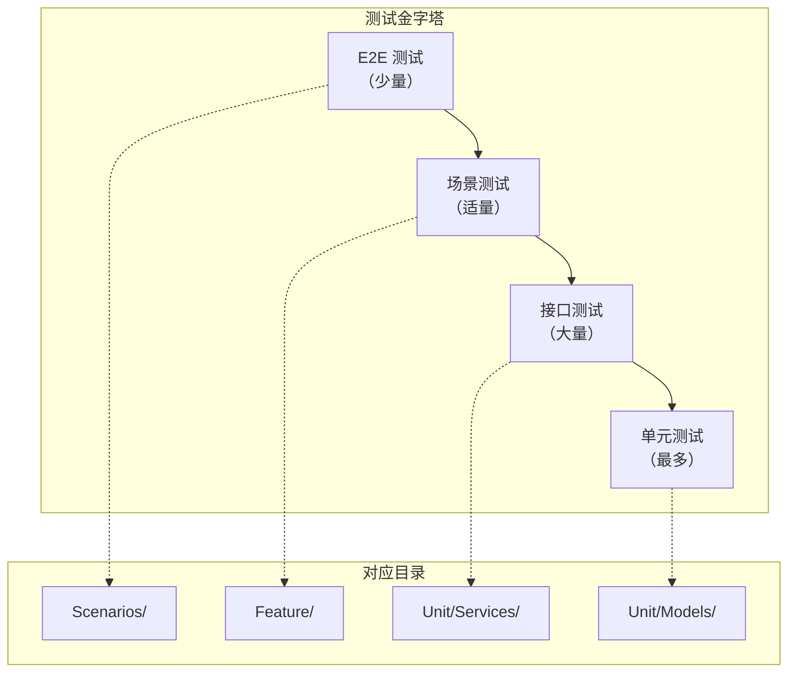

# 🧪 企业级综合业务系统测试方案

> **L5: 验收标准层级** | **阿里 P9 测试专家方案** | **Laravel 12 + Pest PHP**

---

## 📋 元数据

```yaml
document_type: "test_strategy"
version: "1.0"
test_framework: "Pest PHP 2.x"
coverage_tool: "Xdebug + PCOV"
ci_cd: "GitHub Actions"
database_strategy: "固定测试库 + 快照恢复"
```

---

## 🎯 测试目标

| 目标 | 指标 | 说明 |
|------|------|------|
| **接口覆盖率** | ≥ 90% | 所有 API 接口必须有测试用例 |
| **业务场景覆盖** | 100% | 核心业务流程必须有场景测试 |
| **代码覆盖率** | ≥ 80% | 行覆盖率 + 分支覆盖率 |
| **测试数据保护** | ✅ | 测试库数据不能被清空 |
| **测试执行时间** | < 5分钟 | 完整测试套件执行时间 |

---

## 📁 测试架构

### 1.1 目录结构

```
tests/
├── Pest.php                          # Pest 配置
├── TestCase.php                      # 基础测试类
│
├── Unit/                             # 单元测试
│   ├── Models/                       # 模型测试
│   │   ├── SPU_test.php
│   │   ├── SKU_test.php
│   │   ├── Order_test.php
│   │   ├── Cart_test.php
│   │   └── ...
│   ├── Services/                     # 服务层测试
│   │   ├── OrderService_test.php
│   │   ├── CartService_test.php
│   │   ├── PaymentService_test.php
│   │   └── ...
│   └── States/                       # 状态机测试
│       ├── OrderState_test.php
│       └── PaymentState_test.php
│
├── Feature/                          # 特性测试（接口测试）
│   ├── Auth/                         # 认证模块
│   │   ├── Login_test.php
│   │   └── Register_test.php
│   ├── Ecommerce/                    # 电商模块
│   │   ├── ProductTest.php
│   │   ├── CartTest.php
│   │   └── OrderTest.php
│   ├── O2O/                          # O2O 预约
│   │   ├── BookingTest.php
│   │   └── CheckinTest.php
│   ├── Distribution/                 # 分销
│   │   ├── DistributorTest.php
│   │   └── CommissionTest.php
│   ├── RBAC/                         # 权限
│   │   ├── RoleTest.php
│   │   └── PermissionTest.php
│   ├── CRM/                          # 客户
│   │   ├── CustomerTest.php
│   │   └── OpportunityTest.php
│   ├── DRP/                          # 进销存
│   │   ├── PurchaseOrderTest.php
│   │   └── InventoryTest.php
│   └── Finance/                      # 财务
│       ├── PaymentOrderTest.php
│       └── InvoiceTest.php
│
├── Scenarios/                        # 场景测试（用户场景编排）
│   ├── OrderFlow_test.php            # 订单全流程
│   ├── BookingFlow_test.php          # 预约全流程
│   ├── CommissionFlow_test.php       # 分销佣金全流程
│   └── ...
│
└── Fixtures/                         # 测试数据
    ├── factories/                    # 工厂类
    └── seeders/                      # 种子数据
```

### 1.2 测试分层模型



---

## 🗄️ 测试数据库策略（核心：保护测试数据）

### 2.1 问题分析

**传统问题**：
- 使用 `RefreshDatabase` 每次测试后清空数据
- 测试数据无法复用
- 场景测试需要复杂的数据准备

**解决方案**：
- **固定测试库**：独立的测试数据库，数据不被清空
- **快照恢复**：测试前恢复快照，保证数据一致性
- **事务回滚**：单个测试使用事务回滚，不影响其他测试

### 2.2 数据库配置

```php
<?php
// config/database.php

'testing' => [
    'driver' => 'mysql',
    'host' => env('TEST_DB_HOST', '127.0.0.1'),
    'database' => env('TEST_DB_DATABASE', 'laravel_test'),
    'username' => env('TEST_DB_USERNAME', 'root'),
    'password' => env('TEST_DB_PASSWORD', ''),
    'charset' => 'utf8mb4',
    'collation' => 'utf8mb4_unicode_ci',
    'prefix' => '',
    'strict' => true,
    'engine' => null,
],
```

### 2.3 测试数据保护策略

```php
<?php
// tests/TestCase.php

namespace Tests;

use Illuminate\Foundation\Testing\TestCase as BaseTestCase;
use Illuminate\Foundation\Testing\RefreshDatabase;
use Illuminate\Foundation\Testing\DatabaseTransactions;
use Illuminate\Support\Facades\Artisan;

abstract class TestCase extends BaseTestCase
{
    use CreatesApplication;
    
    /**
     * 测试前：恢复数据库快照
     */
    protected function setUp(): void
    {
        parent::setUp();
        
        // 恢复数据库快照（如果存在）
        $this->restoreDatabaseSnapshot();
    }
    
    /**
     * 测试后：创建数据库快照（仅在第一次运行时）
     */
    protected function tearDown(): void
    {
        parent::tearDown();
    }
    
    /**
     * 恢复数据库快照
     */
    protected function restoreDatabaseSnapshot(): void
    {
        $snapshotPath = database_path('testing/snapshots/latest.sql');
        
        if (file_exists($snapshotPath)) {
            // 清空测试数据库
            Artisan::call('db:wipe', ['--database' => 'testing']);
            
            // 导入快照
            $connection = config('database.default');
            $database = config("database.connections.{$connection}.database");
            
            exec("mysql -u{$this->getDbUser()} -p{$this->getDbPass()} {$database} < {$snapshotPath}");
        }
    }
    
    /**
     * 创建数据库快照
     */
    protected function createDatabaseSnapshot(): void
    {
        $snapshotDir = database_path('testing/snapshots');
        if (!is_dir($snapshotDir)) {
            mkdir($snapshotDir, 0755, true);
        }
        
        $snapshotPath = $snapshotDir . '/latest.sql';
        
        $connection = config('database.default');
        $database = config("database.connections.{$connection}.database");
        
        exec("mysqldump -u{$this->getDbUser()} -p{$this->getDbPass()} {$database} > {$snapshotPath}");
    }
}
```

### 2.4 测试命令

```bash
# 创建测试数据库快照（首次运行或数据变更后）
php artisan testing:snapshot:create

# 恢复测试数据库快照
php artisan testing:snapshot:restore

# 清空测试数据（危险操作，仅在必要时使用）
php artisan testing:db:wipe
```

---

## 📝 接口测试用例模板

### 3.1 标准接口测试模板

```php
<?php
// tests/Feature/Ecommerce/ProductTest.php

namespace Tests\Feature\Ecommerce;

use Tests\TestCase;
use App\Models\Product;
use App\Models\Category;
use App\Models\User;
use Illuminate\Foundation\Testing\RefreshDatabase;
use Illuminate\Foundation\Testing\WithFaker;

class ProductTest extends TestCase
{
    use RefreshDatabase, WithFaker;
    
    /**
     * 测试商品列表接口 - 正常访问
     */
    public function test_product_list_success(): void
    {
        // Arrange - 准备测试数据
        $category = Category::factory()->create();
        Product::factory()->count(5)->create([
            'category_id' => $category->id,
            'status' => 'active',
        ]);
        
        // Act - 执行请求
        $response = $this->getJson('/api/v1/products');
        
        // Assert - 验证结果
        $response->assertOk()
            ->assertJsonStructure([
                'data' => [
                    '*' => ['id', 'name', 'price', 'status'],
                ],
                'meta' => ['current_page', 'per_page', 'total'],
            ]);
    }
    
    /**
     * 测试商品列表接口 - 分页
     */
    public function test_product_list_pagination(): void
    {
        // Arrange
        Product::factory()->count(25)->create();
        
        // Act
        $response = $this->getJson('/api/v1/products?per_page=10');
        
        // Assert
        $response->assertOk()
            ->assertJsonPath('meta.per_page', 10)
            ->assertJsonPath('meta.total', 25);
    }
    
    /**
     * 测试商品列表接口 - 按分类筛选
     */
    public function test_product_list_filter_by_category(): void
    {
        // Arrange
        $category1 = Category::factory()->create();
        $category2 = Category::factory()->create();
        
        Product::factory()->count(3)->create(['category_id' => $category1->id]);
        Product::factory()->count(2)->create(['category_id' => $category2->id]);
        
        // Act
        $response = $this->getJson("/api/v1/products?category_id={$category1->id}");
        
        // Assert
        $response->assertOk()
            ->assertJsonPath('meta.total', 3);
    }
    
    /**
     * 测试商品列表接口 - 关键词搜索
     */
    public function test_product_list_search(): void
    {
        // Arrange
        Product::factory()->create(['name' => 'iPhone 15 Pro']);
        Product::factory()->create(['name' => 'MacBook Pro']);
        
        // Act
        $response = $this->getJson('/api/v1/products?keyword=iPhone');
        
        // Assert
        $response->assertOk()
            ->assertJsonPath('meta.total', 1);
    }
    
    /**
     * 测试商品详情接口 - 正常访问
     */
    public function test_product_detail_success(): void
    {
        // Arrange
        $product = Product::factory()->create();
        
        // Act
        $response = $this->getJson("/api/v1/products/{$product->id}");
        
        // Assert
        $response->assertOk()
            ->assertJsonPath('data.id', $product->id)
            ->assertJsonPath('data.name', $product->name);
    }
    
    /**
     * 测试商品详情接口 - 商品不存在
     */
    public function test_product_detail_not_found(): void
    {
        // Act
        $response = $this->getJson('/api/v1/products/99999');
        
        // Assert
        $response->assertNotFound()
            ->assertJsonPath('message', '商品不存在');
    }
    
    /**
     * 测试创建商品接口 - 成功
     */
    public function test_product_create_success(): void
    {
        // Arrange
        $user = User::factory()->admin()->create();
        $category = Category::factory()->create();
        
        $data = [
            'name' => $this->faker->word,
            'category_id' => $category->id,
            'price' => 99.99,
            'description' => $this->faker->sentence,
        ];
        
        // Act
        $response = $this->actingAs($user)
            ->postJson('/api/v1/products', $data);
        
        // Assert
        $response->assertCreated()
            ->assertJsonPath('data.name', $data['name']);
        
        $this->assertDatabaseHas('products', [
            'name' => $data['name'],
            'category_id' => $category->id,
        ]);
    }
    
    /**
     * 测试创建商品接口 - 验证失败
     */
    public function test_product_create_validation_error(): void
    {
        // Arrange
        $user = User::factory()->admin()->create();
        
        // Act
        $response = $this->actingAs($user)
            ->postJson('/api/v1/products', []);
        
        // Assert
        $response->assertStatus(422)
            ->assertJsonValidationErrors(['name', 'category_id', 'price']);
    }
    
    /**
     * 测试创建商品接口 - 未授权
     */
    public function test_product_create_unauthorized(): void
    {
        // Act
        $response = $this->postJson('/api/v1/products', []);
        
        // Assert
        $response->assertUnauthorized();
    }
}
```

### 3.2 购物车接口测试模板

```php
<?php
// tests/Feature/Ecommerce/CartTest.php

namespace Tests\Feature\Ecommerce;

use Tests\TestCase;
use App\Models\Product;
use App\Models\SKU;
use App\Models\Cart;
use App\Models\User;
use Illuminate\Foundation\Testing\RefreshDatabase;

class CartTest extends TestCase
{
    use RefreshDatabase;
    
    protected User $user;
    protected SKU $sku;
    
    protected function setUp(): void
    {
        parent::setUp();
        
        $this->user = User::factory()->create();
        $this->sku = SKU::factory()->create(['stock' => 100]);
    }
    
    /**
     * 测试获取购物车列表
     */
    public function test_cart_list_success(): void
    {
        // Arrange
        Cart::factory()->count(3)->create([
            'user_id' => $this->user->id,
        ]);
        
        // Act
        $response = $this->actingAs($this->user)
            ->getJson('/api/v1/cart');
        
        // Assert
        $response->assertOk()
            ->assertJsonCount(3, 'data');
    }
    
    /**
     * 测试添加商品到购物车
     */
    public function test_cart_add_success(): void
    {
        // Arrange
        $data = [
            'sku_id' => $this->sku->id,
            'quantity' => 2,
        ];
        
        // Act
        $response = $this->actingAs($this->user)
            ->postJson('/api/v1/cart', $data);
        
        // Assert
        $response->assertCreated();
        
        $this->assertDatabaseHas('carts', [
            'user_id' => $this->user->id,
            'sku_id' => $this->sku->id,
            'quantity' => 2,
        ]);
    }
    
    /**
     * 测试添加商品到购物车 - 库存不足
     */
    public function test_cart_add_insufficient_stock(): void
    {
        // Arrange
        $this->sku->update(['stock' => 1]);
        
        $data = [
            'sku_id' => $this->sku->id,
            'quantity' => 10,
        ];
        
        // Act
        $response = $this->actingAs($this->user)
            ->postJson('/api/v1/cart', $data);
        
        // Assert
        $response->assertStatus(422)
            ->assertJsonValidationErrors(['quantity']);
    }
    
    /**
     * 测试更新购物车数量
     */
    public function test_cart_update_quantity_success(): void
    {
        // Arrange
        $cart = Cart::factory()->create([
            'user_id' => $this->user->id,
            'sku_id' => $this->sku->id,
            'quantity' => 1,
        ]);
        
        // Act
        $response = $this->actingAs($this->user)
            ->putJson("/api/v1/cart/{$cart->id}", [
                'quantity' => 5,
            ]);
        
        // Assert
        $response->assertOk();
        
        $this->assertDatabaseHas('carts', [
            'id' => $cart->id,
            'quantity' => 5,
        ]);
    }
    
    /**
     * 测试删除购物车商品
     */
    public function test_cart_delete_success(): void
    {
        // Arrange
        $cart = Cart::factory()->create([
            'user_id' => $this->user->id,
        ]);
        
        // Act
        $response = $this->actingAs($this->user)
            ->deleteJson("/api/v1/cart/{$cart->id}");
        
        // Assert
        $response->assertOk();
        
        $this->assertDatabaseMissing('carts', [
            'id' => $cart->id,
        ]);
    }
}
```

### 3.3 订单接口测试模板

```php
<?php
// tests/Feature/Ecommerce/OrderTest.php

namespace Tests\Feature\Ecommerce;

use Tests\TestCase;
use App\Models\Product;
use App\Models\SKU;
use App\Models\Cart;
use App\Models\Order;
use App\Models\User;
use Illuminate\Foundation\Testing\RefreshDatabase;
use Illuminate\Support\Facades\Redis;

class OrderTest extends TestCase
{
    use RefreshDatabase;
    
    protected User $user;
    protected SKU $sku;
    
    protected function setUp(): void
    {
        parent::setUp();
        
        $this->user = User::factory()->create();
        $this->sku = SKU::factory()->create(['stock' => 100, 'price' => 99.99]);
        
        // 清空 Redis 订单号缓存
        Redis::del('order:sequence:today');
    }
    
    /**
     * 测试创建订单 - 成功
     */
    public function test_order_create_success(): void
    {
        // Arrange
        $cart = Cart::factory()->create([
            'user_id' => $this->user->id,
            'sku_id' => $this->sku->id,
            'quantity' => 2,
            'selected' => true,
        ]);
        
        $data = [
            'cart_ids' => [$cart->id],
            'shipping_info' => [
                'name' => '张三',
                'phone' => '13800138000',
                'province' => '浙江省',
                'city' => '杭州市',
                'district' => '西湖区',
                'address' => 'xxx路xxx号',
            ],
            'remark' => '请尽快发货',
        ];
        
        // Act
        $response = $this->actingAs($this->user)
            ->postJson('/api/v1/orders', $data);
        
        // Assert
        $response->assertCreated()
            ->assertJsonStructure([
                'data' => [
                    'order_sn',
                    'status',
                    'total_amount',
                    'pay_amount',
                ],
            ]);
        
        // 验证订单已创建
        $this->assertDatabaseHas('orders', [
            'user_id' => $this->user->id,
            'status' => 'pending',
        ]);
        
        // 验证库存已锁定
        $this->sku->refresh();
        $this->assertEquals(98, $this->sku->stock);
        $this->assertEquals(2, $this->sku->locked_stock);
    }
    
    /**
     * 测试创建订单 - 库存不足
     */
    public function test_order_create_insufficient_stock(): void
    {
        // Arrange
        $this->sku->update(['stock' => 1]);
        
        $cart = Cart::factory()->create([
            'user_id' => $this->user->id,
            'sku_id' => $this->sku->id,
            'quantity' => 5,
            'selected' => true,
        ]);
        
        $data = [
            'cart_ids' => [$cart->id],
            'shipping_info' => [
                'name' => '张三',
                'phone' => '13800138000',
                'province' => '浙江省',
                'city' => '杭州市',
                'district' => '西湖区',
                'address' => 'xxx路xxx号',
            ],
        ];
        
        // Act
        $response = $this->actingAs($this->user)
            ->postJson('/api/v1/orders', $data);
        
        // Assert
        $response->assertStatus(422)
            ->assertJsonValidationErrors(['quantity']);
    }
    
    /**
     * 测试取消订单
     */
    public function test_order_cancel_success(): void
    {
        // Arrange
        $order = Order::factory()->create([
            'user_id' => $this->user->id,
            'status' => 'pending',
        ]);
        
        // Act
        $response = $this->actingAs($this->user)
            ->postJson("/api/v1/orders/{$order->id}/cancel");
        
        // Assert
        $response->assertOk();
        
        $this->assertDatabaseHas('orders', [
            'id' => $order->id,
            'status' => 'cancelled',
        ]);
    }
    
    /**
     * 测试取消订单 - 状态不允许
     */
    public function test_order_cancel_invalid_status(): void
    {
        // Arrange
        $order = Order::factory()->create([
            'user_id' => $this->user->id,
            'status' => 'paid',
        ]);
        
        // Act
        $response = $this->actingAs($this->user)
            ->postJson("/api/v1/orders/{$order->id}/cancel");
        
        // Assert
        $response->assertStatus(422)
            ->assertJsonPath('message', '订单状态不允许取消');
    }
    
    /**
     * 测试并发创建订单（防超卖）
     */
    public function test_order_create_concurrent(): void
    {
        // Arrange
        $this->sku->update(['stock' => 1]);
        
        $cart = Cart::factory()->create([
            'user_id' => $this->user->id,
            'sku_id' => $this->sku->id,
            'quantity' => 1,
            'selected' => true,
        ]);
        
        // Act - 并发创建 10 个订单
        $responses = [];
        for ($i = 0; $i < 10; $i++) {
            $responses[] = $this->actingAs($this->user)
                ->postJson('/api/v1/orders', [
                    'cart_ids' => [$cart->id],
                    'shipping_info' => [
                        'name' => '张三',
                        'phone' => '13800138000',
                        'province' => '浙江省',
                        'city' => '杭州市',
                        'district' => '西湖区',
                        'address' => 'xxx路xxx号',
                    ],
                ]);
        }
        
        // Assert - 只有 1 个成功，其他失败
        $successCount = collect($responses)->filter(fn($r) => $r->status() === 201)->count();
        $this->assertEquals(1, $successCount);
        
        // 验证库存没有超卖
        $this->sku->refresh();
        $this->assertGreaterThanOrEqual(0, $this->sku->stock);
    }
}
```

---

## 🎭 用户场景测试编排

### 4.1 场景测试设计原则

**原则 1：场景独立性**
- 每个场景测试独立运行
- 场景之间不依赖数据顺序
- 使用 `RefreshDatabase` 保证数据清洁

**原则 2：数据连贯性**
- 场景内数据有逻辑关联
- 模拟真实用户操作流程
- 验证数据流转正确性

**原则 3：统计可验证**
- 场景执行后验证统计数据
- 验证业务规则正确性
- 验证边界条件处理

### 4.2 订单全流程场景测试

```php
<?php
// tests/Scenarios/OrderFlow_test.php

namespace Tests\Scenarios;

use Tests\TestCase;
use App\Models\Product;
use App\Models\SKU;
use App\Models\Cart;
use App\Models\Order;
use App\Models\User;
use App\Models\Payment;
use App\Services\OrderService;
use App\Services\PaymentService;
use Illuminate\Foundation\Testing\RefreshDatabase;
use Illuminate\Support\Facades\Event;

class OrderFlowTest extends TestCase
{
    use RefreshDatabase;
    
    /**
     * 场景：用户完整下单流程
     * 
     * 流程：
     * 1. 用户浏览商品
     * 2. 添加到购物车
     * 3. 提交订单
     * 4. 完成支付
     * 5. 查看订单状态
     * 6. 确认收货
     * 7. 验证统计数据
     */
    public function test_complete_order_flow(): void
    {
        // ====== 步骤 1：准备测试数据 ======
        $user = User::factory()->create();
        $category = Category::factory()->create();
        $product = Product::factory()->create([
            'category_id' => $category->id,
            'status' => 'active',
        ]);
        $sku = SKU::factory()->create([
            'product_id' => $product->id,
            'stock' => 50,
            'price' => 199.00,
        ]);
        
        // ====== 步骤 2：浏览商品 ======
        $response = $this->getJson("/api/v1/products/{$product->id}");
        $response->assertOk()
            ->assertJsonPath('data.id', $product->id);
        
        // ====== 步骤 3：添加到购物车 ======
        $response = $this->actingAs($user)
            ->postJson('/api/v1/cart', [
                'sku_id' => $sku->id,
                'quantity' => 2,
            ]);
        $response->assertCreated();
        
        $cart = Cart::where('user_id', $user->id)->first();
        $this->assertNotNull($cart);
        $this->assertEquals(2, $cart->quantity);
        
        // ====== 步骤 4：提交订单 ======
        $response = $this->actingAs($user)
            ->postJson('/api/v1/orders', [
                'cart_ids' => [$cart->id],
                'shipping_info' => [
                    'name' => '张三',
                    'phone' => '13800138000',
                    'province' => '浙江省',
                    'city' => '杭州市',
                    'district' => '西湖区',
                    'address' => 'xxx路xxx号',
                ],
            ]);
        $response->assertCreated();
        
        $order = Order::where('user_id', $user->id)->first();
        $this->assertNotNull($order);
        $this->assertEquals('pending', $order->status);
        $this->assertEquals(398.00, $order->pay_amount);
        
        // 验证库存已锁定
        $sku->refresh();
        $this->assertEquals(48, $sku->stock);
        $this->assertEquals(2, $sku->locked_stock);
        
        // ====== 步骤 5：完成支付 ======
        $response = $this->actingAs($user)
            ->postJson("/api/v1/orders/{$order->id}/pay", [
                'payment_method' => 'wechat',
            ]);
        $response->assertOk();
        
        $order->refresh();
        $this->assertEquals('paid', $order->status);
        $this->assertNotNull($order->paid_at);
        
        // 验证库存已扣减
        $sku->refresh();
        $this->assertEquals(48, $sku->stock);
        $this->assertEquals(0, $sku->locked_stock);
        
        // ====== 步骤 6：确认收货 ======
        $order->update(['status' => 'shipped']);
        
        $response = $this->actingAs($user)
            ->postJson("/api/v1/orders/{$order->id}/confirm");
        $response->assertOk();
        
        $order->refresh();
        $this->assertEquals('completed', $order->status);
        $this->assertNotNull($order->completed_at);
        
        // ====== 步骤 7：验证统计数据 ======
        $this->assertDatabaseHas('orders', [
            'user_id' => $user->id,
            'status' => 'completed',
        ]);
        
        // 验证用户订单统计
        $user->refresh();
        $this->assertEquals(1, $user->orders_count);
        $this->assertEquals(398.00, $user->total_spent);
    }
    
    /**
     * 场景：订单取消流程
     * 
     * 流程：
     * 1. 用户创建订单
     * 2. 用户取消订单
     * 3. 验证库存恢复
     * 4. 验证统计数据
     */
    public function test_order_cancel_flow(): void
    {
        // ====== 步骤 1：准备测试数据 ======
        $user = User::factory()->create();
        $sku = SKU::factory()->create(['stock' => 10, 'price' => 99.00]);
        
        // ====== 步骤 2：创建订单 ======
        $cart = Cart::factory()->create([
            'user_id' => $user->id,
            'sku_id' => $sku->id,
            'quantity' => 3,
            'selected' => true,
        ]);
        
        $response = $this->actingAs($user)
            ->postJson('/api/v1/orders', [
                'cart_ids' => [$cart->id],
                'shipping_info' => [
                    'name' => '张三',
                    'phone' => '13800138000',
                    'province' => '浙江省',
                    'city' => '杭州市',
                    'district' => '西湖区',
                    'address' => 'xxx路xxx号',
                ],
            ]);
        $response->assertCreated();
        
        $order = Order::where('user_id', $user->id)->first();
        
        // 验证库存已锁定
        $sku->refresh();
        $this->assertEquals(7, $sku->stock);
        $this->assertEquals(3, $sku->locked_stock);
        
        // ====== 步骤 3：取消订单 ======
        $response = $this->actingAs($user)
            ->postJson("/api/v1/orders/{$order->id}/cancel");
        $response->assertOk();
        
        // ====== 步骤 4：验证库存恢复 ======
        $sku->refresh();
        $this->assertEquals(10, $sku->stock);
        $this->assertEquals(0, $sku->locked_stock);
        
        // ====== 步骤 5：验证统计数据 ======
        $this->assertDatabaseHas('orders', [
            'user_id' => $user->id,
            'status' => 'cancelled',
        ]);
    }
}
```

### 4.3 预约全流程场景测试

```php
<?php
// tests/Scenarios/BookingFlow_test.php

namespace Tests\Scenarios;

use Tests\TestCase;
use App\Models\Store;
use App\Models\Service;
use App\Models\Timeslot;
use App\Models\Appointment;
use App\Models\User;
use Illuminate\Foundation\Testing\RefreshDatabase;

class BookingFlowTest extends TestCase
{
    use RefreshDatabase;
    
    /**
     * 场景：用户完整预约流程
     * 
     * 流程：
     * 1. 用户浏览服务列表
     * 2. 选择门店和时间片
     * 3. 创建预约
     * 4. 支付预约
     * 5. 门店核销
     * 6. 验证统计数据
     */
    public function test_complete_booking_flow(): void
    {
        // ====== 步骤 1：准备测试数据 ======
        $user = User::factory()->create();
        $store = Store::factory()->create(['status' => 'active']);
        $service = Service::factory()->create([
            'store_id' => $store->id,
            'price' => 299.00,
            'duration' => 60,
        ]);
        $timeslot = Timeslot::factory()->create([
            'service_id' => $service->id,
            'start_time' => now()->addDay()->setTime(14, 0),
            'end_time' => now()->addDay()->setTime(15, 0),
            'capacity' => 5,
            'booked_count' => 0,
        ]);
        
        // ====== 步骤 2：浏览服务列表 ======
        $response = $this->getJson("/api/v1/stores/{$store->id}/services");
        $response->assertOk();
        
        // ====== 步骤 3：查看可用时间片 ======
        $response = $this->getJson("/api/v1/services/{$service->id}/timeslots");
        $response->assertOk();
        
        // ====== 步骤 4：创建预约 ======
        $response = $this->actingAs($user)
            ->postJson('/api/v1/appointments', [
                'service_id' => $service->id,
                'timeslot_id' => $timeslot->id,
                'store_id' => $store->id,
            ]);
        $response->assertCreated();
        
        $appointment = Appointment::where('user_id', $user->id)->first();
        $this->assertNotNull($appointment);
        $this->assertEquals('pending', $appointment->status);
        
        // 验证时间片已预订
        $timeslot->refresh();
        $this->assertEquals(1, $timeslot->booked_count);
        
        // ====== 步骤 5：支付预约 ======
        $response = $this->actingAs($user)
            ->postJson("/api/v1/appointments/{$appointment->id}/pay", [
                'payment_method' => 'wechat',
            ]);
        $response->assertOk();
        
        $appointment->refresh();
        $this->assertEquals('confirmed', $appointment->status);
        $this->assertNotNull($appointment->confirmation_code);
        
        // ====== 步骤 6：门店核销 ======
        $staff = User::factory()->create();
        $staff->assignRole('store_staff');
        
        $response = $this->actingAs($staff)
            ->postJson("/api/v1/appointments/{$appointment->id}/verify");
        $response->assertOk();
        
        $appointment->refresh();
        $this->assertEquals('completed', $appointment->status);
        $this->assertNotNull($appointment->verified_at);
        
        // ====== 步骤 7：验证统计数据 ======
        $this->assertDatabaseHas('appointments', [
            'user_id' => $user->id,
            'status' => 'completed',
        ]);
        
        $this->assertDatabaseHas('services', [
            'id' => $service->id,
            'total_bookings' => 1,
        ]);
    }
}
```

---

## 📊 测试数据工厂

### 5.1 工厂类定义

```php
<?php
// database/factories/ProductFactory.php

namespace Database\Factories;

use App\Models\Product;
use App\Models\Category;
use Illuminate\Database\Eloquent\Factories\Factory;

class ProductFactory extends Factory
{
    protected $model = Product::class;
    
    public function definition(): array
    {
        return [
            'code' => 'SP' . $this->faker->unique()->numerify('########'),
            'name' => $this->faker->words(3, true),
            'category_id' => Category::factory(),
            'description' => $this->faker->paragraph(),
            'images' => [$this->faker->imageUrl()],
            'status' => 'draft',
            'sort_order' => 0,
            'view_count' => 0,
        ];
    }
    
    public function active(): static
    {
        return $this->state(fn (array $attributes) => [
            'status' => 'active',
        ]);
    }
    
    public function draft(): static
    {
        return $this->state(fn (array $attributes) => [
            'status' => 'draft',
        ]);
    }
}
```

```php
<?php
// database/factories/OrderFactory.php

namespace Database\Factories;

use App\Models\Order;
use App\Models\User;
use Illuminate\Database\Eloquent\Factories\Factory;

class OrderFactory extends Factory
{
    protected $model = Order::class;
    
    public function definition(): array
    {
        return [
            'order_sn' => 'ORD' . $this->faker->unique()->numerify('Ymd######'),
            'user_id' => User::factory(),
            'status' => 'pending',
            'total_amount' => $this->faker->randomFloat(2, 100, 10000),
            'discount_amount' => 0,
            'shipping_fee' => 0,
            'pay_amount' => $this->faker->randomFloat(2, 100, 10000),
            'shipping_info' => [
                'name' => $this->faker->name,
                'phone' => $this->faker->phoneNumber,
                'province' => $this->faker->state,
                'city' => $this->faker->city,
                'district' => $this->faker->citySuffix,
                'address' => $this->faker->address,
            ],
            'remark' => $this->faker->optional()->sentence,
        ];
    }
    
    public function pending(): static
    {
        return $this->state(fn (array $attributes) => [
            'status' => 'pending',
        ]);
    }
    
    public function paid(): static
    {
        return $this->state(fn (array $attributes) => [
            'status' => 'paid',
            'paid_at' => now(),
        ]);
    }
    
    public function shipped(): static
    {
        return $this->state(fn (array $attributes) => [
            'status' => 'shipped',
            'paid_at' => now()->subDay(),
            'shipped_at' => now(),
        ]);
    }
    
    public function completed(): static
    {
        return $this->state(fn (array $attributes) => [
            'status' => 'completed',
            'paid_at' => now()->subDays(2),
            'shipped_at' => now()->subDay(),
            'completed_at' => now(),
        ]);
    }
}
```

### 5.2 测试数据种子

```php
<?php
// database/seeders/TestingSeeder.php

namespace Database\Seeders;

use Illuminate\Database\Seeder;
use App\Models\Category;
use App\Models\Brand;
use App\Models\Product;
use App\Models\SKU;
use App\Models\User;

class TestingSeeder extends Seeder
{
    public function run(): void
    {
        // 创建分类
        $categories = Category::factory()->count(5)->create();
        
        // 创建品牌
        $brands = Brand::factory()->count(3)->create();
        
        // 创建商品
        foreach ($categories as $category) {
            $products = Product::factory()->count(10)->create([
                'category_id' => $category->id,
                'status' => 'active',
            ]);
            
            foreach ($products as $product) {
                SKU::factory()->count(3)->create([
                    'product_id' => $product->id,
                    'stock' => rand(10, 100),
                ]);
            }
        }
        
        // 创建管理员
        User::factory()->admin()->create([
            'email' => 'admin@example.com',
            'password' => 'password',
        ]);
        
        // 创建普通用户
        User::factory()->count(10)->create();
    }
}
```

---

## 📈 覆盖率统计方案

### 6.1 覆盖率配置

```php
<?php
// phpunit.xml

<?xml version="1.0" encoding="UTF-8"?>
<phpunit xmlns:xsi="http://www.w3.org/2001/XMLSchema-instance"
         xsi:noNamespaceSchemaLocation="vendor/phpunit/phpunit/phpunit.xsd"
         bootstrap="vendor/autoload.php"
         colors="true"
         verbose="true"
         failOnRisky="true"
         failOnWarning="true">
    
    <testsuites>
        <testsuite name="Unit">
            <directory>tests/Unit</directory>
        </testsuite>
        <testsuite name="Feature">
            <directory>tests/Feature</directory>
        </testsuite>
        <testsuite name="Scenarios">
            <directory>tests/Scenarios</directory>
        </testsuite>
    </testsuites>
    
    <source>
        <include>
            <directory suffix=".php">app</directory>
        </include>
    </source>
    
    <coverage>
        <report>
            <html outputDirectory="coverage/html"/>
            <text outputFile="coverage.txt" showUncoveredFiles="true"/>
            <clover outputFile="coverage.xml"/>
        </report>
    </coverage>
    
    <php>
        <env name="APP_ENV" value="testing"/>
        <env name="DB_CONNECTION" value="testing"/>
        <env name="CACHE_DRIVER" value="array"/>
        <env name="QUEUE_CONNECTION" value="sync"/>
        <env name="MAIL_MAILER" value="array"/>
    </php>
</phpunit>
```

### 6.2 覆盖率报告命令

```bash
# 生成 HTML 覆盖率报告
php artisan test --coverage --coverage-html=coverage/html

# 生成文本覆盖率报告
php artisan test --coverage --coverage-text

# 生成 XML 覆盖率报告（CI/CD 使用）
php artisan test --coverage --coverage-clover=coverage.xml

# 指定覆盖率阈值
php artisan test --coverage --coverage-min=80
```

### 6.3 覆盖率目标

| 模块 | 行覆盖率 | 分支覆盖率 | 说明 |
|------|---------|-----------|------|
| 电商核心 | ≥ 85% | ≥ 80% | 核心业务模块 |
| O2O 预约 | ≥ 80% | ≥ 75% | 预约流程 |
| 分销 | ≥ 80% | ≥ 75% | 佣金计算 |
| RBAC | ≥ 90% | ≥ 85% | 权限控制 |
| CRM | ≥ 75% | ≥ 70% | 客户管理 |
| 进销存 | ≥ 80% | ≥ 75% | 库存管理 |
| 财务 | ≥ 85% | ≥ 80% | 资金安全 |

---

## 🚀 CI/CD 集成

### 7.1 GitHub Actions 配置

```yaml
# .github/workflows/test.yml

name: Test

on:
  push:
    branches: [main, develop]
  pull_request:
    branches: [main]

jobs:
  test:
    runs-on: ubuntu-latest
    
    services:
      mysql:
        image: mysql:8.0
        env:
          MYSQL_ROOT_PASSWORD: secret
          MYSQL_DATABASE: laravel_test
        ports:
          - 3306:3306
        options: >-
          --health-cmd="mysqladmin ping"
          --health-interval=10s
          --health-timeout=5s
          --health-retries=3
      
      redis:
        image: redis:7
        ports:
          - 6379:6379
    
    steps:
      - uses: actions/checkout@v3
      
      - name: Setup PHP
        uses: shivammathur/setup-php@v2
        with:
          php-version: '8.2'
          extensions: dom, curl, mbstring, zip, pdo, mysql, bcmath, gd
          coverage: xdebug
      
      - name: Install Dependencies
        run: composer install --no-progress --prefer-dist
      
      - name: Prepare Environment
        run: |
          cp .env.testing .env
          php artisan key:generate
      
      - name: Run Migrations
        run: php artisan migrate --force
      
      - name: Seed Database
        run: php artisan db:seed --class=TestingSeeder
      
      - name: Run Tests
        run: php artisan test --coverage --coverage-clover=coverage.xml
      
      - name: Upload Coverage
        uses: codecov/codecov-action@v3
        with:
          files: coverage.xml
          flags: unittests
```

### 7.2 测试报告格式

```php
<?php
// tests/Pest.php

use Illuminate\Foundation\Testing\RefreshDatabase;
use Tests\TestCase;

uses(TestCase::class, RefreshDatabase::class)->in('Feature', 'Unit');

// 自定义 Expectations
expect()->extend('toBeValid', function () {
    return $this->toBe(true);
});

expect()->extend('toBeInvalid', function () {
    return $this->toBe(false);
});

// 数据库断言
expect()->extend('toHaveInDatabase', function (string $table, array $data) {
    $this->value = Database::has($table, $data);
    return $this;
});

// API 响应断言
expect()->extend('toBeSuccessful', function () {
    return $this->toBeBetween(200, 299);
});

expect()->toBeClientError = function () {
    return $this->toBeBetween(400, 499);
};

expect()->toBeServerError = function () {
    return $this->toBeBetween(500, 599);
};
```

---

## 📋 测试执行命令

### 8.1 常用命令

```bash
# 运行所有测试
php artisan test

# 运行单元测试
php artisan test --testsuite=Unit

# 运行接口测试
php artisan test --testsuite=Feature

# 运行场景测试
php artisan test --testsuite=Scenarios

# 运行指定文件
php artisan test tests/Feature/Ecommerce/ProductTest.php

# 运行指定方法
php artisan test --filter=test_product_list_success

# 生成覆盖率报告
php artisan test --coverage --coverage-html=coverage/html

# 并行运行测试
php artisan test --parallel

# 显示详细输出
php artisan test --verbose
```

### 8.2 测试数据保护命令

```bash
# 创建测试数据库快照
php artisan testing:snapshot:create

# 恢复测试数据库快照
php artisan testing:snapshot:restore

# 查看快照信息
php artisan testing:snapshot:info
```

---

## 📊 测试报告模板

```markdown
# 测试报告

## 基本信息
- 测试时间: 2026-04-27
- 测试环境: Testing
- 测试框架: Pest PHP 2.x

## 测试结果摘要
- 总测试数: 156
- 通过: 154
- 失败: 2
- 跳过: 0
- 执行时间: 45.23s

## 覆盖率报告
- 行覆盖率: 82.5%
- 分支覆盖率: 78.3%
- 函数覆盖率: 85.2%

## 模块覆盖率
| 模块 | 行覆盖率 | 分支覆盖率 |
|------|---------|-----------|
| 电商核心 | 85.2% | 80.1% |
| O2O 预约 | 82.1% | 76.5% |
| 分销 | 80.3% | 75.2% |
| RBAC | 92.1% | 88.3% |

## 失败用例详情
1. OrderTest::test_order_create_concurrent
   - 原因: 并发测试超时
   - 建议: 增加超时时间

## 建议
1. 补充 O2O 模块的场景测试
2. 优化并发测试的超时配置
3. 增加财务模块的边界测试
```

---

**版本**: v1.0 | **更新日期**: 2026-04-27 | **作者**: P9 测试专家
