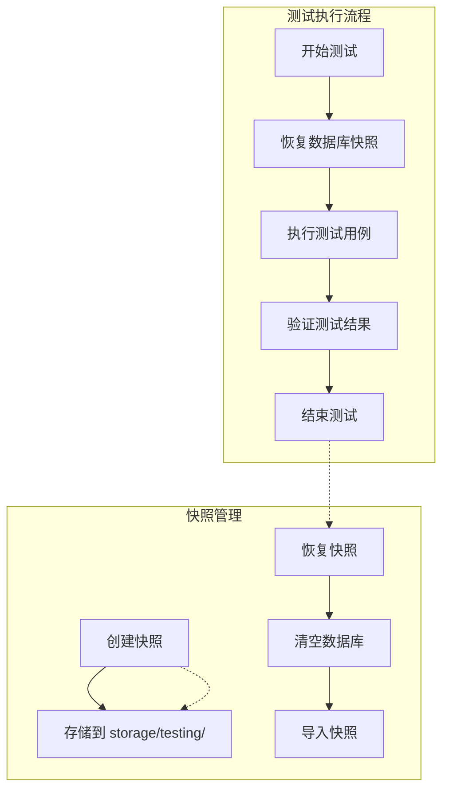
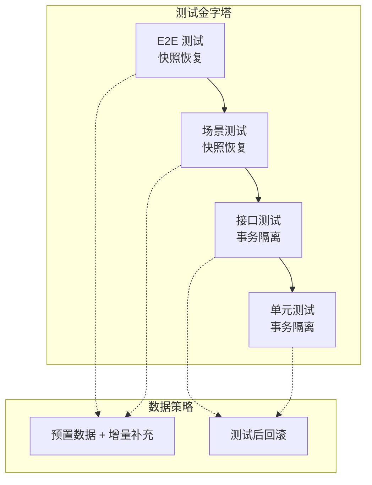

# 🛡️ 测试数据保护方案

> **固定测试库 + 快照恢复 + 事务隔离** | **防止测试数据被清空**

---

## 📋 核心问题

### 问题分析

| 问题 | 传统方案 | 本方案 |
|------|---------|--------|
| 数据被清空 | `RefreshDatabase` 每次清空 | 固定测试库，快照恢复 |
| 数据不一致 | 各测试相互影响 | 事务隔离 + 快照恢复 |
| 数据准备慢 | 每次测试都 Seed | 预置数据 + 增量补充 |
| 并行测试冲突 | 共享数据库 | 独立数据库连接 |

---

## 🗄️ 方案一：固定测试库 + 快照恢复（推荐）

### 1.1 架构设计



### 1.2 实现代码

```php
<?php
// app/Console/Commands/TestingSnapshotCreate.php

namespace App\Console\Commands;

use Illuminate\Console\Command;
use Illuminate\Support\Facades\Config;
use Illuminate\Support\Facades\DB;
use Symfony\Component\Process\Process;
use Symfony\Component\Process\Exception\ProcessFailedException;

class TestingSnapshotCreate extends Command
{
    protected $signature = 'testing:snapshot:create 
                            {--force : 强制覆盖现有快照}';
    
    protected $description = '创建测试数据库快照';
    
    public function handle(): int
    {
        $snapshotDir = storage_path('testing/snapshots');
        $snapshotPath = $snapshotDir . '/latest.sql';
        
        // 检查快照是否存在
        if (file_exists($snapshotPath) && !$this->option('force')) {
            if (!$this->confirm('快照已存在，是否覆盖？')) {
                return self::SUCCESS;
            }
        }
        
        // 创建目录
        if (!is_dir($snapshotDir)) {
            mkdir($snapshotDir, 0755, true);
        }
        
        // 获取数据库配置
        $config = $this->getDatabaseConfig();
        
        // 创建快照
        $this->info('正在创建数据库快照...');
        
        $command = sprintf(
            'mysqldump -h%s -u%s -p%s %s > %s',
            $config['host'],
            $config['username'],
            $config['password'],
            $config['database'],
            $snapshotPath
        );
        
        exec($command, $output, $returnCode);
        
        if ($returnCode !== 0) {
            $this->error('创建快照失败');
            return self::FAILURE;
        }
        
        $this->info("快照已创建: {$snapshotPath}");
        $this->info('文件大小: ' . number_format(filesize($snapshotPath)) . ' bytes');
        
        return self::SUCCESS;
    }
    
    protected function getDatabaseConfig(): array
    {
        $connection = Config::get('database.default');
        return Config::get("database.connections.{$connection}");
    }
}
```

```php
<?php
// app/Console/Commands/TestingSnapshotRestore.php

namespace App\Console\Commands;

use Illuminate\Console\Command;
use Illuminate\Support\Facades\Config;

class TestingSnapshotRestore extends Command
{
    protected $signature = 'testing:snapshot:restore 
                            {--snapshot=latest : 快照文件名}';
    
    protected $description = '恢复测试数据库快照';
    
    public function handle(): int
    {
        $snapshotDir = storage_path('testing/snapshots');
        $snapshotFile = $this->option('snapshot') . '.sql';
        $snapshotPath = $snapshotDir . '/' . $snapshotFile;
        
        // 检查快照是否存在
        if (!file_exists($snapshotPath)) {
            $this->error("快照不存在: {$snapshotPath}");
            return self::FAILURE;
        }
        
        // 获取数据库配置
        $config = $this->getDatabaseConfig();
        
        // 清空数据库
        $this->info('正在清空数据库...');
        $this->call('db:wipe', ['--database' => 'mysql']);
        
        // 导入快照
        $this->info('正在导入快照...');
        
        $command = sprintf(
            'mysql -h%s -u%s -p%s %s < %s',
            $config['host'],
            $config['username'],
            $config['password'],
            $config['database'],
            $snapshotPath
        );
        
        exec($command, $output, $returnCode);
        
        if ($returnCode !== 0) {
            $this->error('导入快照失败');
            return self::FAILURE;
        }
        
        $this->info('快照恢复成功');
        
        return self::SUCCESS;
    }
    
    protected function getDatabaseConfig(): array
    {
        $connection = Config::get('database.default');
        return Config::get("database.connections.{$connection}");
    }
}
```

### 1.3 测试基类修改

```php
<?php
// tests/TestCase.php

namespace Tests;

use Illuminate\Foundation\Testing\TestCase as BaseTestCase;
use Illuminate\Support\Facades\Artisan;

abstract class TestCase extends BaseTestCase
{
    use CreatesApplication;
    
    /**
     * 是否使用快照恢复（子类可覆盖）
     */
    protected bool $useSnapshotRestore = false;
    
    /**
     * 测试前处理
     */
    protected function setUp(): void
    {
        parent::setUp();
        
        if ($this->useSnapshotRestore) {
            $this->restoreSnapshot();
        }
    }
    
    /**
     * 恢复数据库快照
     */
    protected function restoreSnapshot(): void
    {
        $snapshotPath = storage_path('testing/snapshots/latest.sql');
        
        if (file_exists($snapshotPath)) {
            Artisan::call('testing:snapshot:restore');
            $this->info('数据库快照已恢复');
        }
    }
}
```

### 1.4 使用示例

```php
<?php
// tests/Feature/Ecommerce/ProductTest.php

namespace Tests\Feature\Ecommerce;

use Tests\TestCase;
use App\Models\Product;

class ProductTest extends TestCase
{
    /**
     * 使用快照恢复，保证数据清洁
     */
    protected bool $useSnapshotRestore = true;
    
    public function test_product_list(): void
    {
        // 数据库已恢复到快照状态
        // 可以安全地添加测试数据
        Product::factory()->count(5)->create();
        
        $response = $this->getJson('/api/v1/products');
        $response->assertOk();
    }
}
```

---

## 🗄️ 方案二：事务隔离（适合单元测试）

### 2.1 实现原理

每个测试用例在独立事务中运行，测试后回滚，不影响其他测试。

### 2.2 实现代码

```php
<?php
// tests/TestCase.php

namespace Tests;

use Illuminate\Foundation\Testing\TestCase as BaseTestCase;
use Illuminate\Foundation\Testing\DatabaseTransactions;

abstract class TestCase extends BaseTestCase
{
    use CreatesApplication;
    
    /**
     * 测试前处理
     */
    protected function setUp(): void
    {
        parent::setUp();
        
        // 开始事务
        $this->beginDatabaseTransaction();
    }
    
    /**
     * 测试后处理
     */
    protected function tearDown(): void
    {
        // 回滚事务
        $this->rollbackDatabaseTransactions();
        
        parent::tearDown();
    }
    
    /**
     * 开始数据库事务
     */
    protected function beginDatabaseTransaction(): void
    {
        $this->app['db']->beginTransaction();
    }
    
    /**
     * 回滚数据库事务
     */
    protected function rollbackDatabaseTransactions(): void
    {
        $this->app['db']->rollBack();
    }
}
```

### 2.3 使用示例

```php
<?php
// tests/Unit/Models/OrderTest.php

namespace Tests\Unit\Models;

use Tests\TestCase;
use App\Models\Order;

class OrderTest extends TestCase
{
    /**
     * 事务隔离：测试后自动回滚
     */
    public function test_order_creation(): void
    {
        $order = Order::factory()->create();
        
        $this->assertDatabaseHas('orders', [
            'id' => $order->id,
        ]);
        
        // 测试结束后，数据会自动回滚
    }
}
```

---

## 🗄️ 方案三：独立数据库连接（适合并行测试）

### 3.1 配置说明

```php
<?php
// config/database.php

'connections' => [
    'mysql' => [
        'driver' => 'mysql',
        'host' => env('DB_HOST', '127.0.0.1'),
        'database' => env('DB_DATABASE', 'laravel'),
        // ...
    ],
    
    'testing_1' => [
        'driver' => 'mysql',
        'host' => env('DB_HOST', '127.0.0.1'),
        'database' => 'laravel_test_1',
        // ...
    ],
    
    'testing_2' => [
        'driver' => 'mysql',
        'host' => env('DB_HOST', '127.0.0.1'),
        'database' => 'laravel_test_2',
        // ...
    ],
],
```

### 3.2 并行测试配置

```php
<?php
// tests/TestCase.php

namespace Tests;

use Illuminate\Foundation\Testing\TestCase as BaseTestCase;

abstract class TestCase extends BaseTestCase
{
    use CreatesApplication;
    
    /**
     * 获取数据库连接名称
     */
    protected function getDatabaseConnection(): string
    {
        // 根据进程 ID 分配不同的数据库连接
        $workerId = env('TEST_WORKER_ID', 1);
        return "testing_{$workerId}";
    }
    
    /**
     * 设置数据库连接
     */
    protected function setUp(): void
    {
        parent::setUp();
        
        $this->app['db']->setDefaultConnection(
            $this->getDatabaseConnection()
        );
    }
}
```

### 3.3 并行测试命令

```bash
# 使用 parallel-testing 包
php artisan test --parallel

# 指定并行数量
php artisan test --parallel --processes=4

# 使用不同的数据库连接
TEST_WORKER_ID=1 php artisan test
TEST_WORKER_ID=2 php artisan test
```

---

## 📊 方案对比

| 方案 | 优点 | 缺点 | 适用场景 |
|------|------|------|---------|
| **快照恢复** | 数据一致、可复用 | 需要维护快照 | 场景测试、集成测试 |
| **事务隔离** | 简单、快速 | 无法测试事务 | 单元测试 |
| **独立数据库** | 支持并行 | 资源占用高 | 大规模并行测试 |

---

## 🎯 推荐策略

### 测试分层策略



### 执行流程

```bash
# 1. 首次运行：创建快照
php artisan testing:snapshot:create

# 2. 运行单元测试（事务隔离）
php artisan test --testsuite=Unit

# 3. 运行接口测试（事务隔离）
php artisan test --testsuite=Feature

# 4. 运行场景测试（快照恢复）
php artisan test --testsuite=Scenarios

# 5. 生成覆盖率报告
php artisan test --coverage
```

---

**版本**: v1.0 | **更新日期**: 2026-04-27
