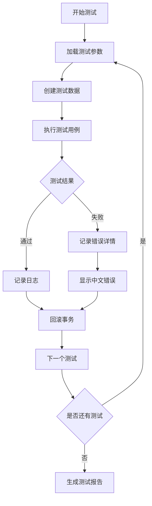

# 🔌 接口自动化测试方案

> **阿里 P9 测试架构师方案** | **Laravel 12 + Pest PHP** | **高效、可维护、数据安全**

---

## 📋 元数据

```yaml
document_type: "api_test_strategy"
version: "1.0"
test_framework: "Pest PHP 2.x"
database_strategy: "事务隔离 + 数据保留"
data_safety: "不修改表结构，不清空数据"
```

---

## 🎯 设计目标

| 目标 | 指标 | 说明 |
|------|------|------|
| **快速执行** | < 30秒 | 单个模块测试执行时间 |
| **数据安全** | 100% | 不修改表结构，不清空数据 |
| **易于维护** | 模块化 | 按业务模块组织测试代码 |
| **参数化驱动** | 支持 | 修改参数即可测试不同场景 |
| **错误定位** | 精准 | 简化调用链路，快速定位问题 |
| **中文友好** | 支持 | 错误信息显示明文中文 |

---

## 📁 目录结构规范

### 1.1 测试目录结构

```
tests/
├── Pest.php                              # Pest 配置
├── TestCase.php                          # 基础测试类
├── README.md                             # 测试文档
│
├── Api/                                  # API 测试根目录
│   ├── Traits/                           # 共享 Traits
│   │   ├── ResponseAssert.php            # 响应断言
│   │   ├── DatabaseHelper.php            # 数据库辅助
│   │   ├── JsonResponseHelper.php        # JSON 解析辅助
│   │   └── ParameterDriven.php           # 参数化驱动
│   │
│   ├── V1/                               # API 版本
│   │   ├── Auth/                         # 认证模块
│   │   │   ├── LoginTest.php
│   │   │   ├── RegisterTest.php
│   │   │   └── LogoutTest.php
│   │   │
│   │   ├── Ecommerce/                    # 电商模块
│   │   │   ├── ProductTest.php           # 商品接口
│   │   │   ├── CategoryTest.php          # 分类接口
│   │   │   ├── CartTest.php              # 购物车接口
│   │   │   ├── OrderTest.php             # 订单接口
│   │   │   └── PaymentTest.php           # 支付接口
│   │   │
│   │   ├── O2O/                          # O2O 预约模块
│   │   │   ├── BookingTest.php           # 预约接口
│   │   │   ├── StoreTest.php             # 门店接口
│   │   │   └── ServiceTest.php           # 服务接口
│   │   │
│   │   ├── Distribution/                 # 分销模块
│   │   │   ├── DistributorTest.php       # 分销员接口
│   │   │   └── CommissionTest.php        # 佣金接口
│   │   │
│   │   ├── RBAC/                         # 权限模块
│   │   │   ├── RoleTest.php              # 角色接口
│   │   │   └── PermissionTest.php        # 权限接口
│   │   │
│   │   ├── CRM/                          # 客户模块
│   │   │   ├── CustomerTest.php          # 客户接口
│   │   │   └── OpportunityTest.php       # 机会接口
│   │   │
│   │   ├── DRP/                          # 进销存模块
│   │   │   ├── InventoryTest.php         # 库存接口
│   │   │   └── PurchaseTest.php          # 采购接口
│   │   │
│   │   └── Finance/                      # 财务模块
│   │       ├── PaymentOrderTest.php      # 付款单接口
│   │       └── InvoiceTest.php           # 发票接口
│   │
│   └── Scenarios/                        # 场景测试
│       ├── OrderFlowTest.php             # 订单全流程
│       ├── BookingFlowTest.php           # 预约全流程
│       └── CommissionFlowTest.php        # 佣金全流程
│
└── Fixtures/                             # 测试数据配置
    └── parameters.yaml                   # 参数化配置文件
```

### 1.2 目录命名规范

| 层级 | 命名规则 | 示例 |
|------|---------|------|
| 版本目录 | `V{版本号}` | `V1` |
| 模块目录 | PascalCase | `Ecommerce` |
| 测试文件 | `{Entity}Test.php` | `ProductTest.php` |
| Traits | PascalCase | `ResponseAssert.php` |

---

## 🔧 测试基础设施

### 2.1 基础 TestCase

```php
<?php
// tests/TestCase.php

namespace Tests;

use Illuminate\Foundation\Testing\TestCase as BaseTestCase;
use Illuminate\Foundation\Testing\RefreshDatabase;
use Illuminate\Support\Facades\Artisan;
use Tests\Traits\JsonResponseHelper;

abstract class TestCase extends BaseTestCase
{
    use CreatesApplication;
    use JsonResponseHelper;
    
    /**
     * 是否使用事务隔离（默认启用）
     */
    protected bool $useTransaction = true;
    
    /**
     * 测试前处理
     */
    protected function setUp(): void
    {
        parent::setUp();
        
        // 禁用事件广播
        $this->withoutEvents();
        
        // 禁用中间件（可选）
        // $this->withoutMiddleware([\App\Http\Middleware\VerifyCsrfToken::class]);
    }
    
    /**
     * 获取认证用户
     */
    protected function getAuthenticatedUser(string $role = 'user'): \App\Models\User
    {
        $user = \App\Models\User::factory()->create();
        $user->assignRole($role);
        
        return $user;
    }
    
    /**
     * 获取认证 Token
     */
    protected function getAuthToken(\App\Models\User $user): string
    {
        return $user->createToken('test-token')->plainTextToken;
    }
    
    /**
     * 模拟认证请求
     */
    protected function actingAsApi(\App\Models\User $user): self
    {
        $this->actingAs($user, 'sanctum');
        return $this;
    }
}
```

### 2.2 响应断言 Trait

```php
<?php
// tests/Api/Traits/ResponseAssert.php

namespace Tests\Api\Traits;

use Illuminate\Testing\TestResponse;

trait ResponseAssert
{
    /**
     * 断言成功响应
     */
    protected function assertSuccessResponse(
        TestResponse $response,
        int $statusCode = 200
    ): TestResponse {
        $response->assertStatus($statusCode)
            ->assertJson([
                'success' => true,
            ]);
        
        return $response;
    }
    
    /**
     * 断言创建成功
     */
    protected function assertCreatedResponse(TestResponse $response): TestResponse {
        return $this->assertSuccessResponse($response, 201);
    }
    
    /**
     * 断言错误响应
     */
    protected function assertErrorResponse(
        TestResponse $response,
        int $statusCode,
        ?string $message = null
    ): TestResponse {
        $response->assertStatus($statusCode);
        
        if ($message) {
            $response->assertJson([
                'success' => false,
                'message' => $message,
            ]);
        }
        
        return $response;
    }
    
    /**
     * 断言验证错误
     */
    protected function assertValidationErrors(
        TestResponse $response,
        array $fields
    ): TestResponse {
        $response->assertStatus(422)
            ->assertJsonValidationErrors($fields);
        
        return $response;
    }
    
    /**
     * 断言 JSON 结构
     */
    protected function assertJsonStructure(
        TestResponse $response,
        array $structure
    ): TestResponse {
        $response->assertJsonStructure($structure);
        return $response;
    }
    
    /**
     * 断言分页结构
     */
    protected function assertPaginatedResponse(
        TestResponse $response,
        array $itemStructure
    ): TestResponse {
        $response->assertJsonStructure([
            'data' => [
                '*' => $itemStructure,
            ],
            'meta' => [
                'current_page',
                'per_page',
                'total',
                'last_page',
            ],
        ]);
        
        return $response;
    }
    
    /**
     * 断言列表响应
     */
    protected function assertListResponse(
        TestResponse $response,
        array $itemStructure
    ): TestResponse {
        $response->assertJsonStructure([
            'data' => [
                '*' => $itemStructure,
            ],
        ]);
        
        return $response;
    }
}
```

### 2.3 JSON 解析辅助 Trait

```php
<?php
// tests/Api/Traits/JsonResponseHelper.php

namespace Tests\Api\Traits;

use Illuminate\Testing\TestResponse;

trait JsonResponseHelper
{
    /**
     * 解析 JSON 响应中的中文
     */
    protected function decodeJsonChinese(TestResponse $response): array
    {
        $content = $response->getContent();
        
        // 解码 Unicode 转义的中文
        $decoded = preg_replace_callback('/\\\\u([0-9a-fA-F]{4})/', function ($matches) {
            return mb_convert_encoding(pack('H*', $matches[1]), 'UTF-8', 'UCS-2BE');
        }, $content);
        
        return json_decode($decoded, true);
    }
    
    /**
     * 获取响应中的中文消息
     */
    protected function getChineseMessage(TestResponse $response): ?string
    {
        $data = $this->decodeJsonChinese($response);
        return $data['message'] ?? null;
    }
    
    /**
     * 格式化错误信息（支持中文显示）
     */
    protected function formatErrorForDisplay(TestResponse $response): string
    {
        $data = $this->decodeJsonChinese($response);
        
        $errors = $data['errors'] ?? [];
        $message = $data['message'] ?? '未知错误';
        
        $formatted = "错误信息: {$message}\n";
        
        if (!empty($errors)) {
            $formatted .= "详细错误:\n";
            foreach ($errors as $field => $fieldErrors) {
                $formatted .= "  - {$field}: " . implode(', ', $fieldErrors) . "\n";
            }
        }
        
        return $formatted;
    }
    
    /**
     * 获取响应数据（支持中文）
     */
    protected function getResponseData(TestResponse $response): ?array
    {
        return $this->decodeJsonChinese($response)['data'] ?? null;
    }
    
    /**
     * 获取响应元数据
     */
    protected function getResponseMeta(TestResponse $response): ?array
    {
        return $this->decodeJsonChinese($response)['meta'] ?? null;
    }
}
```

### 2.4 参数化驱动 Trait

```php
<?php
// tests/Api/Traits/ParameterDriven.php

namespace Tests\Api\Traits;

trait ParameterDriven
{
    /**
     * 从 YAML 文件加载测试参数
     */
    protected function loadParameters(string $file): array
    {
        $path = base_path("tests/Fixtures/{$file}");
        
        if (!file_exists($path)) {
            throw new \RuntimeException("参数文件不存在: {$path}");
        }
        
        return yaml_parse_file($path);
    }
    
    /**
     * 获取指定场景的参数
     */
    protected function getScenarioParameters(
        string $file,
        string $scenario
    ): array {
        $params = $this->loadParameters($file);
        return $params['scenarios'][$scenario] ?? [];
    }
    
    /**
     * 获取所有场景名称
     */
    protected function getScenarioNames(string $file): array
    {
        $params = $this->loadParameters($file);
        return array_keys($params['scenarios'] ?? []);
    }
    
    /**
     * 从环境变量获取参数
     */
    protected function getEnvParameter(string $key, $default = null)
    {
        return env("TEST_{$key}", $default);
    }
    
    /**
     * 获取测试 ID（支持环境变量覆盖）
     */
    protected function getTestId(string $entity, string $scenario = 'default'): int
    {
        $envKey = strtoupper("test_{$entity}_id");
        $envValue = env($envKey);
        
        if ($envValue !== null) {
            return (int) $envValue;
        }
        
        // 从参数文件获取
        try {
            $params = $this->getScenarioParameters('parameters.yaml', $scenario);
            return $params[$entity . '_id'] ?? 1;
        } catch (\Exception $e) {
            return 1;
        }
    }
    
    /**
     * 动态参数替换
     */
    protected function resolveParameters(array $params): array
    {
        $resolved = [];
        
        foreach ($params as $key => $value) {
            if (is_string($value) && str_starts_with($value, '{{') && str_ends_with($value, '}}')) {
                $paramKey = trim($value, '{} ');
                $resolved[$key] = $this->getEnvParameter($paramKey, $value);
            } else {
                $resolved[$key] = $value;
            }
        }
        
        return $resolved;
    }
}
```

### 2.5 数据库辅助 Trait

```php
<?php
// tests/Api/Traits/DatabaseHelper.php

namespace Tests\Api\Traits;

use Illuminate\Support\Facades\DB;

trait DatabaseHelper
{
    /**
     * 获取数据库表记录数（不清空数据）
     */
    protected function getTableCount(string $table): int
    {
        return DB::table($table)->count();
    }
    
    /**
     * 检查记录是否存在
     */
    protected function recordExists(
        string $table,
        array $conditions
    ): bool {
        return DB::table($table)->where($conditions)->exists();
    }
    
    /**
     * 获取单条记录
     */
    protected function getRecord(string $table, array $conditions): ?object
    {
        return DB::table($table)->where($conditions)->first();
    }
    
    /**
     * 创建测试记录（保留数据）
     */
    protected function createTestRecord(
        string $table,
        array $data
    ): int {
        return DB::table($table)->insertGetId($data);
    }
    
    /**
     * 安全删除测试记录（只删除测试数据）
     */
    protected function safeDeleteTestRecords(
        string $table,
        array $conditions
    ): int {
        // 确保只删除测试数据（以 test_ 开头或特定标记）
        $conditions['is_test'] = true;
        
        return DB::table($table)->where($conditions)->delete();
    }
    
    /**
     * 获取最后插入的 ID
     */
    protected function getLastInsertId(string $table): int
    {
        return DB::table($table)->latest('id')->value('id');
    }
    
    /**
     * 检查表结构是否变更
     */
    protected function assertTableStructureUnchanged(
        string $table,
        array $expectedColumns
    ): void {
        $actualColumns = DB::getSchemaBuilder()->getColumnListing($table);
        
        sort($actualColumns);
        sort($expectedColumns);
        
        $this->assertEquals(
            $expectedColumns,
            $actualColumns,
            "表 {$table} 结构发生变更"
        );
    }
}
```

---

## 📝 测试用例模板

### 3.1 标准接口测试模板

```php
<?php
// tests/Api/V1/Ecommerce/ProductTest.php

namespace Tests\Api\V1\Ecommerce;

use Tests\TestCase;
use App\Models\Product;
use App\Models\Category;
use App\Models\User;
use Tests\Api\Traits\ResponseAssert;
use Tests\Api\Traits\JsonResponseHelper;
use Tests\Api\Traits\ParameterDriven;

class ProductTest extends TestCase
{
    use ResponseAssert, JsonResponseHelper, ParameterDriven;
    
    /**
     * 测试商品列表接口 - 正常访问
     */
    public function test_product_list_success(): void
    {
        // Arrange - 准备测试数据
        $category = Category::factory()->create();
        Product::factory()->count(5)->create([
            'category_id' => $category->id,
            'status' => 'active',
        ]);
        
        // Act - 执行请求
        $response = $this->getJson('/api/v1/products');
        
        // Assert - 验证结果
        $this->assertSuccessResponse($response);
        $this->assertPaginatedResponse($response, [
            'id',
            'name',
            'price',
            'status',
        ]);
    }
    
    /**
     * 测试商品列表接口 - 参数化场景
     * 
     * @dataProvider productListProvider
     */
    public function test_product_list_with_params(array $params, int $expectedCount): void
    {
        // Arrange
        $category = Category::factory()->create();
        Product::factory()->count(10)->create([
            'category_id' => $category->id,
            'status' => 'active',
        ]);
        
        // Act
        $response = $this->getJson('/api/v1/products', $params);
        
        // Assert
        $this->assertSuccessResponse($response);
        $this->assertEquals($expectedCount, $response->json('meta.total'));
    }
    
    /**
     * 商品列表参数数据集
     */
    public static function productListProvider(): array
    {
        return [
            '默认分页' => [
                'params' => [],
                'expected' => 10,
            ],
            '每页5条' => [
                'params' => ['per_page' => 5],
                'expected' => 10,
            ],
            '第2页' => [
                'params' => ['per_page' => 5, 'page' => 2],
                'expected' => 10,
            ],
        ];
    }
    
    /**
     * 测试商品详情接口 - 成功
     */
    public function test_product_detail_success(): void
    {
        // Arrange
        $product = Product::factory()->create();
        
        // Act
        $response = $this->getJson("/api/v1/products/{$product->id}");
        
        // Assert
        $this->assertSuccessResponse($response);
        $this->assertJsonStructure($response, [
            'data' => [
                'id',
                'name',
                'description',
                'price',
                'category',
                'skus',
            ],
        ]);
    }
    
    /**
     * 测试商品详情接口 - 不存在
     */
    public function test_product_detail_not_found(): void
    {
        // Act
        $response = $this->getJson('/api/v1/products/99999');
        
        // Assert
        $this->assertErrorResponse($response, 404, '商品不存在');
    }
    
    /**
     * 测试创建商品接口 - 成功
     */
    public function test_product_create_success(): void
    {
        // Arrange
        $user = User::factory()->admin()->create();
        $category = Category::factory()->create();
        
        $data = [
            'name' => '测试商品',
            'category_id' => $category->id,
            'price' => 99.99,
            'description' => '商品描述',
        ];
        
        // Act
        $response = $this->actingAsApi($user)
            ->postJson('/api/v1/products', $data);
        
        // Assert
        $this->assertCreatedResponse($response);
        $this->assertDatabaseHas('products', [
            'name' => '测试商品',
            'category_id' => $category->id,
        ]);
    }
    
    /**
     * 测试创建商品接口 - 验证失败
     */
    public function test_product_create_validation_error(): void
    {
        // Arrange
        $user = User::factory()->admin()->create();
        
        // Act
        $response = $this->actingAsApi($user)
            ->postJson('/api/v1/products', []);
        
        // Assert
        $this->assertValidationErrors($response, [
            'name',
            'category_id',
            'price',
        ]);
        
        // 显示中文错误信息
        $errorDisplay = $this->formatErrorForDisplay($response);
        $this->assertNotEmpty($errorDisplay);
    }
    
    /**
     * 测试创建商品接口 - 未授权
     */
    public function test_product_create_unauthorized(): void
    {
        // Act
        $response = $this->postJson('/api/v1/products', []);
        
        // Assert
        $this->assertErrorResponse($response, 401);
    }
    
    /**
     * 测试更新商品接口 - 成功
     */
    public function test_product_update_success(): void
    {
        // Arrange
        $user = User::factory()->admin()->create();
        $product = Product::factory()->create();
        
        $data = [
            'name' => '更新后的商品',
            'price' => 199.99,
        ];
        
        // Act
        $response = $this->actingAsApi($user)
            ->putJson("/api/v1/products/{$product->id}", $data);
        
        // Assert
        $this->assertSuccessResponse($response);
        $this->assertDatabaseHas('products', [
            'id' => $product->id,
            'name' => '更新后的商品',
            'price' => 199.99,
        ]);
    }
    
    /**
     * 测试删除商品接口 - 成功
     */
    public function test_product_delete_success(): void
    {
        // Arrange
        $user = User::factory()->admin()->create();
        $product = Product::factory()->create();
        
        // Act
        $response = $this->actingAsApi($user)
            ->deleteJson("/api/v1/products/{$product->id}");
        
        // Assert
        $this->assertSuccessResponse($response);
        $this->assertDatabaseMissing('products', [
            'id' => $product->id,
        ]);
    }
    
    /**
     * 测试商品列表 - 使用参数化配置
     */
    public function test_product_list_with_config(): void
    {
        // 从环境变量获取参数
        $categoryId = $this->getTestId('category');
        
        // Act
        $response = $this->getJson('/api/v1/products', [
            'category_id' => $categoryId,
        ]);
        
        // Assert
        $this->assertSuccessResponse($response);
    }
}
```

### 3.2 场景测试模板

```php
<?php
// tests/Api/Scenarios/OrderFlowTest.php

namespace Tests\Api\Scenarios;

use Tests\TestCase;
use App\Models\Product;
use App\Models\SKU;
use App\Models\Cart;
use App\Models\Order;
use App\Models\User;
use Tests\Api\Traits\ResponseAssert;
use Tests\Api\Traits\JsonResponseHelper;

class OrderFlowTest extends TestCase
{
    use ResponseAssert, JsonResponseHelper;
    
    /**
     * 场景：用户完整下单流程
     * 
     * 流程：
     * 1. 浏览商品
     * 2. 添加到购物车
     * 3. 提交订单
     * 4. 完成支付
     * 5. 查看订单状态
     * 6. 确认收货
     */
    public function test_complete_order_flow(): void
    {
        // ====== 步骤 1：准备测试数据 ======
        $user = User::factory()->create();
        $category = \App\Models\Category::factory()->create();
        $product = Product::factory()->create([
            'category_id' => $category->id,
            'status' => 'active',
        ]);
        $sku = SKU::factory()->create([
            'product_id' => $product->id,
            'stock' => 50,
            'price' => 199.00,
        ]);
        
        // ====== 步骤 2：浏览商品 ======
        $response = $this->getJson("/api/v1/products/{$product->id}");
        $this->assertSuccessResponse($response);
        $this->assertEquals($product->id, $response->json('data.id'));
        
        // ====== 步骤 3：添加到购物车 ======
        $response = $this->actingAsApi($user)
            ->postJson('/api/v1/cart', [
                'sku_id' => $sku->id,
                'quantity' => 2,
            ]);
        $this->assertCreatedResponse($response);
        
        // ====== 步骤 4：提交订单 ======
        $response = $this->actingAsApi($user)
            ->postJson('/api/v1/orders', [
                'sku_id' => $sku->id,
                'quantity' => 2,
                'shipping_info' => [
                    'name' => '张三',
                    'phone' => '13800138000',
                    'address' => '浙江省杭州市',
                ],
            ]);
        $this->assertCreatedResponse($response);
        
        $orderId = $response->json('data.id');
        
        // ====== 步骤 5：完成支付 ======
        $response = $this->actingAsApi($user)
            ->postJson("/api/v1/orders/{$orderId}/pay", [
                'payment_method' => 'wechat',
            ]);
        $this->assertSuccessResponse($response);
        
        // ====== 步骤 6：确认收货 ======
        $response = $this->actingAsApi($user)
            ->postJson("/api/v1/orders/{$orderId}/confirm");
        $this->assertSuccessResponse($response);
        
        // ====== 验证最终状态 ======
        $this->assertDatabaseHas('orders', [
            'id' => $orderId,
            'status' => 'completed',
        ]);
    }
}
```

---

## 🔧 命令行参数支持

### 4.1 环境变量配置

```bash
# .env.testing

# 测试数据库（不会被清空）
TEST_DB_HOST=127.0.0.1
TEST_DB_DATABASE=laravel_test
TEST_DB_USERNAME=root
TEST_DB_PASSWORD=

# 参数化测试 ID
TEST_PRODUCT_ID=1
TEST_CATEGORY_ID=1
TEST_ORDER_ID=100
TEST_USER_ID=1

# 测试模式
TEST_MODE=unit  # unit | integration | scenario
```

### 4.2 命令行执行

```bash
# 运行所有测试
php artisan test

# 运行指定模块
php artisan test --testsuite=Api

# 运行指定文件
php artisan test tests/Api/V1/Ecommerce/ProductTest.php

# 运行指定方法
php artisan test --filter=test_product_list_success

# 使用环境变量覆盖参数
TEST_PRODUCT_ID=100 php artisan test --filter=test_product_detail

# 并行运行
php artisan test --parallel
```

---

## 📊 数据安全策略

### 5.1 核心原则

| 原则 | 说明 | 实现方式 |
|------|------|---------|
| **不修改表结构** | 测试不能改变数据库表结构 | 使用事务回滚 |
| **不清空数据** | 不能使用 RefreshDatabase | 事务隔离 + Factory |
| **测试数据标记** | 测试数据可识别 | 添加 is_test 标记 |
| **数据可追溯** | 测试数据可查询 | 保留测试数据 |

### 5.2 事务隔离实现

```php
<?php
// tests/TestCase.php

abstract class TestCase extends BaseTestCase
{
    use CreatesApplication;
    
    /**
     * 测试前：开始事务
     */
    protected function setUp(): void
    {
        parent::setUp();
        
        $this->beginDatabaseTransaction();
    }
    
    /**
     * 测试后：回滚事务
     */
    protected function tearDown(): void
    {
        $this->rollbackDatabaseTransactions();
        
        parent::tearDown();
    }
    
    /**
     * 开始数据库事务
     */
    protected function beginDatabaseTransaction(): void
    {
        $this->app['db']->beginTransaction();
    }
    
    /**
     * 回滚数据库事务
     */
    protected function rollbackDatabaseTransactions(): void
    {
        $this->app['db']->rollBack();
    }
}
```

### 5.3 测试数据 Factory

```php
<?php
// database/factories/ProductFactory.php

namespace Database\Factories;

use App\Models\Product;
use App\Models\Category;
use Illuminate\Database\Eloquent\Factories\Factory;

class ProductFactory extends Factory
{
    protected $model = Product::class;
    
    public function definition(): array
    {
        return [
            'code' => 'TEST_' . $this->faker->unique()->numerify('######'),
            'name' => $this->faker->words(3, true),
            'category_id' => Category::factory(),
            'description' => $this->faker->paragraph(),
            'images' => [$this->faker->imageUrl()],
            'status' => 'draft',
            'is_test' => true, // 标记为测试数据
        ];
    }
    
    public function active(): static
    {
        return $this->state(fn (array $attributes) => [
            'status' => 'active',
        ]);
    }
}
```

---

## 📋 测试执行流程



---

## 📊 测试报告格式

```markdown
# 接口测试报告

## 执行信息
- 执行时间: 2026-04-30 10:30:00
- 执行环境: Testing
- 测试框架: Pest PHP 2.x

## 执行结果
- 总测试数: 156
- 通过: 154
- 失败: 2
- 跳过: 0
- 执行时间: 45.23s

## 模块统计
| 模块 | 测试数 | 通过 | 失败 |
|------|--------|------|------|
| Auth | 12 | 12 | 0 |
| Ecommerce | 35 | 34 | 1 |
| O2O | 18 | 18 | 0 |
| Distribution | 15 | 15 | 0 |
| RBAC | 20 | 20 | 0 |
| CRM | 12 | 12 | 0 |
| DRP | 18 | 18 | 0 |
| Finance | 16 | 14 | 1 |
| Scenarios | 10 | 10 | 0 |

## 失败用例详情
1. ProductTest::test_product_create_validation_error
   - 原因: 验证规则变更
   - 文件: tests/Api/V1/Ecommerce/ProductTest.php:120
   - 错误: 缺少 name 字段的验证

## 中文错误信息
- 商品名称不能为空
- 分类ID必须存在
- 价格必须大于0
```

---

**版本**: v1.0 | **更新日期**: 2026-04-30 | **作者**: P9 测试架构师
